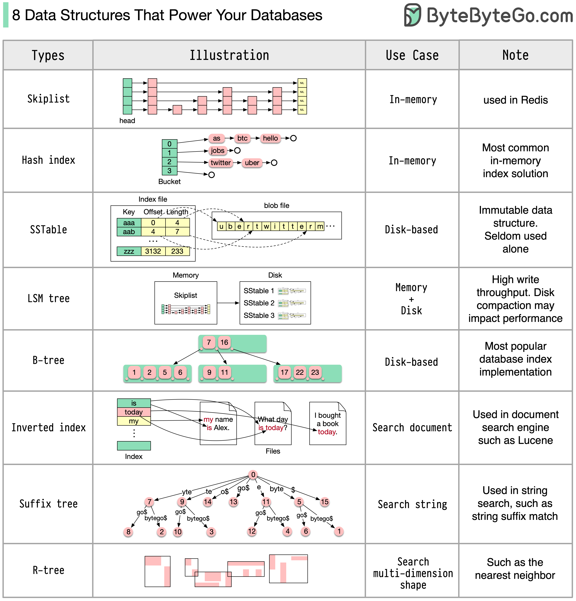
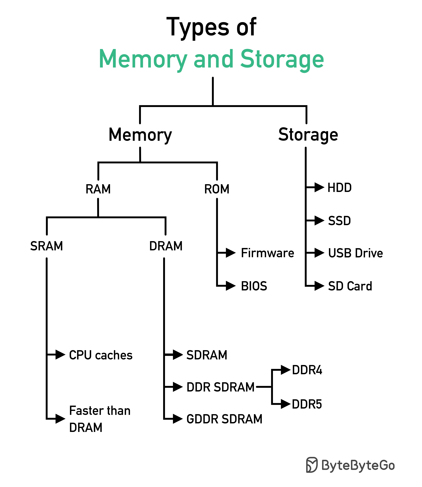

## 数据库

### 云服务中不同数据库的简明指南

  

为你的项目选择合适的数据库是一项复杂的任务。许多数据库选项，各自适用于不同的用例，可能会迅速导致决策疲劳。

我们希望这份简明指南能为你提供高层次的方向，帮助你找到符合项目需求的合适服务，并避免潜在的陷阱。

注意：Google 对其数据库用例的文档有限。尽管我们尽力查看了可用的资料并得出了最佳选项，但某些条目可能需要更准确。

### 支持你数据库的 8 种数据结构

答案会根据你的用例而有所不同。数据可以在内存中或磁盘上进行索引。同样，数据格式也各不相同，如数字、字符串、地理坐标等。系统可能是写密集型或读密集型。所有这些因素都会影响你选择的数据库索引格式。

  

以下是一些最常用的数据结构，用于索引数据：

- 跳表：一种常见的内存索引类型。用于 Redis
- 哈希索引：一种非常常见的“映射”数据结构（或“集合”）的实现
- SSTable：不可变的磁盘“映射”实现
- LSM 树：跳表 + SSTable。高写入吞吐量
- B 树：基于磁盘的解决方案。读写性能一致
- 倒排索引：用于文档索引。用于 Lucene
- 后缀树：用于字符串模式搜索
- R 树：多维搜索，如查找最近邻

### SQL 语句在数据库中是如何执行的？

下图展示了这个过程。请注意，不同数据库的架构不同，图中展示了一些常见的设计。

  

步骤 1 - 通过传输层协议（如 TCP）将 SQL 语句发送到数据库。

步骤 2 - SQL 语句被发送到命令解析器，在那里进行语法和语义分析，然后生成查询树。

步骤 3 - 查询树被发送到优化器。优化器创建执行计划。

步骤 4 - 执行计划被发送到执行器。执行器从执行中检索数据。

步骤 5 - 访问方法提供执行所需的数据获取逻辑，从存储引擎中检索数据。

步骤 6 - 访问方法决定 SQL 语句是否为只读。如果查询是只读的（SELECT 语句），则将其传递给缓冲管理器进行进一步处理。缓冲管理器在缓存或数据文件中查找数据。

步骤 7 - 如果语句是 UPDATE 或 INSERT，则将其传递给事务管理器进行进一步处理。

步骤 8 - 在事务期间，数据处于锁定模式。这由锁管理器保证。它还确保事务的 ACID 属性。

### CAP 定理

CAP 定理是计算机科学中最著名的术语之一，但我敢打赌，不同的开发人员对它有不同的理解。让我们来看看它是什么以及为什么它会令人困惑。

  

CAP 定理指出，分布式系统不能同时提供以下三个保证中的两个以上。

**一致性**：一致性意味着所有客户端在同一时间看到相同的数据，无论它们连接到哪个节点。

**可用性**：可用性意味着任何请求数据的客户端都会得到响应，即使某些节点宕机。

**分区容忍性**：分区表示两个节点之间的通信中断。分区容忍性意味着系统在网络分区的情况下继续运行。

“2 选 3”的表述可能有用，但这种简化可能会误导。

1. 选择数据库并不容易。仅仅基于 CAP 定理来证明我们的选择是不够的。例如，公司不会仅仅因为 Cassandra 是一个 AP 系统而选择它用于聊天应用程序。Cassandra 具有一系列良好的特性，使其成为存储聊天消息的理想选择。我们需要深入挖掘。

2. “CAP 仅禁止设计空间的一小部分：在存在分区的情况下实现完美的可用性和一致性，这是罕见的。” 引自论文：CAP 十二年后：规则如何改变。

3. 该定理关于 100% 的可用性和一致性。更现实的讨论是当没有网络分区时，延迟和一致性之间的权衡。有关更多详细信息，请参见 PACELC 定理。

**CAP 定理真的有用吗？**

我认为它仍然有用，因为它打开了一组权衡讨论，但这只是故事的一部分。我们需要在选择合适的数据库时深入挖掘。

### 内存和存储的类型

  

### 可视化 SQL 查询

  

SQL 语句由数据库系统执行，包括以下几个步骤：

- 解析 SQL 语句并检查其有效性
- 将 SQL 转换为内部表示形式，如关系代数
- 优化内部表示形式并创建利用索引信息的执行计划
- 执行计划并返回结果

SQL 的执行非常复杂，涉及许多考虑因素，如：

- 索引和缓存的使用
- 表连接的顺序
- 并发控制
- 事务管理

### SQL 语言

1986 年，SQL（结构化查询语言）成为标准。在接下来的 40 年里，它成为关系数据库管理系统的主导语言。阅读最新的标准（ANSI SQL 2016）可能会耗费时间。我该如何学习它？

  

SQL 语言有 5 个组成部分：

- DDL：数据定义语言，如 CREATE、ALTER、DROP
- DQL：数据查询语言，如 SELECT
- DML：数据操作语言，如 INSERT、UPDATE、DELETE
- DCL：数据控制语言，如 GRANT、REVOKE
- TCL：事务控制语言，如 COMMIT、ROLLBACK

对于后端工程师，你可能需要了解大部分内容。作为数据分析师，你可能需要对 DQL 有深入的了解。选择与你最相关的主题进行学习。