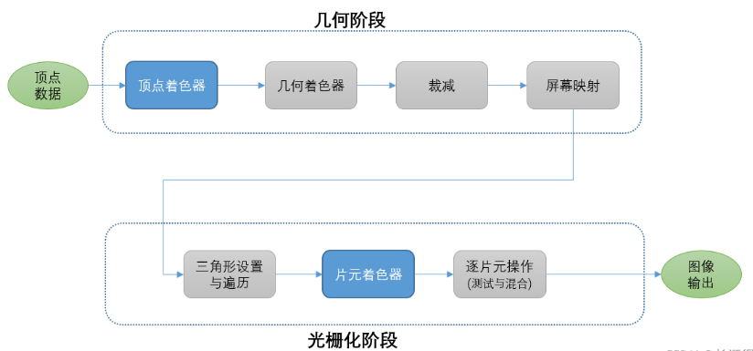

  6. GPU 渲染管线与着色器 大白话总结 ---- 一篇就够
    原文链接:https://blog.csdn.net/newchenxf/article/details/119803489
    
## 渲染管线

### 1. 什么是渲染管线？
渲染管线，也被称为图形管线，是一个用于生成2D图像（如屏幕上的图像）的硬件或软件实现的概念模型。这个过程通常基于3D场景的数据，包括但不限于几何、视点、纹理、光照信息等。

渲染管线通常可以分为几个阶段，每个阶段都有特定的任务。以下是一个典型的3D渲染管线的阶段：

1. **模型变换**：在这个阶段，原始的3D模型坐标会被转换到世界坐标系中。

2. **视图变换**：在这个阶段，世界坐标系中的模型会被转换到相机视图坐标系中。

3. **投影变换**：在这个阶段，视图坐标系中的模型会被投影到一个2D的裁剪空间中。

4. **裁剪**：在这个阶段，裁剪空间中的模型会被裁剪，以移除那些不在视野内的部分。

5. **光栅化**：在这个阶段，裁剪后的模型会被转换成像素的形式，以便在屏幕上显示。

6. **片元处理**：在这个阶段，每个像素会被赋予颜色和深度。这通常涉及到纹理映射、光照计算等操作。

7. **混合和测试**：在这个阶段，会进行深度测试、模板测试和颜色混合等操作，以确定最终的像素颜色。

这个过程可以在CPU上通过软件实现，也可以在GPU上通过硬件实现。在现代的图形API（如OpenGL和DirectX）中，这个过程通常是在GPU上实现的，以利用GPU的并行处理能力。

而之所以叫管线，其实是流水线的意思。

即每一个上述的任务都是同步进行的，像流水线一样，每个步骤都是一直在进行，上游任务准备好就给下游任务，分放任务到下游的同时，不代表完成，而是又有了新的任务进来。

#### 1.1 渲染流程的三个阶段是什么
如果按照CPU和GPU的配合来看，渲染流程又可以看成是三个阶段。

在3D图形渲染流程中，通常可以将整个过程分为三个主要阶段：应用阶段、几何阶段和光栅化阶段。

1. **应用阶段**：这个阶段主要在CPU上执行，包括场景管理、动画、物理模拟、AI计算等任务。这个阶段的目标是准备好所有需要渲染的数据，并将这些数据以渲染命令的形式发送给GPU。

2. **几何阶段**：这个阶段主要在GPU上执行，包括模型变换、视图变换、投影变换和裁剪等任务。这个阶段的目标是将3D模型转换为2D图像，并进行裁剪以移除不在视野内的部分。

3. **光栅化阶段**：这个阶段也在GPU上执行，包括光栅化、片元处理和混合测试等任务。这个阶段的目标是将2D图像转换为像素，并赋予每个像素颜色和深度。

这三个阶段是串行的，每个阶段的输出都是下一个阶段的输入。但在每个阶段内部，许多任务可以并行执行，以提高渲染效率。

#### 2.1 渲染中，cpu和gpu是如何并行工作的

在渲染过程中，CPU和GPU的并行工作主要体现在以下几个方面：

1. **场景准备**：CPU负责准备渲染所需的数据，包括3D模型、纹理、光照信息等。这些数据被组织成一种称为渲染命令的形式，然后发送给GPU。

2. **渲染命令处理**：GPU接收到渲染命令后，开始执行渲染管线中的各个阶段。这包括模型变换、视图变换、投影变换、裁剪、光栅化、片元处理和混合测试等。

3. **异步执行**：在现代的图形API（如DirectX 12和Vulkan）中，CPU可以在GPU还在处理一个渲染命令的同时，继续准备下一个渲染命令。这样，CPU和GPU可以并行工作，提高整体的渲染效率。

4. **缓冲区交换**：当GPU完成一帧的渲染后，它会将结果写入一个叫做后缓冲区的内存区域。然后，CPU会指示显示器从后缓冲区读取数据，并将其显示在屏幕上。同时，CPU会开始准备下一帧的渲染命令。

总的来说，CPU和GPU在渲染过程中的并行工作，主要是通过异步执行和缓冲区交换来实现的。这样可以充分利用CPU和GPU的计算能力，提高渲染的效率。

### 2. CPU处理--应用阶段

在3D图形渲染流程中，CPU处理的应用阶段主要负责以下任务：

1. **场景管理**：确定哪些对象需要被渲染，哪些对象可以被剔除（例如，不在摄像机视野内的对象）。

2. **动画处理**：计算动画对象的新位置和方向。

3. **物理模拟**：计算物理效果，如碰撞、重力和流体动力学。

4. **AI计算**：计算AI的决策，如角色的移动和行为。

5. **设置渲染状态**：设置渲染参数，如光照参数、纹理参数等。

6. **提交渲染命令**：将渲染命令和数据发送给GPU。

这个阶段的任务通常在CPU上进行，因为它们涉及到大量的逻辑判断和复杂的计算，这些是CPU擅长的任务。然后，CPU会将渲染命令和数据发送给GPU，GPU会执行实际的渲染任务。

#### 2.1 如果从偏硬件层次一点的角度来理解，可以分为三个阶段

这段文本描述的是3D图形渲染流程中的一部分，从硬件层面来看，可以进一步解释如下：

1. **把数据加载到显存（GPU的内存）**：这个阶段主要是将需要渲染的数据，如顶点数据、纹理数据等，从CPU的内存复制到GPU的内存（显存）。这是因为GPU直接从显存中读取数据，这样可以大大提高数据读取的速度。

2. **设置渲染状态**：渲染状态定义了如何进行渲染，包括混合模式、深度测试、模板测试、光栅化模式等。这些状态会影响到渲染的结果。在这个阶段，CPU会设置这些状态，并将它们发送给GPU。

3. **提交渲染命令（调用Draw Call）**：Draw Call是CPU告诉GPU开始渲染的命令。在这个阶段，CPU会发送Draw Call给GPU，GPU会根据前两个阶段准备的数据和状态，开始执行渲染管线，生成最终的图像。

这三个阶段是3D图形渲染流程中的一部分，它们主要涉及到CPU和GPU之间的交互。在这三个阶段之后，GPU会开始执行渲染管线，包括几何阶段和光栅化阶段，生成最终的图像。

### 3. GPU处理--几何阶段

在GPU的渲染管线中，几何阶段是一个非常重要的阶段。在这个阶段，GPU会对输入的顶点数据进行一系列的处理，包括以下几个步骤：

1. **顶点着色（Vertex Shading）**：在这个步骤中，GPU会执行顶点着色器，对每个顶点进行处理。顶点着色器是一个可以编程的函数，它可以对顶点数据进行各种操作，如变换顶点的位置、计算顶点的颜色等。

2. **图元装配（Primitive Assembly）**：在这个步骤中，GPU会把处理过的顶点组装成图元，如点、线、三角形等。这些图元是渲染的基本单位。

3. **几何着色（Geometry Shading）**：这是一个可选的步骤，如果启用了几何着色器，GPU会在这个步骤中执行几何着色器。几何着色器可以对图元进行处理，如生成新的图元、改变图元的形状等。

4. **裁剪（Clipping）**：在这个步骤中，GPU会裁剪掉不在视野范围内的图元，只保留在视野范围内的图元。这可以减少后续步骤的计算量。

5. **屏幕映射（Screen Mapping）**：在这个步骤中，GPU会把裁剪后的图元映射到屏幕空间。这是一个从3D空间到2D空间的转换过程。

完成这些步骤后，几何阶段的输出会被送入下一个阶段，即光栅化阶段。在光栅化阶段，GPU会把图元转换成像素，然后执行像素着色器，计算每个像素的颜色。

#### 3.1 顶点着色
顶点着色是GPU渲染管线中的一个步骤，它发生在几何阶段的开始。在这个步骤中，GPU会执行一个叫做顶点着色器的程序，对每个输入的顶点进行处理。

顶点着色器是一个可以编程的函数，它接收一个顶点作为输入，输出一个处理过的顶点。顶点着色器可以对顶点数据进行各种操作，例如：

1. **变换顶点的位置**：这通常涉及到将顶点的位置从模型空间变换到世界空间、视图空间或投影空间。这些变换通常通过矩阵乘法来实现。

2. **计算顶点的颜色**：顶点着色器可以根据顶点的属性（如位置、法线等）和光照条件来计算顶点的颜色。

3. **计算纹理坐标**：如果模型使用了纹理映射，顶点着色器可以计算出每个顶点在纹理图像上的位置。

4. **计算其他顶点属性**：除了位置、颜色和纹理坐标，顶点着色器还可以计算其他的顶点属性，如法线、切线等。

顶点着色器的输出会被送入下一个步骤，即图元装配。在图元装配步骤中，GPU会把处理过的顶点组装成图元，如点、线、三角形等。这些图元是渲染的基本单位，它们会被送入后续的渲染步骤，如几何着色、裁剪、光栅化等。

#### 3.2 图元装配

图元装配（Primitive Assembly）是GPU渲染管线中的一个步骤，它发生在顶点着色之后，几何着色之前。

在图元装配阶段，GPU会将处理过的顶点组装成图元。图元是构成3D模型的基本元素，常见的图元包括点（Point）、线（Line）和三角形（Triangle）。

例如，如果我们正在渲染一个三角形，那么在图元装配阶段，GPU会把这个三角形的三个顶点组装成一个三角形图元。这个三角形图元会被送入后续的渲染步骤，如几何着色、裁剪、光栅化等。

图元装配是3D图形渲染的一个重要步骤，它决定了我们看到的3D模型的形状。通过改变图元的大小和排列，我们可以创建出各种复杂的3D形状。

#### 3.3 几何着色

#### 3.4 裁剪
裁剪（Clipping）是GPU渲染管线中的一个步骤，它发生在几何阶段的结束。在这个步骤中，GPU会裁剪掉不在视野范围内的图元，只保留在视野范围内的图元。这可以减少后续步骤的计算量，提高渲染效率。裁剪通常是在投影空间进行的，它会保证只有在视野范围内的图元会被渲染。

#### 3.5 屏幕映射
屏幕映射（Screen Mapping）是GPU渲染管线中的一个步骤，它发生在裁剪之后，光栅化之前。在这个步骤中，GPU会把裁剪后的图元映射到屏幕空间。这是一个从3D空间到2D空间的转换过程，它会将图元的坐标从投影空间变换到屏幕空间。这个步骤决定了图元在屏幕上的位置和大小。

### 4. GPU处理--光栅阶段

在GPU的渲染管线中，光栅化阶段是一个非常重要的步骤。在这个阶段，GPU会把图元（如点、线、三角形等）转换成像素。这个过程也被称为扫描转换（Scan Conversion）。

光栅化阶段的主要任务包括：

1. **生成片元**：片元（Fragment）是像素的一个候选者，每个片元包含一个像素的所有信息，如位置、颜色、深度等。在光栅化阶段，GPU会为每个像素生成一个或多个片元。

2. **插值**：在生成片元的过程中，GPU会对图元的属性进行插值。例如，如果我们正在渲染一个三角形，那么GPU会根据三角形的三个顶点的颜色，计算出每个像素的颜色。

3. **深度测试**：在生成片元后，GPU会进行深度测试，决定哪些片元应该被绘制到屏幕上。深度测试可以防止被遮挡的图元覆盖前面的图元。

完成光栅化阶段后，生成的片元会被送入下一个阶段，即片元着色阶段。在片元着色阶段，GPU会执行片元着色器，计算每个片元的最终颜色。

#### 4.1 

### quiz

#### 1. 为什么gpu要有自己的内存，即显存？
GPU需要有自己的内存，即显存，主要有以下几个原因：

1. **高带宽**：显存通常使用高带宽的内存技术，如GDDR或HBM，这些内存技术提供的带宽远高于常规的DDR内存。当我们说显存（GPU的内存）具有"高带宽"，我们是指显存能够在单位时间内传输大量的数据。这对于GPU来说非常重要，因为GPU在渲染过程中需要处理大量的数据，如顶点数据、纹理数据等。

2. **并行处理**：GPU是一个高度并行的处理器，它可以同时处理大量的数据。为了支持这种并行处理，GPU需要能够同时访问大量的数据，这就需要有足够大的内存。

3. **减少CPU和GPU之间的数据传输**：如果GPU没有自己的内存，那么它需要从CPU的内存中读取数据。这会增加CPU和GPU之间的数据传输，降低渲染效率。有了自己的内存，GPU可以直接从显存中读取数据，无需通过CPU，从而提高渲染效率。

4. **独立运行**：有了自己的内存，GPU可以在执行渲染任务时独立于CPU运行，不受CPU的内存使用情况的影响。

因此，为了提高渲染效率和支持并行处理，GPU需要有自己的内存，即显存。

#### 2. cpu和gpu的区别是什么？
CPU（中央处理器）和GPU（图形处理器）都是计算机的重要组成部分，但它们在设计和功能上有一些重要的区别：

1. **设计目标**：CPU设计用于处理各种类型的计算任务，包括运行操作系统、执行应用程序代码等。它是一个通用的处理器，可以处理各种类型的数据和指令。而GPU最初是为了加速图形渲染而设计的，它是一个专用的处理器，擅长处理大量的并行数据。

2. **架构**：CPU通常只有几个核心，但每个核心都非常强大，可以处理复杂的指令和逻辑。而GPU有成百上千个小核心，每个核心都不如CPU核心强大，但由于数量众多，所以在处理大量并行数据时，GPU的性能远超CPU。

3. **内存**：CPU使用系统内存（RAM），而GPU使用自己的内存（显存）。显存通常使用高带宽的内存技术，如GDDR或HBM，这些内存技术提供的带宽远高于常规的DDR内存。

4. **用途**：CPU用于运行大部分的应用程序，包括操作系统、办公软件、浏览器等。而GPU主要用于图形渲染，如3D游戏、专业图形应用等。但现在，GPU也越来越多地用于非图形的计算任务，如科学计算、机器学习等，这被称为GPGPU（通用图形处理器计算）。

总的来说，CPU和GPU在设计和功能上有各自的优势，它们在计算机系统中共同工作，提供强大的计算能力。

简单来说，cpu适合处理串行任务，而gpu适合处理并行任务。

例如，显示的时候，每个像素点都是独立计算的，不是说像素点之间彼此依赖的，所以显示任务是更适合通过gpu去运算的。

#### 3. 顶点数据是什么？
顶点数据是3D图形渲染中的基本元素，它描述了3D物体的形状和其他属性。一个顶点通常包含以下信息：

1. **位置**：顶点在3D空间中的坐标，通常用一个三维向量（x, y, z）来表示。

2. **颜色**：顶点的颜色，通常用一个四维向量（r, g, b, a）来表示，其中r、g、b分别代表红、绿、蓝三种颜色的强度，a代表透明度。

3. **纹理坐标**：顶点在纹理图像上的位置，通常用一个二维向量（u, v）来表示。

4. **法线**：顶点的法线，用于光照计算。法线是一个三维向量，表示顶点表面的方向。

在3D图形渲染中，我们通常使用一组顶点数据来定义一个3D物体。例如，一个三角形需要三个顶点，一个立方体需要八个顶点。这些顶点数据会被发送到GPU，GPU会根据这些数据进行渲染，生成最终的图像。

##### 3.1 怎么理解纹理坐标
纹理坐标，也被称为UV坐标，是用来定义3D模型表面上每个顶点如何映射到2D纹理图像的。它是一个二维坐标，通常用(u, v)来表示。

在3D模型的每个顶点上，都会定义一个对应的纹理坐标。当我们把2D纹理应用到3D模型上时，纹理坐标就决定了每个顶点对应到纹理图像上的哪个位置。

例如，纹理坐标(0, 0)通常对应到纹理图像的左下角，(1, 1)对应到纹理图像的右上角。如果一个顶点的纹理坐标是(0.5, 0.5)，那么它就对应到纹理图像的中心位置。

通过这种方式，我们可以把2D纹理图像映射到3D模型的表面，从而给模型添加详细的表面纹理，如皮肤、毛发、布料等。这是3D图形渲染中的一个重要步骤，可以大大提高渲染的真实感。

##### 3.2 怎么理解法线
在3D图形中，"法线"是一个向量，它表示3D模型表面在某一点的方向。法线通常用于光照计算，以确定模型表面如何反射或吸收光线。

法线通常是垂直于模型表面的。例如，如果你有一个平面，那么这个平面的法线就是垂直于这个平面的向量。在一个曲面上，每一点的法线都可能不同，因为曲面在不同的地方有不同的方向。

在3D模型的每个顶点上，都会定义一个法线。当我们进行光照计算时，会使用这些法线来确定光线如何影响模型的颜色。例如，如果法线与光线的方向相同，那么这个地方就会被照亮；如果法线与光线的方向相反，那么这个地方就会在阴影中。

通过使用法线，我们可以在3D模型上创建出复杂的光照和阴影效果，从而提高渲染的真实感。

#### 4. 图元数据是什么？
在计算机图形学中，图元（Primitive）是构成3D模型的基本元素。常见的图元包括点（Point）、线（Line）和三角形（Triangle）。图元数据就是描述这些基本元素的数据。

例如，一个三角形图元的数据通常包括三个顶点的数据，每个顶点的数据包括位置、颜色、纹理坐标和法线等信息。这些数据会被送入图形渲染管线，经过一系列的处理（如顶点处理、光栅化、片元处理等），最终生成图像。

在实际的3D图形渲染中，三角形是最常用的图元，因为任何3D模型都可以由三角形组成。通过改变三角形的大小和排列，我们可以创建出各种复杂的3D形状。

## 图形库框架

### 1. 图形库的架构
一个图形库的架构通常包括以下几个关键组成部分：

1. **渲染引擎（Rendering Engine）**:
   - 负责图形的绘制，包括2D/3D图形渲染。
   - 管理图形硬件加速，如使用OpenGL、DirectX或Vulkan等API。
   - 实现光照、阴影、纹理映射等图形效果。

2. **场景图（Scene Graph）**:
   - 组织和管理图形对象（如形状、模型）和场景中的关系。
   - 支持图形对象的变换（平移、旋转、缩放）。
   - 实现场景的遍历，以便渲染。

3. **资源管理（Resource Management）**:
   - 管理图形资源，如纹理、模型数据、着色器程序。
   - 负责资源的加载、缓存和释放。

4. **输入处理（Input Handling）**:
   - 处理用户输入，如鼠标、键盘、触摸事件。
   - 将用户输入转换为图形对象的交互，如拖动、缩放视图。

5. **界面组件（UI Components）**:
   - 提供绘制用户界面的组件，如按钮、滑块、文本框。
   - 支持用户界面的布局和事件处理。

6. **动画和物理（Animation and Physics）**:
   - 实现图形对象的动画效果，如平滑变换、关键帧动画。
   - 集成物理引擎，支持碰撞检测、刚体动力学等。

7. **工具和编辑器（Tools and Editors）**:
   - 提供资源编辑器，如材质编辑器、场景编辑器。
   - 支持图形资源的创建、编辑和预览。

8. **抽象层（Abstraction Layer）**:
   - 提供与硬件和操作系统无关的编程接口。
   - 使图形库能够跨平台运行，如Windows、Linux、macOS。

9. **优化和调试（Optimization and Debugging）**:
   - 实现性能优化，如批处理渲染、遮挡剔除。
   - 提供调试工具，帮助开发者诊断和解决图形渲染问题。

一个完整的图形库可能不需要实现上述所有组件，具体取决于其目标应用场景和性能要求。例如，一个专注于2D图形的库可能不需要复杂的3D渲染引擎，而一个用于游戏开发的图形库可能会重点关注动画、物理和优化。

### 2. 渲染的数据是怎么存储的？
渲染数据的存储方式通常依赖于渲染的具体需求和使用的图形API（如OpenGL、DirectX、Vulkan等）。以下是一些常见的数据存储方式：

1. **顶点数据（Vertex Data）**:
   - 存储在顶点缓冲区（Vertex Buffer）中，包括顶点的位置、颜色、纹理坐标、法线等信息。
   - 通常以数组的形式组织，可以直接被图形硬件处理。

2. **索引数据（Index Data）**:
   - 存储在索引缓冲区（Index Buffer）中，用于定义顶点数组中哪些顶点组成图形的一个面（如三角形）。
   - 通过索引可以重用顶点，减少数据量。

3. **纹理数据（Texture Data）**:
   - 存储图像数据，用于贴图。
   - 可以存储在纹理缓冲区中，支持多种格式和压缩方法。

4. **着色器代码（Shader Code）**:
   - 存储图形渲染的程序代码，如顶点着色器、片段着色器代码。
   - 通常以文本或字节码形式存储，由图形API编译并在GPU上执行。

5. **统一缓冲区（Uniform Buffer）**:
   - 存储着色器全局使用的常量数据，如变换矩阵、光照参数等。
   - 使得数据可以在多个着色器间共享。

6. **帧缓冲区（Frame Buffer）**:
   - 存储渲染过程的输出，包括颜色、深度和模板信息。
   - 可以用于实现后处理效果，如模糊、边缘检测等。

7. **几何数据（Geometry Data）**:
   - 对于复杂模型，可能包括网格数据、骨骼动画信息等。
   - 可以使用场景图（Scene Graph）组织管理，支持高效的遍历和渲染。

这些数据通常存储在GPU的内存中，以便快速访问和处理。不同的图形API提供了不同的机制来管理这些数据，如VBO（Vertex Buffer Object）、VAO（Vertex Array Object）、FBO（Frame Buffer Object）等。正确地管理和优化这些数据的存储和访问对于实现高效的图形渲染至关重要。

### 3. 也就是在建模软件中，模型可能是是有层次有结构的，但是对于渲染引擎来说，是没有这些概念的。

### 4. 模型的结构体现在图形库的场景图中
场景图在图形渲染中起到了组织和优化渲染过程的作用。以下是场景图如何在图形渲染中发挥作用的详细步骤：

1. **组织场景结构**:
   - 场景图通过树状或图状结构组织场景中的所有对象，包括几何体、光源、摄像机等。这种结构反映了场景中对象的层次关系和空间关系，便于管理和遍历。

2. **继承变换**:
   - 在场景图中，子节点继承父节点的变换（位置、旋转、缩放）。这使得可以通过改变父节点的变换来高效地同时影响所有子节点，便于实现组合对象的统一管理和动画。

3. **高效遍历**:
   - 渲染过程需要遍历场景中的对象。场景图提供了一种高效的遍历机制，可以根据需要遍历整个场景或场景的一部分，如只渲染摄像机可见的对象。

4. **剔除不可见对象**:
   - 利用场景图的结构，可以实现视锥体剔除（frustum culling）和遮挡剔除（occlusion culling），即忽略在当前视角下不可见的对象，从而提高渲染效率。

5. **优化渲染命令**:
   - 场景图可以用来组织渲染命令，如通过合并具有相同材质或着色器的对象的渲染调用来减少状态变更，从而优化渲染性能。

6. **动态场景管理**:
   - 场景图支持动态修改，如添加、删除或更改节点。这对于实时应用（如游戏、模拟）中动态变化的场景非常重要，可以实现实时的场景更新和交互。

7. **多级细节（LOD）管理**:
   - 场景图可以用来实现多级细节（Level of Detail, LOD）管理，即根据对象与摄像机的距离选择不同细节级别的模型进行渲染，以优化性能。

8. **光照和阴影计算**:
   - 场景图可以帮助组织和优化光照计算，如确定哪些对象受到哪些光源的影响，以及实现阴影的高效计算。

通过上述方式，场景图在图形渲染中起到了至关重要的作用，不仅提高了渲染效率和性能，还增加了渲染过程的灵活性和动态交互能力。