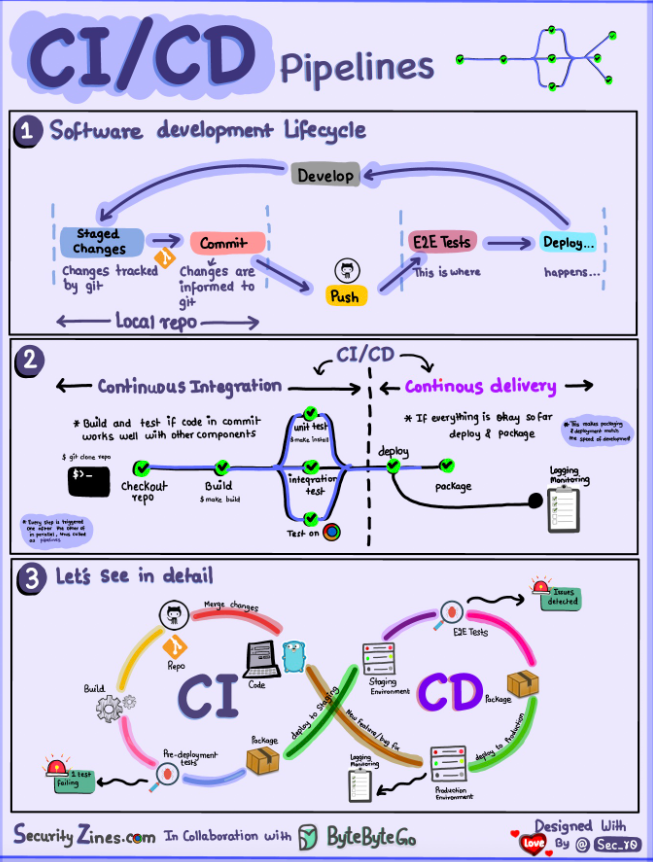
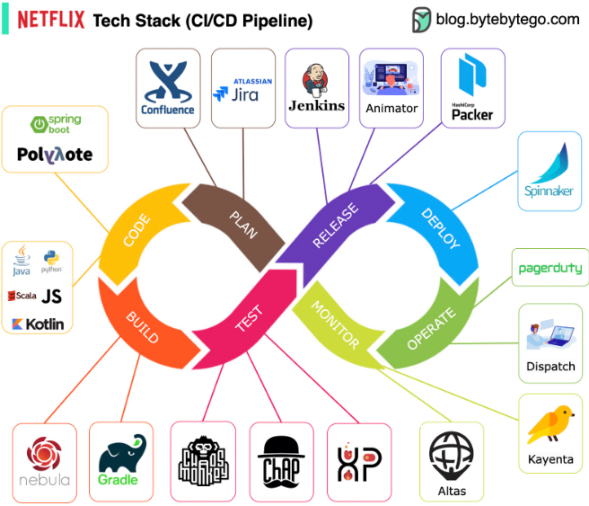
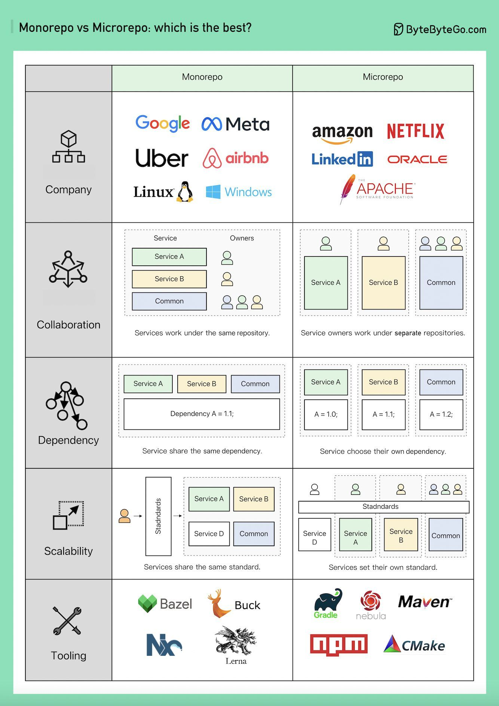

## CI/CD

### 1. concepts

#### 1.1 什么是CI/CD

### 规划
Netflix 工程团队使用 JIRA 进行规划，并使用 Confluence 进行文档编写。

### 编码
Java 是后端服务的主要编程语言，同时也使用其他语言来应对不同的使用场景。

### 构建
主要使用 Gradle 进行构建，并且构建了支持各种使用场景的 Gradle 插件。

### 打包
将包和依赖项打包成 Amazon Machine Image (AMI) 以进行发布。

### 测试
测试强调生产文化中的混沌工具构建。

### 部署
Netflix 使用自建的 Spinnaker 进行金丝雀发布部署。

### 监控
监控指标集中在 Atlas 中，并使用 Kayenta 检测异常。

### 事件报告
事件根据优先级进行分派，并使用 PagerDuty 处理事件。

### Monorepo vs. Microrepo

哪种方式更好？为什么不同公司选择不同的选项？

  

Monorepo 并不是新概念；Linux 和 Windows 都是使用 Monorepo 创建的。为了提高可扩展性和构建速度，Google 开发了内部专用工具链，以更快地扩展，并制定了严格的代码质量标准以保持一致性。

Amazon 和 Netflix 是微服务哲学的主要倡导者。这种方法自然地将服务代码分离到不同的存储库中。它扩展得更快，但可能会导致后期的治理问题。

在 Monorepo 中，每个服务是一个文件夹，每个文件夹都有一个 BUILD 配置和 OWNERS 权限控制。每个服务成员负责自己的文件夹。

另一方面，在 Microrepo 中，每个服务负责其存储库，构建配置和权限通常设置为整个存储库。

在 Monorepo 中，依赖项在整个代码库中共享，因此当有版本升级时，所有代码库都会升级其版本。

在 Microrepo 中，依赖项在每个存储库中受到控制。业务根据自己的时间表选择何时升级版本。

Monorepo 有一个标准的提交流程。Google 的代码审查过程以高标准著称，确保 Monorepo 的一致质量标准，无论业务如何。

Microrepo 可以设置自己的标准或通过采用最佳实践来共享标准。它可以更快地扩展业务，但代码质量可能会有所不同。Google 工程师构建了 Bazel，Meta 构建了 Buck。还有其他开源工具，包括 Nx、Lerna 等。

多年来，Microrepo 有更多支持的工具，包括 Java 的 Maven 和 Gradle，NodeJS 的 NPM，以及 C/C++ 的 CMake 等。

# 微服务部署

​	在项目迭代的过程中，不可避免需要”上线“。上线对应着部署，或者重新部署；部署对应着修改；修改则意味着风险

​	目前有很多用于部署的技术，有的简单，有的复杂；有的得停机，有的不需要停机即可完成部署

## 蓝绿部署(Blue/Green Deployment)

* **蓝绿部署无需停机，并且风险较小**
  1. 部署版本1的应用（一开始的状态），所有外部请求的流量都打到这个版本上
  2. 部署版本2的应用，版本2的代码与版本1不同(新功能、Bug修复等)
  3. 将流量从版本1切换到版本2
  4. 如版本2测试正常，就删除版本1正在使用的资源（例如实例），从此正式用版本2

* 从过程不难发现，在部署的过程中，我们的应用始终在线。并且，新版本上线的过程中，并没有修改老版本的任何内容，在部署期间，老版本的状态不受影响。这样风险很小，并且，只要老版本的资源不被删除，理论上，我们**可以在任何时间回滚到老版本**

## 滚动发布(Rolling Update)

* 滚动发布，一般是**取出一个或者多个服务器停止服务**，执行更新，并重新将其投入使用。周而复始，直到集群中所有的实例都更新成新版本
* 这种部署方式相对于蓝绿部署，**更加节约资源**——**它不需要运行两个集群、两倍的实例数**。我们可以部分部署，例如每次只取出集群的20%进行升级
* 这种方式也有很多缺点，例如：
  1. 没有一个确定OK的环境。使用蓝绿部署，我们能够清晰地知道老版本是OK的，而使用滚动发布，我们无法确定
  2. 修改了现有的环境
  3. 如果需要回滚，很困难。举个例子，在某一次发布中，我们需要更新100个实例，每次更新10个实例，每次部署需要5分钟。当滚动发布到第80个实例时，发现了问题，需要回滚。此时，脾气不好的程序猿很可能想掀桌子，因为回滚是一个痛苦，并且漫长的过程
  4. 有的时候，我们还可能对系统进行动态伸缩，如果部署期间，系统自动扩容/缩容了，我们还需判断到底哪个节点使用的是哪个代码。尽管有一些自动化的运维工具，但是依然令人心惊胆战
* 并不是说滚动发布不好，滚动发布也有它非常合适的场景

## 灰度发布/金丝雀部署

* 灰度发布是指在黑与白之间，能够**平滑过渡**的一种发布方式。AB test就是一种灰度发布方式，**让一部分用户继续用A，一部分用户开始用B，如果用户对B没有什么反对意见，那么逐步扩大范围，把所有用户都迁移到B上面来**。灰度发布可以保证整体系统的稳定，在初始灰度的时候就可以发现、调整问题，以保证其影响度

* 很多人把灰度发布与蓝绿部署混为一谈，笔者认为，与灰度发布最类似的应该是金丝雀部署

* “金丝雀部署”是**增量发布**的一种类型，它的执行方式是在原有软件生产版本可用的情况下，同时部署一个新的版本。同时运行同一个软件产品的多个版本需要软件针对配置和完美自动化部署进行特别设计。

* 我们来看一下金丝雀部署的步骤：
  1. 准备好部署各个阶段的工件，包括：构建工件，测试脚本，配置文件和部署清单文件
  2. 从负载均衡列表中移除掉“金丝雀”服务器
  3. 升级“金丝雀”应用（排掉原有流量并进行部署）
  4. 对应用进行自动化测试
  5. 将“金丝雀”服务器重新添加到负载均衡列表中（连通性和健康检查）
  6. 如果“金丝雀”在线使用测试成功，升级剩余的其他服务器（否则就回滚）

* 灰度发布中，常常按照用户设置路由权重，例如90%的用户维持使用老版本，10%的用户尝鲜新版本。不同版本应用共存，经常与A/B测试一起使用，用于测试选择多种方案。灰度发布比较典型的例子，是阿里云那个“新版本”，点击“进入新版本”，我们就成了金丝雀

## 总结

1. 蓝绿部署：不停止老版本，额外搞一套新版本，等测试发现新版本OK后，删除老版本
2. 滚动发布：按批次停止老版本实例，启动新版本实例
3. 灰度发布/金丝雀部署：不停止老版本，额外搞一套新版本，常常按照用户设置路由权重，例如90%的用户维持使用老版本，10%的用户尝鲜新版本。不同版本应用共存，经常与A/B测试一起使用，用于测试选择多种方案

