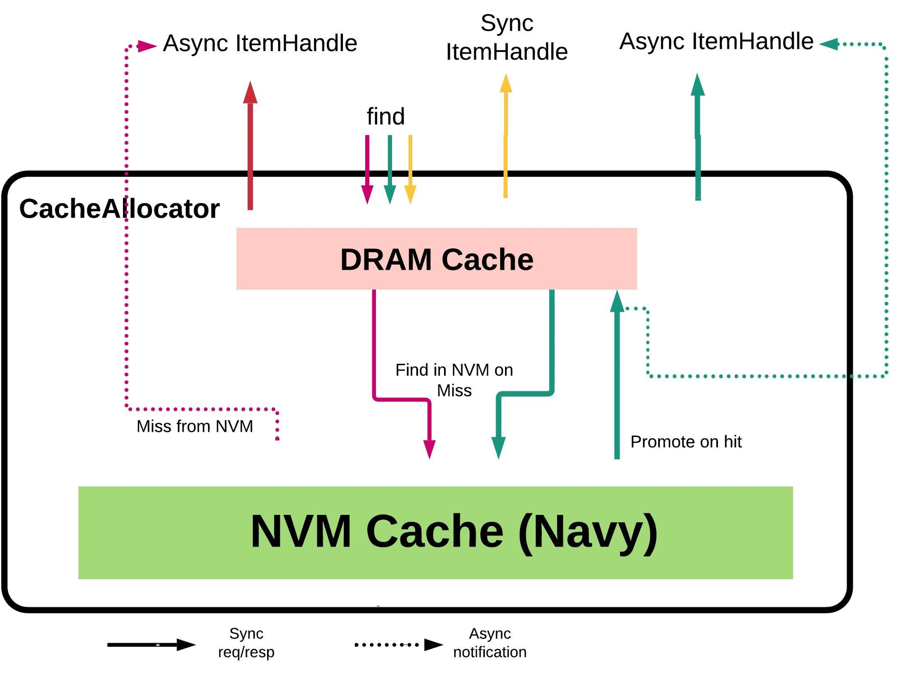

CacheLib supports use of multiple HW mediums through [hybrid cache](/docs/Cache_Library_User_Guides/HybridCache/) feature. To make this transparent to the user, the CacheAllocator API is extended to support caching items in both DRAM and NVM. Barring few features, users should not be aware of whether the Item is cached in DRAM or NVM.

## Overview of Hybrid Cache design
Currently we support SSDs as the NVM medium for Hybrid Cache. Navy is our SSD optimized cache engine. To interface  with Navy,  CacheAllocator uses the `NvmCache` wrapper. CacheAllocator delegates the responsibility of performing thread safe lookups,  inserts and deletes for Navy to `NvmCache`. `NvmCache` implements the functionality that handles transitions of Item to and from NVM. Since there is no global key level lock in CacheAllocator to synchronize operations that change Item's state between DRAM and NVM, `NvmCache` employs optimistic concurrency control primitives to enforce data correctness.

### Item allocation and eviction
CacheAllocator allocates the Item in DRAM when `allocate` is called. Once the Item becomes a victim for eviction in the MMContainer, CacheAllocator evicts the Item to `NvmCache`. Since NVM has constraints on write endurance, CacheAllocator supports a pluggable admission policy that can reject Items when needed or suitable.  Items read from NVM are also inserted into DRAM. When these Items get evicted, CacheAllocator can choose to not write them into NVM since it is already present by inferring if `it->isNvmClean()`.

### Item lookups
When performing lookups through `find`, CacheAllocator first checks if the Item is present in DRAM. If not, it looks into `NvmCache` and if present, fetches the Item asynchronously, and inserts them into DRAM. Since Items can be asynchronously moved from NVM to DRAM,  we extend the functionality of Item's `Handle` (see [Accessing items on cache](/docs/Cache_Library_User_Guides/HybridCache/)) to expose the async nature of the Item in hybird cache. Item's `Handle` internally holds a `WaitContext` that is shared between all outstanding `Handles` for the same key. The `WaitContext` holds a baton that is used to  communicate when the Item is ready and available in DRAM. The overhead of `WaitContext` is only incurred when hybrid cache is enabled. In pure DRAM setups, the Item's `Handle` simply encapsulates an active reference of an Item.

When `NvmCache`  inserts Items into DRAM from NVM, they are marked to indicate `NvmClean`  so that future evictions can skip re-writing them unless the Item has been mutated.

### Optimistic concurrency in NVMCache
CacheAllocator does not employ any key level locks to protect the state of an Item between DRAM and NVM. This is motivated from having to avoid holding any locks that can potentially contend over IO operations into NVM.  Instead, it relies on the intuition that concurrent mutations to Item's state within the cache is very rare and leverages optimistic concurrency. For example, while Thread1 looks up for an Item in NVM, Thread2 could be allocating and inserting an Item. There are more subtle races co-ordinating the lookup of an Item with eviction of the Item into NVM in the absence of global per key mutex.  For all inflight operations, `NvmCache` maintains book keeping. `PutTokens` represent the in-flight evictions that will be inserted into NVM. `DeleteTombstone` represent an in-flight indication of preparing to purge a key from DRAM and NVM. A `GetContext` is used to track in-flight lookups into NVM.

On lookups, `NvmCache` ensures that any in-flight eviction from DRAM into NVM is aborted to preserve the consistency of lookup order between NVM and DRAM. When lookup for NVM completes, before inserting the Item into DRAM, any outstanding `DeleteTombstone` is respected by ignoring the value read and returning a miss instead. This ensures that once a delete is enqued by the user through `remove` API, any lookups started after return a miss, even if the lookup is executed concurrently ahead of the `remove` by another thread. The effect of this is that we serialize any rare occurence of concurrent in-flight lookups, deletes and insert to the same key without blocking the  threads over IO operations.
