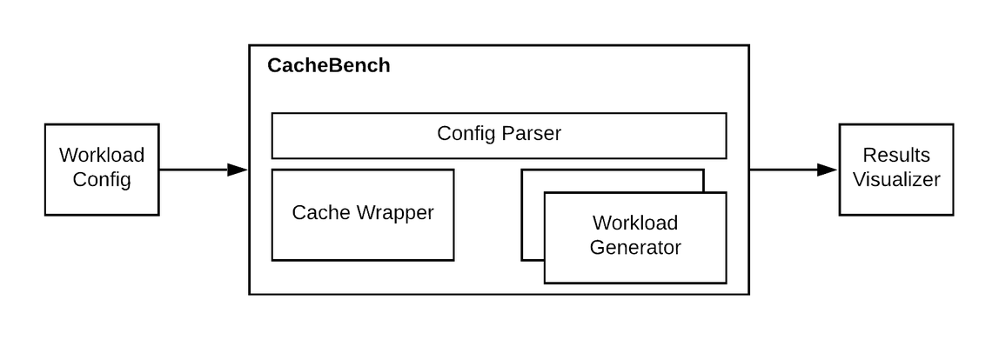

CacheBench provides features to model cache workloads, represent cache workloads, to run cache benchmarks and more. This guide will explain how CacheBench is structured and how to add new configs or build features for it.

## Anatomy of CacheBench

CacheBench consists of several components, each organized under a
sub-directory inside `CacheLib/cachebench`.  

When CacheBench starts up, it reads the config file passed through
`--json_test_config` through the utilities present in `cachebench/util`. Once
the stress test config is parsed, it is passed to initialize a workload
generator (see under `cachebench/workload`) and a test `Runner`(see under
`cachebench/runner`). The `Runner` operates the stress test by invoking the
appropriate `Stressor` implementation and passes the workload generator to the
stressor for generating the traffic if appropriate. `CacheStressor` is the
commonly used implementation to continue running the workload against an
instance of CacheLib cache (see under `cachebench/cache`). This instance of
the cache is a wrapper around a CacheLib cache instance and is appropriately
instrumented to run several kinds of testing (consistency checking,
correctness validation etc.)

The main customization points into CacheBench are through writing workload
configs that represent new workloads or  by writing custom workload generators
(like the piece-wise replay generator).


## Write a new config

To write a CacheBench config, you must specify the workload configuration
first. The workload configuration describes the nature of the cache workload
by defining the number of cache objects, their size and popularity
distribution, and the distribution of API operations.

### Simple config with key-value sizes and popularity distribution

The following config sets up a basic [hybrid cache](HybridCache) instance with two DRAM cache pools and also sets up and runs it in a DRAM-backed mode (useful for testing). The test config itself specifies the number of operations per threads, number of threads, number of keys, and then proceeds to describe the distribution of its key and value sizes and the distribution of the operations. It’s an example of a simple config that is usually written by a person for the purpose of adding a new integration test or a simple benchmark for a particular feature. Configs in this manner are not meant for representing real life workloads and used for performance measurements. For reference on what each option means, please refer to these files.

* Cache Config: `cachebench/util/CacheConfig.h`
* Stressor Config: `cachebench/util/Config.h`

<details> <summary> Sample config  </summary>

```json
{
  "cache_config" : {
    "cacheSizeMB" : 128,
    "poolRebalanceIntervalSec" : 1,
    "moveOnSlabRelease" : false,

    "numPools" : 2,
    "poolSizes" : [0.3, 0.7],

    "dipperSizeMB" : 512,
    "dipperBackend" : "navy_dipper",
    "dipperUseDirectIO": false,
    "dipperFilePath" : "/dev/shm/cachebench"
  },
  "test_config" :
    {
      "prepopulateCache" : true,

      "numOps" : 100000,
      "numThreads" : 16,
      "numKeys" : 100000,
      "distribution" :  "range",

      "keySizeRange" : [1, 8, 64],
      "keySizeRangeProbability" : [0.3, 0.7],

      "valSizeRange" : [256, 1024, 4096],
      "valSizeRangeProbability" : [0.2, 0.8],

      "chainedItemLengthRange" : [1, 2, 4, 32],
      "chainedItemLengthRangeProbability" : [0.8, 0.18, 0.02],

      "chainedItemValSizeRange" : [1, 128, 256, 1024, 4096, 20480],
      "chainedItemValSizeRangeProbability" : [0.1, 0.1, 0.2, 0.3, 0.3],

      "getRatio" : 0.5,
      "setRatio" : 0.3,
      "addChainedRatio" : 0.2,
      "keyPoolDistribution": [0.5, 0.5],
      "opPoolDistribution" : [0.5, 0.5]
    }
}
```

</details>

The value size will be changed to max(valSize, sizeof(CacheValue)) when allocate in the cache for cachebench. If the size distribution is important to the test, this may affect the test.

### Real world config example

Coming up with appropriate distribution sizes of key, values and getting their popularity is a challenging problem. To make this easier, CacheBench can take the popularity and size distribution through json files. To examine a real world config at use in production service, refer to `cachelib/cachebench/test_configs/ssd_perf/graph_cache_leader/config.json`

This describes the cache setup (similar to how we do it in the simple test config example above) for a production service. The `pop.json` file describes the popularity distribution across the key space and the `sizes.json` file describes the value distribution across the key space. They are key to getting close to simulate a production workload.

These files are generated by our workload analyzer. We currently have the ability to generate workload configs by taking the most recent social graph and general purpose look-aside cache traces. For example to generate a workload config that simulates the most recent two days of traffic, simply run:

### Replay production cache traces

CacheBench can also be used to replay the production cache traces. This is as close as we can get to production and is very useful when we want to simulate a cache setup that is similar to production. To do that, we need to size our cache to the same scale as our trace. If the trace is sampled at 0.01% of the traffic across 1000 hosts, then we need a cache size that’s roughly 10% of production.  To do this, under the `test_config`, instead of passing the workload distribution, you can pass the trace file location. To handle the trace file appropriately, see examples in `cachebench/workload/KVReplayGenerator.h`


<details> <summary> Example replay based config file </summary>

```json
{
  "cache_config": {
    "cacheSizeMB": 8192,
    "poolRebalanceIntervalSec": 0
  },
  "test_config":
    {
      "enableLookaside": true,
      "generator": "replay",
      "numOps": 240000000,
      "numThreads": 1,
      "prepopulateCache": true,
      "traceFileName": "cache_trace.csv"
    }

}
```

</details>

Due to the size of trace file, we do not store the raw traces in CacheBench repo. So to run the config above, the user must first fetch the raw trace locally and put it in the same directory as the config file.

To handle the trace file format, you can write your own workload generator.
`PiecewiseReplayGenerator` is one such example replay generator.

## Writing a new workload generator

Workload generator needs to implement an interface that CacheBench’s Cache implementation expects. The most important two APIs are as follows.

```cpp
# Get a request for our next operation. The request contains key and size.
const Request& getReq(uint8_t poolId, std::mt19937& gen);

# Get an operation to go with the generated request (e.g. get, set, del)
OpType getOp(uint8_t pid, std::mt19937& gen);
```

For an example, please look at OnlineGenerator (`cachebench/workload/OnlineGenerator.h`) which implements a generator that use distribution descriptions for popularity and value sizes to generates requests.
