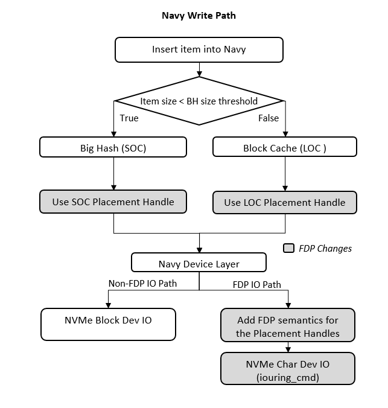

### NVMe® Flexible Data Placement (NVMe® FDP)
NVM Express®(NVMe®) released the ratified technical proposal TP4146a Flexible Data Placement (FDP) that defines a new method for placing host data (logical blocks) into the SSD in an effort to reduce SSD [Write Amplification Factor (WAF)](https://nvmexpress.org/nvmeflexible-data-placement-fdp-blog/). This provides the host a mechanism to control which of its data is placed into different sets of physical locations of the SSD (NAND blocks) called Reclaim Units. The host is able to write into multiple such Reclaim Units at a time allowing the host to isolate its data that has different lifetime. For more information on NVMe® FDP and various use cases refer this document: [Introduction to FDP](https://download.semiconductor.samsung.com/resources/white-paper/FDP_Whitepaper_102423_Final_10130020003525.pdf).

### How does CacheLib use FDP?
CacheLib's BigHash and BlockCache produce distinct IO patterns on the SSD. BigHash generates a random write pattern while BlockCache generates a sequential write pattern. In a conventional SSD, these writes get mixed up in the physical NAND media. This intermixing can lead to a higher SSD Write Amplification Factor (WAF). To combat this in production environments CacheLib uses upto [50% of the SSD as host over-provisioning](https://www.usenix.org/system/files/osdi20-berg.pdf). The Flexible Data Placement (FDP) support within CacheLib aims to segregate the BigHash and BlockCache data of CacheLib within the SSDs. This reduces the device WAF even when configured with 0% host over-provisioning and improves device endurance. FDP support within Navy is optional.

|  |
|:--:|
| *CacheLib IO Flow with and without FDP* |

Since FDP directives are not yet supported by the Linux kernel block layer interface, we have used Linux kernel [I/O Passthru](https://www.usenix.org/system/files/fast24-joshi.pdf) mechanism (which leverages [io_uring_cmd interface](https://www.usenix.org/system/files/fast24-joshi.pdf)) as seen in the figure. 

### FDP support within Navy
The `FdpNvme` class embeds all the FDP related semantics and APIs and is used  by the `FileDevice` class. This can be extended to other modules in the future if they desire to use FDP support. The below are some key functions added to the `FdpNvme` class related to FDP and iouring_cmd.
 
```cpp

  // Allocates an FDP specific placement handle to modules using FdpNvme like Block Cache and Big Hash.
  // This handle will be interpreted by the device for data placement.
  int allocateFdpHandle();

  // Prepares the Uring_Cmd sqe for read/write command with FDP directives.
  void prepFdpUringCmdSqe(struct io_uring_sqe& sqe,
                          void* buf,
                          size_t size,
                          off_t start,
                          uint8_t opcode,
                          uint8_t dtype,
                          uint16_t dspec);
```

### When should FDP be enabled?
When using Navy, FDP can help play a role in improving SSD endurance in comparison to Non-FDP. If the workload has both small objects and large objects, FDP's WAF gains will most likely be evident because FDP segregates these two in the SSD. In cases like CacheLib's CDN workload where BigHash is typically not configured, this FDP based segregation will make no difference to SSD WAF. On the other hand with CacheLib's KV Cache workload where both Big Hash and Block Cache are configured, we see the gains from using FDP. We showcase the WAF gains in the results section below. 

### Building the code for FDP
> ** _Note on building the code:_ ** As the FDP path uses IOUring for I/Os as mentioned above, make sure to install the [liburing library](https://github.com/axboe/liburing) before building the CacheLib code.  

The method to build the CacheLib code remains unchanged. Refer [Build and Installation](/docs/installation/installation.md) for the detailed steps. After building the code, to run a CacheLib instance with FDP make sure to enable FDP both in the SSD and CacheLib.

### How to enable FDP in the SSD?

```bash
#Delete any pre-exisitng namespaces 
nvme delete-ns /dev/nvme0 -n 1 

#Disable FDP 
nvme set-feature /dev/nvme0 -f 0x1D -c 0 -s nvme get-feature /dev/nvme0 -f 0x1D -H 

#Enable FDP 
nvme set-feature /dev/nvme0 -f 0x1D -c 1 -s 

#Verify whether FDP has been enabled/disabled
nvme get-feature /dev/nvme0 -f 0x1D -H 

# Get capacity of drive and use it for further calculations 
nvme id-ctrl /dev/nvme0 | grep nvmcap | sed "s/,//g" | awk '{print $3/4096}' 

# Create namespace. use the capacity values from the above command in --nsze. For e.g. capacity is 459076086 
nvme create-ns /dev/nvme0 -b 4096 --nsze=459076086 --ncap=459076086 -p 0,1,2,3 -n 4 

#Attach namespace. e.g. NS id = 1, controller id = 0x7 
nvme attach-ns /dev/nvme0 --namespace-id=1 --controllers=0x7 

# Deallocate 
nvme dsm /dev/nvme0n1 -n 1 -b 459076086
```

### How to enable FDP in CacheLib?
To enable Flexible Data Placement (FDP) support in `Device` layer of Navy, use the following configuration:

 ```cpp
  navyConfig.setEnableFDP(enableFDP);
 ```
* When set to `true`, FDP is enabled and the BigHash and BlockCache device writes get segregated within the SSD.

Apart from enabling FDP explicitly, the steps to setup and run a CacheLib instance remain unchanged.

* To enable FDP in the CacheBench config file add the following line to the cache_config parameters:

```cpp
  "navyEnableIoUring": true,
  "navyQDepth": 1,
  "deviceEnableFDP" : true
```

### Qemu FDP emulation  
Even if an FDP enabled SSD is unavailable, a hybrid cache instance can be spun up with FDP enabled using a Qemu emulated FDP SSD. This allows for experimentation with an FDP enabled cache but the WAF gains won't be visible because Qemu doesn't emulate the SSD internal operations which lead to write amplification. However, this can be a helpful tool for understanding how to enable FDP in CacheLib and to study other aspects that come with it. To setup a Qemu emulated FDP SSD, follow the steps documented here : [Qemu NVMe Emulation](https://qemu-project.gitlab.io/qemu/system/devices/nvme.html#flexible-data-placement).

### Results with and without FDP
We run experiments using the [key-value cache traces](/docs/Cache_Library_User_Guides/Cachebench_FB_HW_eval/) using a 1.88TB SSD that supports FDP. We observe the following:
* NVM Cache Size of 930GB (50% of the 1.88TB device) and RAM Size 43GB with SOC size set to 4%
  * SSD WAF FDP - 1.03, SSD WAF Non-FDP - 1.22
* NVM Cache Size of 1.88TB (100% of the 1.88TB device) and RAM Size 43GB with SOC size set to 4%
  * SSD WAF FDP - 1.03, SSD WAF Non-FDP - 3.22
* Further results can be found [here.](https://download.semiconductor.samsung.com/resources/white-paper/FDP_Whitepaper_102423_Final_10130020003525.pdf)
