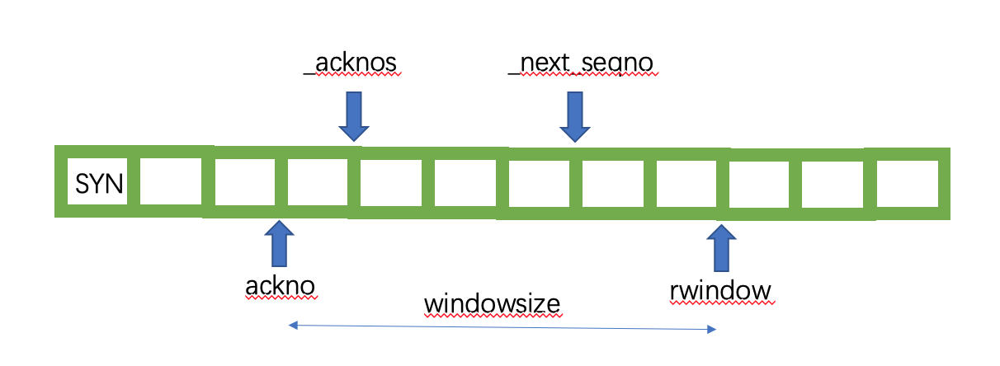

## Resources

[course ppt](./notes) : supplemented ppt

[lab handouts](./lab_handouts) : detailed lab descriptions

[exams](./exams) : midterm/final exams with solution

## Lab Session

The most wonderful part of this class is the labs. There are 8 labs in total, which guides you to implement a complete Internet infrastructure step by step. Here is a brief overview of each lab :

- Lab 0 : simple Internet applications 
- Lab 1 - 4 : implementation of the TCP protocols
  - Lab 1 : stream assembler
  - Lab 2 : TCP receiver
  - Lab 3 : TCP sender
  - Lab 4 : TCP connection
- Lab 5 : Network Interface 
- Lab 6 : IP routing
- Lab 7 : Putting it all together (Use your own Internet infrastructures to talk with each other, so cool ! )

#### Lab 1 : stream assembler (2 - 3 hour)

Related files : stream_reassembler.cc, stream_reassembler.hh

My implementation uses the idea of a fix-sized sliding window. I use a variable `unass_base` to record the index of the first unassembled byte, which is also the first byte of the sliding window. To simplify the implementation, I use a bitmap to indicate the current state of each byte in my slipping window. So when a substring being pushed into the assembler, I first mark the intersection of the substring and the window as assembled (in the bitmap). Then I call the `check_contiguous()` function to check if I can move the window further, i.e., assemble more bytes. A tricky part of my code is that to keep the sliding window's size fixed, whenever you kick one element out of the window, you should also push one placeholder into the window.

Caveat : eof of the incoming substrings does not mean all the substrings have been all assembled, because these substrings may come in any order, which means the last part of the string may come first, indicating the eof as true, but you should wait for all the substrings to come to finally end the input.

#### Lab 2 : TCP receiver (4 hour)

Related files : wrapping_integers.cc, wrapping_integers.hh, tcp_receiver.cc, tcp_receiver.hh

The code is quite short, but it's tricky to implement correctly. My implementation is a little bit messy : (, but it finally works : ).

#### Lab 3 : TCP sender (6 hour)

Related files : tcp_sender.cc, tcp sender.hh

Think twice before coding is not enough, I suggest that you read the handout at least five times and understand every single detail before coding. I wrote the code in about 1 hour, but spent the next terrible 5 hours debugging. I think the most tricky part of the lab is the concept of `window` and what happened when the window size is zero. To implement correctly, I suggest that you use one variable to record the window size of which the receiver advertised (I use _recx_windowsize) and use another variable to record the right edge of the window (I use rwindow) which the receiver has acknowledged (you does not need to record the left edge, since it's equal to _next_seqno). Hope the figure below can give you some intuition. From the figure you should know that each time the function fill_window() is called, you only need to send data between _next_seqno and rwindow.



Now spend some time to fully understand the below paragraph in Section 3.2.

```plaintext
⋆What should I do if the window size is zero? 
If the receiver has announced a window size of zero, the fill window method should act like the window size is one. The sender might end up sending a single byte that gets rejected (and not acknowledged) by the receiver, but this can also provoke the receiver into sending a new acknowledgment segment where it reveals that more space has opened up in its window. Without this, the sender would never learn that it was allowed to start sending again.
```

Here the "window size" means literally the window size of the receiver, i.e. the window size above in the figure. You should do what the above said only when the receiver has said that his window size is zero. So, when you find _next_seqno == rwindow, you should check the value of windowsize.

Also, I strongly suggest you treat the first SYN packet as a special case in the fill_window(). It will simplify your implementation and save you a lot of time.

#### Lab 4 : TCP Connection (3 hours)

Related files : tcp_connection.cc, tcp_connection.hh

Hints : 

- sender's fill_window() only push segments into its own segments_out(), it is not the same as TCPConnection's segments_out() ! So whenever you call sender's function which may send a segment, you need to pop the segment out of sender's segments_out(), add the ackno and window_size, and push it into TCPConnection's segments_out()

- It's a little bit tricky to decide where to check if need to linger after streams finish. Read the words below carefully which is in section 5.1 in the handout.

  ```
  Practically what all this means is that your TCPConnection has a member variable called linger after streams finish, exposed to the testing apparatus through the state() method. The variable starts out true. If the inbound stream ends before the TCPConnection
  has reached EOF on its outbound stream, this variable needs to be set to false.
  At any point where prerequisites #1 through #3 are satisfied, the connection is “done” (and active() should return false) if linger after streams finish is false. Otherwise you need to linger: the connection is only done after enough time (10 × cfg.rt timeout) has elapsed since the last segment was received.
  ```

  Briefly, you need to check right after the inbound stream has ended ! So when you first know that ? Obviously when you call the segment_received in TCPConnection because that is where you may get the FIN from the other peer.

#### Lab 5 : Network Interface (2 hours)

Easy and straightforward, I passed the tests after the first successful compiling.

#### Lab 6 : IP routing (1 hour)

Don't think too much about the efficiency, you may want to use Trie to do the longest-prefix-match, but the brute-force algorithm is enough to pass the tests. Remeber to handle the special case : 0.0.0.0/0 in the test's setting. 
