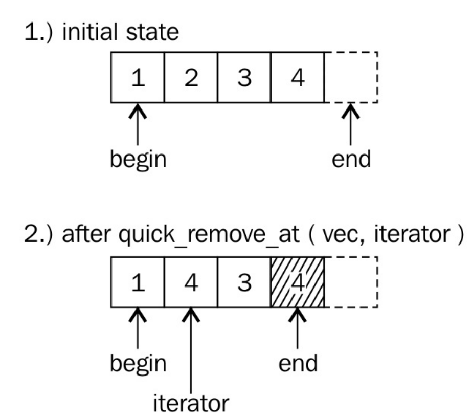

# 以O(1)的时间复杂度删除未排序std::vector中的元素

因为其他元素要填补删除元素所留下来的空隙，从而需要进行移动，所以从`std::vector`中删除元素的时间复杂度为O(n)。

移动其他元素也与此类似，当很多很大或很复杂的元素需要移动，那么就会花费很长的时间。当无法保证顺序时，我们需要对其进行优化，这就是本节的内容。

## How to do it...

我们继续使用一些数字来填充`std::vector`实例，并且实现一个快速删除函数，以O(1)的时间复杂度删除vector中的元素。

1. 首先，包含必要的头文件：

   ```c++
   #include <iostream>
   #include <vector>
   #include <algorithm>

   int main(){
       std::vector<int> v{123, 456, 789, 100, 200}; 
       quick_remove_at(v, 2);
       for (int i : v){
           std::cout << i << ", ";
       }
       std::cout << '\n';
       quick_remove_at(v, std::find(std::begin(v), std::end(v), 123));
       for (int i : v) {
      		std::cout << i << ", ";
       }
       std::cout << '\n';
   template <typename T>
   void quick_remove_at(std::vector<T> &v, std::size_t idx)
   {
       if (idx < v.size()) {
           v[idx] = std::move(v.back());
           v.pop_back();
       }
   }
   template <typename T>
   void quick_remove_at(std::vector<T> &v,
   				    typename std::vector<T>::iterator it)
   {
   	if (it != std::end(v)) {
           *it = std::move(v.back());
           v.pop_back();
       }
   }
   
   ```

10. 这就完事了。让我们来编译程序，并运行：

   ```txt
   $ ./main
   123, 456, 200, 100,
   100, 456, 200,
   ```

## How it works...

`quick_remove_at`函数移除元素非常快，而且不需要动其他元素。这个函数使用了更加具有创造性的做法：这是一种与实际元素交换的方式，然后将最后一个元素从`vector`中删除。虽然，最后一个元素与选中的元素没有实际的关联，但是它在这个特别的位置上，而且删除最后一个元素的成本最低！`vector`的长度在删除完成后，也就减少1，这就是这个函数所要做的。并且无需移动任何元素。看一下下面的图，可能有助于你理解这个函数的原理。



完成这两步的代码如下：

```c++
v.at(idx) = std::move(v.back());
v.pop_back();
```

迭代器版本实现几乎一模一样：

```c++
*it = std::move(v.back());
v.pop_back();
```

逻辑上，我们将选定元素与最后一个元素进行交换。不过，在代码中元素并没有进行交换，代码直接使用最后一个值覆盖了选定元素的值。为什么要这样？当我们交换元素时，就需要将选定的元素存储在一个临时变量中，并在最后将这个临时变量中的值放在`vector`的最后。这个临时变量是多余的，而且要删除的值对于我们来说是没有意义的，所以这里选择了直接覆盖的方式，更加高效的实现了删除。

好了，交换是无意义的，覆盖是一种更好的方式。让我们来看下这个，当我们要获取`vector`最后元素的迭代器时，只需要简单的执行`*it = v.back();`就行了，对吧？完全正确，不过试想我们存储了一些非常长的字符串在`vector`中，或存储了另一个`vector`或`map`——这种情况下，简单的赋值将对这些值进行拷贝，那么就会带来非常大的开销。这里使用`std::move`可将这部分开销优化掉：比如字符串，指向堆内存上存储的一个大字符串。我们无需拷贝它。只需要移动这个字符串即可，就是将目标指针指向这块地址即可。移动源保持不变，不过出于无用的状态，这样做可以类似的让目标指针指向源指针所在的位置，然后将原始位置的元素删除，这样做即完成了元素移动，又免去了移动消耗。