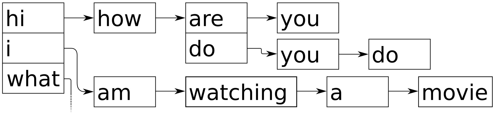

# 使用STL算法实现单词查找树类

所谓的trie数据类型，能够对感兴趣的数据进行存储，并且易于查找。将文本语句分割成多个单词，放置在列表中，我们能发现其开头一些单词的共性。

让我们看下下图，这里有两个句子“hi how are you”和“hi how do you do”，存储在一个类似于树的结构体中。其都以“hi how”开头，句子后面不同的部分，划分为树结构：



## How to do it...

   ```c++
   #include <iostream>
   #include <optional>
   #include <algorithm>
   #include <functional>
   #include <iterator>
   #include <map>
   #include <vector>
   #include <string>

   using namespace std;
    // 我们的实现中，trie为`map`的递归映射。每个trie节点够包含一个`map`，节点的有效值`T`映射了下一个节点：
   template <typename T>
   class trie
   {
    	map<T, trie> tries;
   public:
       template <typename It>
       void insert(It it, It end_it) {
           if (it == end_it) { return; }
           tries[*it].insert(next(it), end_it);
       }
   	template <typename C>
       void insert(const C &container) {
       	insert(begin(container), end(container));
       } 
   	void insert(const initializer_list<T> &il) {
   		insert(begin(il), end(il));
   	}
       void print(vector<T> &v) const {
           if (tries.empty()) {
               copy(begin(v), end(v),
               	ostream_iterator<T>{cout, " "});
               cout << '\n';
           }
           for (const auto &p : tries) {
               v.push_back(p.first);
               p.second.print(v);
               v.pop_back();
           }
       }
   	void print() const {
           vector<T> v;
           print(v);
       } 
       template <typename It>
       optional<reference_wrapper<const trie>>
       subtrie(It it, It end_it) const {
           if (it == end_it) { return ref(*this); }
           auto found (tries.find(*it));
           if (found == end(tries)) { return {}; }
           
           return found->second.subtrie(next(it), end_it);
       }
       template <typename C>
       auto subtrie(const C &c) {
       	return subtrie(begin(c), end(c));
       }
   };
    int main()
    {
        trie<string> t;
        t.insert({"hi", "how", "are", "you"});
        t.insert({"hi", "i", "am", "great", "thanks"});
        t.insert({"what", "are", "you", "doing"});
        t.insert({"i", "am", "watching", "a", "movie"});
    	cout << "recorded sentences:\n";
    	t.print();
        cout << "\npossible suggestions after \"hi\":\n";

        if (auto st (t.subtrie(initializer_list<string>{"hi"}));
            st) {
            st->get().print();
        }
    }
    ```

13. 编译并运行程序，其会返回两个句子的以“hi”开头的子trie：

    ```c++
    $ ./trie
    recorded sentences:
    hi how are you
    hi i am great thanks
    i am watching a movie
    what are you doing

    possible suggestions after "hi":
    how are you
    i am great thanks
    ```

## How it works...

有趣的是，单词序列的插入代码要比在子trie查找给定字母序列的代码简单许多。所以，我们首先来看一下插入代码：

```c++
template <typename It>
void trie::insert(It it, It end_it) {
    if (it == end_it) { return; }
    tries[*it].insert(next(it), end_it);
}
```

迭代器对`it`和`end_it`，表示要插入的字符序列。`tries[*it]`代表在子trie中要搜索的第一个字母，然后调用`.insert(next(it), end_it);`对更低级的子trie序列使用插入函数，使用迭代器一个词一个词的推进。` if (it == end_it) { return; }`行会终止递归。返回语句不会做任何事情，这到有点奇怪了。所有插入操作都在`tries[*it]`语句上进行，`std::map`的中括号操作将返回键所对应的值或是创建该键，相关的值(本节中映射类型是一个trie)由默认构造函数构造。这样，当我们查找不理解的单词时，就能隐式的创建一个新的trie分支。

查找子trie看起来十分复杂，因为我们没有必要隐藏那么多的代码：

```c++
template <typename It>
optional<reference_wrapper<const trie>>
subtrie(It it, It end_it) const {
    if (it == end_it) { return ref(*this); }
    auto found (tries.find(*it));
    if (found == end(tries)) { return {}; }

    return found->second.subtrie(next(it), end_it);
}
```

这段代码的主要部分在于`auto found (tries.find(*it));`。我们使用find来替代中括号操作符。当我们使用中括号操作符进行查找时，trie将会为我们创建丢失的元素(顺带一提，当我们尝试这样做，类的函数为`const`，所以这样做事不可能的。这样的修饰能帮助我们减少bug的发生)。

另一个细节是返回值`optional<reference_wrapper<const trie>>`。我们选择`std::optional`作为包装器，因为其可能没有我们所要找打tire。当我们仅插入“hello my friend”，那么就不会找到“goodbye my friend”。这样，我们仅返回`{}`就可以了，其代表返回一个空`optional`对象给调用者。不过这还是没有解释，我们为什么使用`reference_wrapper`代替`optional<const trie &>`。`optional`的实例，其为`trie&`类型，是不可赋值的，因此不会被编译。使用`reference_warpper`实现一个引用，就是用来对对象进行赋值的。