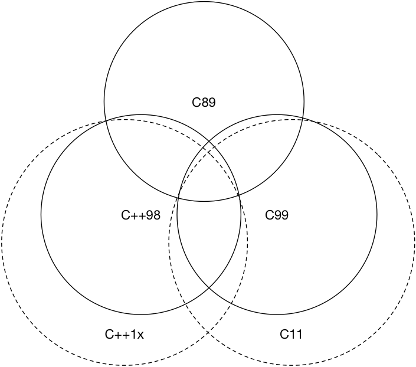

# 第 1 章 迈向现代 C++

[TOC]

**编译环境**：本书将使用 `clang++` 作为唯一使用的编译器，同时总是在代码中使用 `-std=c++2a` 编译标志。

```bash
> clang++ -v
Apple LLVM version 10.0.1 (clang-1001.0.46.4)
Target: x86_64-apple-darwin18.6.0
Thread model: posix
InstalledDir: /Library/Developer/CommandLineTools/usr/bin
```

## 1.1 被弃用的特性


- **不再允许字符串字面值常量赋值给一个 `char *`。如果需要用字符串字面值常量赋值和初始化一个 `char *`，应该使用 `const char *` 或者 `auto`。**

    ```cpp
    char *str = "hello world!"; // 将出现弃用警告
    ```

- **`register` 关键字被弃用，可以使用但不再具备任何实际含义。**

- **如果一个类有析构函数，为其生成拷贝构造函数和拷贝赋值运算符的特性被弃用了。**

- **特别地，在最新的 C++17 标准中弃用了一些可以使用的 C 标准库，例如 `<ccomplex>`、`<cstdalign>`、`<cstdbool>` 与 `<ctgmath>` 等**

- ……等等

还有一些其他诸如参数绑定（C++11 提供了 `std::bind` 和 `std::function`）、`export` 等特性也均被弃用。前面提到的这些特性**如果你从未使用或者听说过，也请不要尝试去了解他们，应该向新标准靠拢**，直接学习新特性。毕竟，技术是向前发展的。

## 1.2 与 C 的兼容性

出于一些不可抗力/历史原因,我们不得不在 C++ 中使用一些 C 语言代码(甚至古老的 C 语言代码),例如 Linux 系统调用.在现代 C++ 出现之前,大部分人当谈及"C 与 C++ 的区别是什么"时,普遍除了回答面向对象的类特性/泛型编程的模板特性外,就没有其他的看法了,甚至直接回答"差不多",也是大有人在.图 1.2 中的韦恩图大致上回答了 C 和 C++ 相关的兼容情况.



如果你是首次接触现代 C++，那么你很可能还看不懂上面的那一小段代码，即：

```cpp
[out = std::ref(std::cout << "Result from C code: " << add(1, 2))](){
    out.get() << ".\n";
}();
```

不必担心，本书的后续章节将为你介绍这一切。

[返回目录](./toc.md) | [上一章](./00-preface.md) | [下一章 语言可用性强化](./02-usability.md)

## 进一步阅读的参考文献

- [C++ 语言导学. Bjarne Stroustrup](https://www.amazon.cn/dp/B00WUBYBYS/ref=sr_1_1?ie=UTF8&qid=1522400738&sr=8-1&keywords=C%2B%2B+%E8%AF%AD%E8%A8%80%E5%AF%BC%E5%AD%A6)
- [C++ 历史](https://en.cppreference.com/w/cpp/language/history)
- [C++ 特性在 GCC/Clang 等编译器中的支持情况](https://en.cppreference.com/w/cpp/compiler_support)
- [C++98 与 C99 之间的区别](http://david.tribble.com/text/cdiffs.htm#C99-vs-CPP98)

