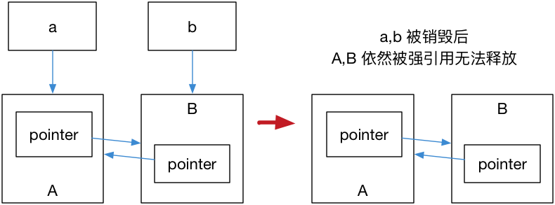

# 第 5 章 智能指针与内存管理

[TOC]

## 5.2 `std::shared_ptr`

```cpp
#include <iostream>
#include <memory>
void foo(std::shared_ptr<int> i) {
    (*i)++;
}
int main() {
    // auto pointer = new int(10); // illegal, no direct assignment
    // Constructed a std::shared_ptr
    auto pointer = std::make_shared<int>(10);
    foo(pointer);
    std::cout << *pointer << std::endl; // 11
    // The shared_ptr will be destructed before leaving the scope
    return 0;
}
```

`std::shared_ptr` 可以通过 `get()` 方法来获取原始指针，通过 `reset()` 来减少一个引用计数，
并通过`use_count()`来查看一个对象的引用计数。例如：

## 5.3 `std::unique_ptr`

`std::unique_ptr` 是一种独占的智能指针，它禁止其他智能指针与其共享同一个对象，从而保证代码的安全：

```cpp
std::unique_ptr<int> pointer = std::make_unique<int>(10); // make_unique 从 C++14 引入
std::unique_ptr<int> pointer2 = pointer; // 非法
```

> `make_unique` 并不复杂，C++11 没有提供 `std::make_unique`，可以自行实现：
>
> ```cpp
> template<typename T, typename ...Args>
> std::unique_ptr<T> make_unique( Args&& ...args ) {
>   return std::unique_ptr<T>( new T( std::forward<Args>(args)... ) );
> }
> ```
>
> 至于为什么没有提供，C++ 标准委员会主席 Herb Sutter 在他的[博客](https://herbsutter.com/gotw/_102/)中提到原因是因为『被他们忘记了』。

既然是独占，换句话说就是不可复制。但是，我们可以利用 `std::move` 将其转移给其他的 `unique_ptr`，例如：

```cpp
#include <iostream>
#include <memory>

struct Foo {
    Foo() { std::cout << "Foo::Foo" << std::endl; }
    ~Foo() { std::cout << "Foo::~Foo" << std::endl; }
    void foo() { std::cout << "Foo::foo" << std::endl; }
};

void f(const Foo &) {
    std::cout << "f(const Foo&)" << std::endl;
}

int main() {
    std::unique_ptr<Foo> p1(std::make_unique<Foo>());
    // p1 不空, 输出
    if (p1) p1->foo();
    {
        std::unique_ptr<Foo> p2(std::move(p1));
        // p2 不空, 输出
        f(*p2);
        // p2 不空, 输出
        if(p2) p2->foo();
        // p1 为空, 无输出
        if(p1) p1->foo();
        p1 = std::move(p2);
        // p2 为空, 无输出
        if(p2) p2->foo();
        std::cout << "p2 被销毁" << std::endl;
    }
    // p1 不空, 输出
    if (p1) p1->foo();
    // Foo 的实例会在离开作用域时被销毁
}
```

## 5.4 `std::weak_ptr`

如果你仔细思考 `std::shared_ptr` 就会发现依然存在着资源无法释放的问题。看下面这个例子：

```cpp
struct A;
struct B;

struct A {
    std::shared_ptr<B> pointer;
    ~A() {
        std::cout << "A 被销毁" << std::endl;
    }
};
struct B {
    std::shared_ptr<A> pointer;
    ~B() {
        std::cout << "B 被销毁" << std::endl;
    }
};
int main() {
    auto a = std::make_shared<A>();
    auto b = std::make_shared<B>();
    a->pointer = b;
    b->pointer = a;
}
```

运行结果是 A, B 都不会被销毁，这是因为 a,b 内部的 pointer 同时又引用了 `a,b`，这使得 `a,b` 的引用计数均变为了 2，而离开作用域时，`a,b` 智能指针被析构，却只能造成这块区域的引用计数减一，这样就导致了 `a,b` 对象指向的内存区域引用计数不为零，而外部已经没有办法找到这块区域了，也就造成了内存泄露，如图 5.1：



解决这个问题的办法就是使用弱引用指针 `std::weak_ptr`，`std::weak_ptr`是一种弱引用（相比较而言 `std::shared_ptr` 就是一种强引用）。弱引用不会引起引用计数增加，当换用弱引用时候，最终的释放流程如图 5.2 所示：


在上图中，最后一步只剩下 B，而 B 并没有任何智能指针引用它，因此这块内存资源也会被释放。

`std::weak_ptr` 没有 `*` 运算符和 `->` 运算符，所以不能够对资源进行操作，它可以用于检查 `std::shared_ptr` 是否存在，其 `expired()` 方法能在资源未被释放时，会返回 `false`，否则返回 `true`；除此之外，它也可以用于获取指向原始对象的 `std::shared_ptr` 指针，其 `lock()` 方法在原始对象未被释放时，返回一个指向原始对象的 `std::shared_ptr` 指针，进而访问原始对象的资源，否则返回`nullptr`。
