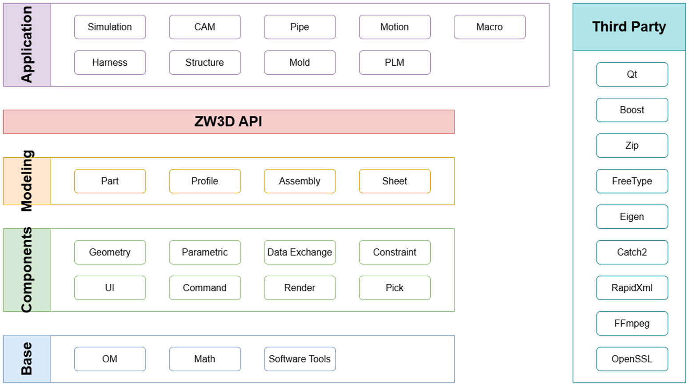

## 3d

### 1. 新员工通关地图
- 编译
- vs2019 + va

### 2. 工程开发须知
https://zwiki.zwcax.com/pages/viewpage.action?pageId=137928869

#### 2.1 vs
#### 2.2 开发规范clang-format
#### 2.3 clang-tidy
#### 2.4 cmake
#### 2.5 git
#### 2.6 集成


### 3. zw3d



#### 3.1 framework
* framework
  - Base
      - OM/db：object manager
        - containers
        - global ID
        - 跨文件引用？
        - 通知、观察者
        - 事务
        - 序列化
        - 压缩
        - migration?
        - bin
        - segment？
      - Math：
      - tools：
        - multithread
        - expressParser
        - file IO
        - string
        - logging
        - network
        - profiling
        - cross platform
        - memory pool
        - raii
        - command 
        
  - render概念
    
  - Application
    - cad
      - Modeling
          - detailed-task
            - part：零件
            - Profile：草图
            - Assembly：装配
            - Sheet：钣金
          - concepts:
            - vdata, wire, profile, expression, dimension
            - beep, attributes
            - udf, pattern, reference, copy/paste
            - defeature, static entity
            - rolling
            - dependency, selective regen, suppress
            - labeling, regen
      - Components
        - Geometry
        - Parametric：参数化
        - Data Exchange：数据交换，导入导出？
        - Constraint：约束
        - UI：user interface，图形和交互等
        - Command：命令
        - Render：渲染
        - Pick：选择
    - cam
    - plm
    - 仿真
  - Zw3D_API
    - 二次开发 
  - Third Party
    - qt
    - boost
    - zip
    - freeType
    - eigen
    - catch2
    - repaidXml
    - ffmpeg
    - openSSL

##### 3.1.2 software tools
##### 3.1.3 om
  * zw3D数据安全性.pptx
##### 3.1.4 parametric
##### 3.1.5 geometry
##### 3.1.6 render

### 4. macros
https://zwiki.zwcax.com/pages/viewpage.action?pageId=110329859

### 97. 待整理
* 特征/ 永久命名概念

### 98. 有用的
* log
    zw3d/debugx64/output/logs/xxxxx.log
    有日志
* resource
    * driver/text
    * 存放资源文件
* vs
    debug->windows有宝藏
    * 全局变量输出打印？
    * 内存破坏-https://zwiki.zwcax.com/pages/viewpage.action?pageId=52658797
    * info信息-https://zwiki.zwcax.com/pages/viewpage.action?pageId=23691649

### 99. quiz
#### 1. 什么是 ribbon？

ribbon 是什么？ribbon 是一个概念，是一个界面的概念。
如果翻译成一个能够望文生义的名字，则应该叫工具栏。
ribbon 一般会包含多个选项卡，每个选项卡下面有一组命令和工具，使用户能够更高效使用软件。

#### 2. 什么是 tcmd？

#### 3. 测试方案？
* catch2和gtest都是用于单元测试的
* 两者都支持是不同团队开发偏好导致的。
* 宏，宏表示的是一组可以重复使用的指令序列。多用于办公软件、cad软件、游戏中
  * 办公软件：录制一个宏，可以用于自动化重复处理相同工作。
  * 游戏：
    * 鼠标宏：一组鼠标操作
    * 键盘宏：一组按键操作
  * CAD：
    * 也是录制宏的方式，宏录制完了之后，一般会转为字符串存储，可以包含操作（如画圆），变量（如圆心位置）等等描述如下所示：
    ```ini
      ^C^C_LINE
      0,0
      10,10
      ^C^C_CIRCLE
      5,5
      3
    ```
    * 如果想要重复操作，程序只需要提供解析宏的能力，重新执行一遍操作，即可复现用户的操作步骤。


#### 4. cmake的格式化
* 服务器的.git仓库配置cmake-format工具，对所有提交代码进行格式化。
* 服务器的配置pre-receive(receive push)，显示修改的还是推送用户，而不是服务器的git账号。
