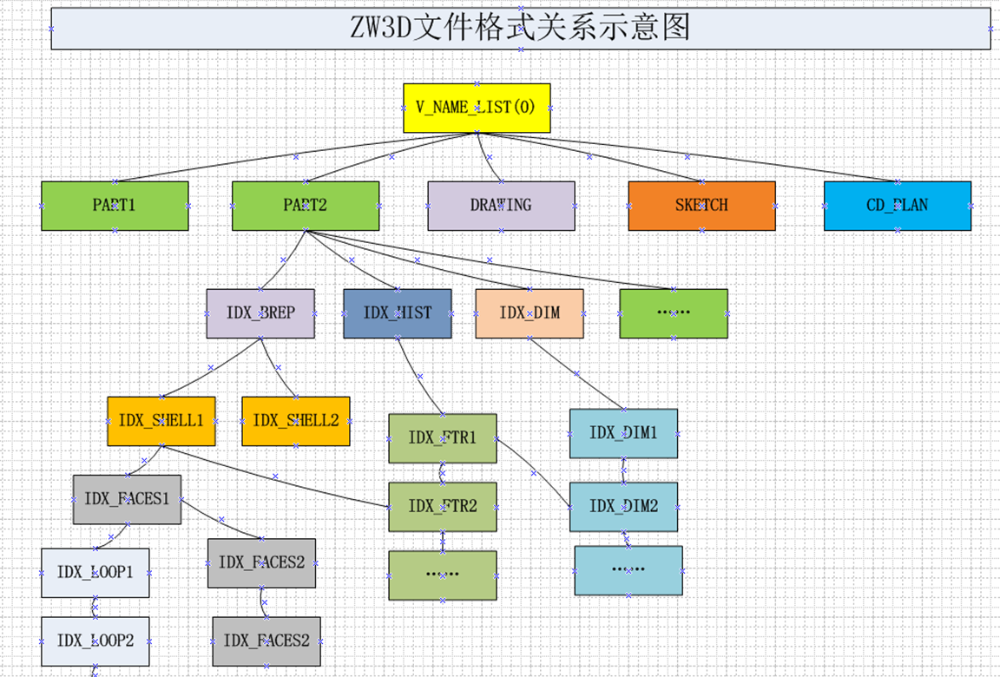
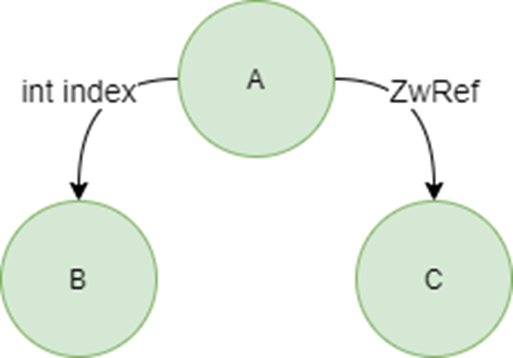

## om

### 1. framework

ZW3D的数据库，逻辑上大体是一个网状结构，它的顶层是一个根对象列表，也就是像零件、装配、工程图这样的文件级别的对象，然后每个根对象管理各自的数据。数据对象之间存在复杂的相互引用。比如part下面有历史树、brep，历史树上的特征会引用brep下面的shell。

组织方式——网状数据库
由根对象列表（NameList，id=0）往下遍历子对象，对象之间还会存在互相引用的关系，如图所示。

* OM核心层：
    负责数据库对象的组织、存储与生命周期管理。
    实现了事务机制、持久化、对象拷贝、对象版本兼容、一致性检查等机制的框架。
* OM接口层：
    1. 提供基本数据结构及其算法（旧）：group；inherit。。
    2. 定义对象之间引用的方式：int index； ZwRef<T>。
    3. 提供数据库对象的增、删、改、查接口。
        增： OmObjAdd/ ZwCreate，ZwNew。
        删： OmNetDel/ ZwDelete。
        改：OmObjMod/ 调用对象成员函数修改。
        查：OmUpdHandle/ 通过ZwRef可直接拿到对象数据
    4. 上层通过重写Meta方法实现自定义对象的事务、持久化、拷贝、版本兼容、一致性检查等功能。
        事务：默认记录事务，通过特殊标记不记录/ xn_copy_to()。
        持久化：覆写Io方法/ save()&load()。
        拷贝：覆写Trav、Map方法/ collect_for_copy()、map_for_copy()。
        版本兼容：覆写Io、Revise方法/ load_migrate()。
        一致性检查：覆写Fix方法/ check_or_fix()。
    5. 提供观察者架构，可以监控数据库对象的变化，执行回调函数。

### 99. ref
更多资料请参考：
数据引擎组文档库：比较正式的对外文档库。
数据引擎组BBS：不太正式，用于OM内部共享。
新架构设计文档：如题。
https://zwiki.zwcax.com/pages/viewpage.action?pageId=80548848
https://zwiki.zwcax.com/pages/viewpage.action?pageId=13271928
https://zwiki.zwcax.com/display/Platformarchitecture/New+Generation+OM
culling