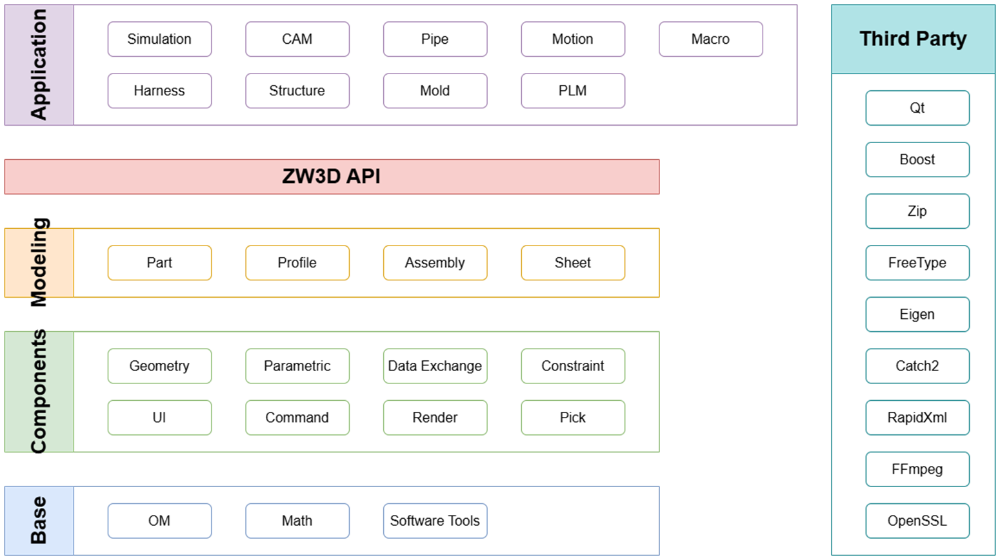

- Application
  - 仿真、cam、plm
- Zw3DAPI
- Modeling
  - part：零件
  - Profile：？
  - Assembly：装配
  - Sheet：
- Components
  - Geometry
  - Parametric：参数化
  - Data Exchange：数据交换，导入导出？
  - Constraint：约束
  - UI：user interface，图形和交互等
  - Command：命令
  - Render：渲染
  - Pick：选择
- Base

  - OM：object manager
  - Math：/

- Third Party

- OM 概念

  - global ID
  - 跨文件引用？
  - 通知、观察者
  - 事务
  - 序列化
  - 压缩
  - migration?
  - bin
  - segment？
  -

- Tool 概念
  - 多线程
  -
