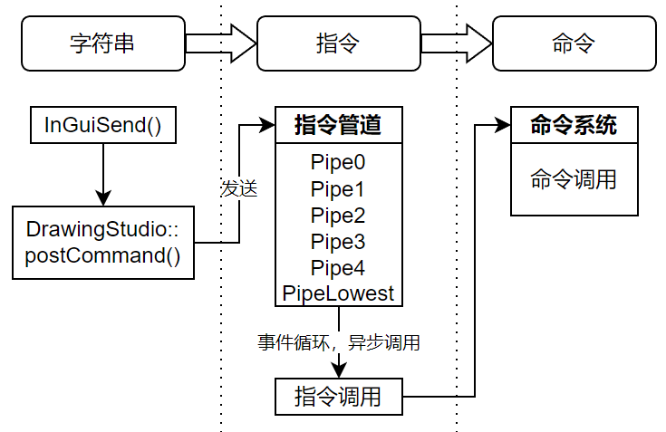

## 指令管道

### 1. 原理

* 指令管道的作用是实现指令异步？指令管道是用于缓存指令的容器。
* 指令异步的原理是：指令发送的时候，先将其缓存在某个队列容器，等到合适的时机，从队列中取出调用。
* 指令：字符串
* 指令系统：根据

instruction

前面提到管道其实是一个队列容器。它的规则就是先进先出，即先发送的指令先执行。而对于某些指令，我们并不希望它太早被执行，那么就需要想办法降低它的优先级。ZW3D的做法就是预设多条指令管道，那些低优先级的指令就post到低等级管道。最典型的例子就是宏系统（见第四节）。

前面提到管道其实是一个队列容器。它的规则就是先进先出，即先发送的指令先执行。而对于某些指令，我们并不希望它太早被执行，那么就需要想办法降低它的优先级。ZW3D的做法就是预设多条指令管道，那些低优先级的指令就post到低等级管道。最典型的例子就是宏系统（见第四节）。

> 对于需要立即执行的指令，请直接使用InGuiProcStr()，而不要使用InGuiSend()+uiEvtProcessAll()的形式！！！

* postCommand:命令放入队列中，命令被异步处理。  
* sendCommand:立即发送命令，同步处理命令；命令会在sendEvent调用时立即处理；