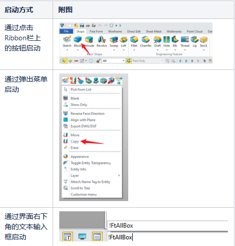

## tcmd

### 1. concepts

#### 1.1 什么是tcmd？
模版命令(template command)，其对应文件是其英文名称的缩写tcmd。tcmd本质就是一个xml文件。通过tcmdEditor去解析，就可以实现功能了。这种设计其实挺常见的，比如说模板语言和配置文件。

> **什么是模板语言？有哪些模板语言？**
> 模板语言的核心思想是将静态模板与动态数据结合起来生成最终的输出。
> 比如说，常见的qt的`.ui`就是一种模板语言，qt-designer通过一些.xml解析工具类似的方式去decoder和encoder一个.ui文件出来。这个.ui文件会在`uic`工具被转为c++语言，uic会在预处理阶段被调用，然后进一步参与编译生成二进制文件。
> 模板语言更强调生成目标代码

> **什么是配置文件？**
> 配置文件一般都是使用常见的`json`，`xml`，`ini`等格式作为配置。使用其对应解析器，去处理键值对，然后完成业务逻辑。

因此，严格来说，tcmd是一种更接近于配置文件的，但解析器能处理的键值对依赖于规则解析，因此更像是一种参照模板填写配置，因此得名为template command。

#### 1.2 tcmd能用在什么场景？tcmd能做什么？

一般来说，当我们开发的功能需要与绘图区交互时，就需要使用模板命令。

”绘图区交互“指：

    预览显示（Echo）；
    拾取物体（Pick）；
    动态拖拽（DDD）；

Echo：预览。echo这个单词本身的意思是“回声”。当命令被确认之前，我们可以先根据用户输入的参数创建临时的“幻象”显示在绘图区，这便是echo。

Pick：拾取。使用鼠标在绘图区上面移动或点击，可以对实体进行拾取。这里所说的实体，包括面、边、线、点等等。注意，并不是一定要发生“鼠标点击”才算是pick，鼠标在绘图区上面移动并触发实体高亮的过程，实际上就是在进行pick了。

DDD：动态拖拽标注（Dynamic drag dimension），是一种可以直接在绘图区上进行拖拽交互的标注。详细请参考《动态拖拽标注(DDD)开发指引》https://zwiki.zwcax.com/pages/viewpage.action?pageId=90046752

#### 1.3 tcmd怎么用？
##### 1.3.1 模板命令启动

##### 1.3.2 模板命令启动

#### 1.4 tcmd的进一步理解
* ==tcmd是一个对象==
    tcmd是一个xml文件，通过键值对解析之后，可以理解为是对一个对象带着不同参数。
    每个参数都可以与vdata关联？
* ==模板命令是通过指令触发的？==

### 2. impl

---
tcmd文件不一定有对应的ui文件。一个模板文件当中，可能有多个模板名称的配置项。更多信息请参考其他文档。

模版命令分类
主命令，tcmd中主要设置回调函数相关属性，参考《模板命令回调机制》。
多级子命令，tcmd需要设置child属性与repeatable属性。
辅助命令，tcmd需要设置level属性。
一、模板命令调用
1.什么是模板命令调用

       模板命令调用是当点击一个功能，通过命令调用打开form的一个过程。

2.模板命令调用方式有哪些
正常调用，指在没有打开其他功能的情况下打开一个功能
多级调用，指在打开一个form的情况下，通过利用下拉栏等方式打开一个命令，打开新的form，两个form不能同时显示，两个form之间存在数据交互关系。
辅助调用，指在打开一个form的前提下，调用辅助命令。
嵌套子form调用，指打开form的时候，存在同屏显示的子form。
VxInput。
3.为什么存在多种调用方式

       调用方式的多样化适应不同的应用场景。

用户最常用的场景是直接通过点击命令打开，此时只需要在命令管道当中发送对应的命令即可。例子：FtAllbox
但用户希望通过调用其他的命令，获取数据并返回到原本使用的命令，比如通过测量的长度来决定绘制线的长度。例子：CdDstAllChld
除此以外，用户希望在不影响当前命令的情况下修改当前的已经创造的实体，而且需要执行的命令是模版命令，比如隐藏当前绘图区的实体等等。例子：CdBlankPart
UI设计时存在很多可以重复使用的组件，我们希望通过同屏的关系显示出来。例子：Chamfer命令下的FtChamEdgSet。
输入时希望能够一选中对象即执行命令，不需要再去点击确定。例子：CdMatInpSk

       保证命令的正常执行并能够在不同命令之间流转，这需要多种调用方式。

二、不同模板命令调用方式

首先，我们需要知道一条模版命令从生成到结束所经历的过程。

重点：有且只有一条模版命令在同一时间处于执行状态。这一点对于理解我们的调用方式非常关键。

图1 模版命令从激活到完成的过程
1.正常调用

       正常调用指在ribbon栏点击对应相应项新建调用对应的命令，这是最为常见的调用方式。

命令中默认为主命令，需要设置对应的属性，具体属性设置请看《模板命令回调机制》文档。

A.直接打开主命令 && 在打开一个命令的情况下打开另一个主命令

图2 激活中init与init after触发顺序

execute在执行新的主命令时将会terminate当前命令，也就是当前命令的数据将不会保存。

调用主命令需要注意init与init_after的时间，对界面的设置需要放在init_after。

2.多级调用

       多级调用指的是在打开一个form的情况下，通过利用下拉栏等方式打开一个命令，打开新的form。原来的form等待新打开的form完成以后，重新激活。

图3 多级调用
A.使用多级调用方法

多级调用的为多级子命令，我们需要在tcmd当中设置以下属性使命令成为子命令。

图4 多级子命令设置

child属性为1表示为当前为子命令，repeatable属性设置为false避免刚关闭在主界面通过中键唤醒。

在parm当中child对应child，repeatable对应last_tpl。

图5 创建命令流程对以上两个属性的设置

B.多级调用三原则
模版多级子命令，可以多层执行
模版多级子命令执行，不计算层次，也就是主命令的多级子命令执行，视作主命令执行
模版多级子命令的优先级与对应的根命令相同

       多级命令在逻辑上是有父子关系的，子命令当中的数据是需要回传到父命令当中。

图6 多级调用流程
3.辅助调用

       辅助调用中的辅助命令则是指类似于mid widget和inquire上的一些辅助操作，如blank、measure。我们在操作过程中，往往需要做一些不影响当前form数据的辅助操作，这时候我们需要进行辅助调用辅助命令，在使用完成后又能够返回原来正在操作的form，并且数据没有丢失。

图6 Mid Widget中的辅助命令

图7 Inquire中的辅助命令
A.辅助调用使用方式

辅助调用关键为设置命令为辅助命令，是否为辅助命令在tcmd当中<level>属性设置。设置为1表示为辅助命令。详细设置与辅助命令的分类见下图。

图8 CdBlankPart的属性设置

图9 辅助命令分类
B.与嵌套调用的不同

       辅助命令在调用后不需要返回数据。辅助命令只是在调用关系上承接了，实际上还是互相独立的命令，甚至可以理解为是在最基础的环境上进行的命令执行。

图10 辅助命令详细流程

       我们可以发现，在执行新的命令时，挂起操作是针对于辅助命令的，若新命令为辅助命令且当前命令并非希望的新命令，则对当前命令进行挂起。

      当然，挂起操作针对挂起的队列的不同情况有不同处理，incmdpatcher模块当中对大多数情况都进行了判断。挂起操作在execute中进行。下面是其流程图。

图11 执行当中的挂起流程
当队列为空时，若当前命令与希望执行的命令相同，则将其终止，再放到命令管道中重新执行；如果命令不相同，则将当前命令挂起。
当队列不为空时，则需要判断上一条最后挂起的命令与当前命令是否为父子关系。如果是，则可以将当前命令挂起；如果不是，则需要将队列中保存的命令清空。
C.辅助命令中的auto_pause
I.auto_pause使用方式与使用场景

auto_pause属性应用在需要创造辅助特征的场景下，需要tcmd中两个属性，form_id与pause_id，这两者是相对应的。

这个form id的设置与form数据的返回类型相关，比如新建草图命令会返回VPROF，则这里设置为70。

并且form id所在的命令必须为根命令。

图12 CdProfNew所设置的form id
图13 Ftholemain中设置的pause_id

图14 pause_id的读取
II.暂停操作的意义

       为什么需要暂停操作，这与挂起操作有何不同？我目前并不确定他的目的。经过测试，同时满足以上条件的只有在控件下拉栏使用与草图相关的命令。

我认为当创建辅助特征并需要切换环境的情况下，需要先保存当前界面数据，再进行下一步的操作，这时候就需要使用auto_pause功能保存当前的命令。

III.与挂起操作的区别

       在打孔命令当中调用新建草图命令，这时候新建草图将创建辅助特征，在activate parm过程中发送"|FormReturn"命令。

进入finish过程当中，通过autopausecmd与stackcmd的对比，将识别到上一步完成了autoPause操作，避免重新激活stackcmd当中的命令。

这时候autoPause与suspend存在区分。

       以下为在execute过程当中对不同情况的判断。

       

图15 execute三种情况的判断流程
4.嵌套子form调用
A.嵌套子form定义与意义

       我们在ui文件中常常看到formproxy类型，这就是嵌套子form，通过激活流程或者点击能够激活子form当中的控件，子form与父form之间也可以进行数据交流。

图16 嵌套子form表现

       嵌套子form的存在就有两个作用：

对基础功能的form进行复用。
适配setlist功能。对于setlist功能请参考SetList文档。
B.子form的设置方法

       子form实际上是多级子命令的一种表现形式，其两者的设置是比较类似的。

图17 子form的执行流程
I：主form中设置

图18 主form中设置
设置type=“form”。
property template中设置对应的子form名称。
comp属性对应setlist功能，参考对应文档。
II：子form中设置

图19 子form中设置
设置“child”属性为true。
设置“parent_form”为1。
C.子form的调用逻辑
I：进入嵌套子form逻辑

图20 嵌套子表单激活流程

当点击或者打开form的激活流程时，此时程序仍在主命令当中，在激活到类型为form类型的parm时，对应的activate()将根据tcmd中comp属性发送对应的命令。

II：退出子form逻辑

退出子form的关键在于找准时机进行ZsInCmdSwithch()或ZsInCmdReturn()等结束命令操作重新切换到主form当中。

目前有两种情况：

设置了setlist将会在绑定控件的slot函数当中触发
未设置的将会在form设置的回调函数中触发
5.VxInput
A.VxInput描述与使用场景

       VxInput的描述如下：使用指定的模板收集输入数据。在这个函数中等待，直到数据收集完毕。通过idx_data_out进行输出。如果输入的idx_data_in<0，则分配一个新的数据文件。其他情况则是对原有的idx进行编辑。如果idx_data_out的数据被InFormTerm()或者InFormTermAll()删除，这表明用户希望在VxInput()的过程中执行其他命令。

       VxInput的关键在于重新开启事件循环，并在其中进行数据获取。目前我发现两个使用场景，一是在装配树双击进入在位编辑的时候，另一个是调用嵌套子命令打开新form，vxinput会等待你的输入（inwait），输入完成后继续后面的函数，重新激活进入vxinput时执行的函数。

B.VxInput参数介绍

       VxInput与VxInputNoAct通过设置不同的参数调用VxInputUtil。

参数名	参数含义	VxInput设置	VxInputNoAct设置
name	form模板名称	name	name
idx_data_in	数据对象(-1表示未设置)	idx_data_in	idx_data_in
fld_id	数据id(-1表示未设置)	-1	-1
fReAct	是否重新激活父form	1	0
*idx_data_out	返回的vdata地址	idx_data_out	idx_data_out
rtn_to_wait	是否返回数据到wait函数	1	1
表1 VxInputUtil参数

两者的差距只有是否重新激活父form。

C.VxInputUtil的函数流程

图21 VxInputUtil流程图

在这过程中escaper的清空再恢复的原因在于，创建新的事件循环需要对escaper进行初始化，只有当escaper中的esc操作清空后才会进行初始化。

四、模版命令调用目前问题
1.VxInputUtil中eventloop导致的问题

       当在vxinput的inwait的过程中切换文档，程序将会先激活新的文档再进行leaveloop操作，这时候恢复到原来form的操作已经对错误的数据进行操作，导致问题。

优化：在切换文档时加上退出事件循环的判断，不过涉及位置很广，工作量较大。

2.同一层级子form之间的切换

       如果像Chamfer或Fillet功能主form中同级嵌套着多个子form的情况，在子form之间切换，由于需要进行ZsInCmdSwitch()操作，在主form之中保存的临时状态如picklist的选中状态将会消失，在使用上是影响体验的。

3.在打开一个命令的时候，通过点击历史树的方式打开辅助命令

       历史树对于辅助命令的操作可能导致无法将选中对象加入entity的缓存当中。

### 99. quiz
1. 什么是vdata
2. 指令