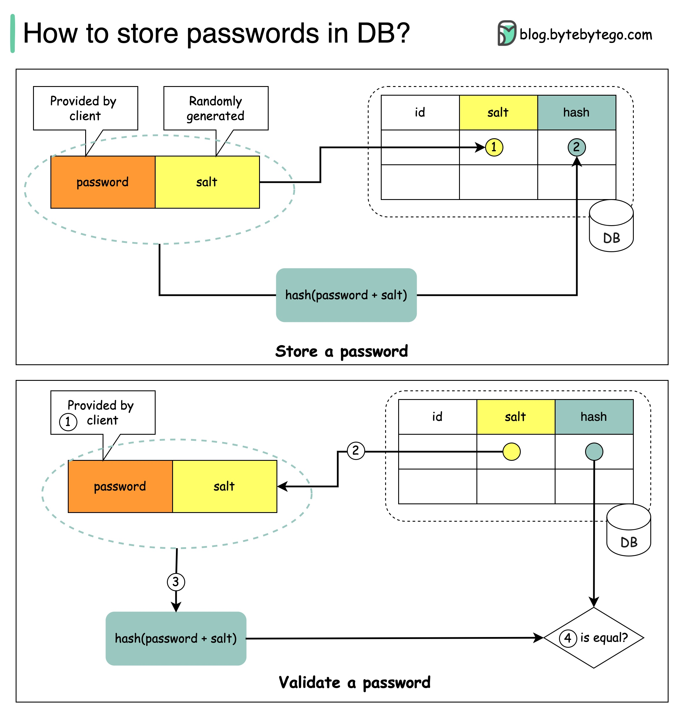

## 网络安全

### 1. DNS

#### 1. 针对DNS服务器的攻击

- ***是什么？***

  ​	通过随机生成一些域名，向DNS服务器发起解析，由于DNS本地一般不会有随机生成的域名结果，就会递归往上查询。如果有很多域名解析请求就会导致DNS服务器崩溃。

- ***怎么应对？***

  ​	因为DNS无法判断一个域名到底是恶意的，还是非恶意的，所以还是逃不了应搜尽搜。唯一的解决思路就是判断请求是否恶意，如果短时间某个IP地址发起大量请求，就对其进行限制

  - 对突然发起大量相应频度低(即没什么人搜索的域名)进行带宽限制
  - 对突然发起大量相应频度低(即没什么人搜索的域名)设置低优先级
  - 限制每个IP的域名解析次数

#### 2. DNS劫持

- ***是什么？***

  ​	攻击或者伪造域名解析服务器(DNS)，把目标域名解析到错误的地址，导致用户无法正确访问网站，或被引导到冒牌网站，导致被骗的风险。

- ***具体实现方法是？***

  - 本地电脑被恶意入侵，本地DNS配置(hosts文件、DNS服务器地址、DNS缓存)

    > 本地的dns就是hosts，DNS缓存是避免高频次使用网站每次都要查

  - 路由器存在漏洞，被入侵并篡改配置

- ***怎么应对？***

  ​	总的来说，预防大于根治，DNS劫持挺难防范的，做好防范木马，关闭不必要的DNS解析就差不多了。更多的DNS防止劫持方法看[这里](https://www.dns.com/supports/1630.html)

### 2. 中间人攻击

- ***prerequisties***

  - https

- ***是什么？***

  > [什么是中间人攻击](https://zhuanlan.zhihu.com/p/62025258)

  ​	是指攻击者与通讯的两端分别创建独立的联系，并交换其所收到的数据，使通讯的两端认为他们正在通过一个私密的连接与对方 直接对话，但事实上整个会话都被攻击者完全控制。在中间人攻击中，攻击者可以拦截通讯双方的通话并插入新的内容。中间人攻击是一个(缺乏)相互认证的攻击。

  ​	大多数的加密协议都专门加入了一些特殊的认证方法以阻止中间人攻击。例如，SSL协议可以验证参与通讯的一方或双方使用的证书是否是由权威的受信任的数字证书认证机构颁发，并且能执行双向身份认证。

- ***具体实现方法***

  1. 客户端发送请求到服务端，请求被中间人截获。

  2. 服务器向客户端发送公钥。

  3. 中间人截获公钥，保留在自己手上。然后自己生成一个【伪 造的】公钥，发给客户端。

  4. 客户端收到伪造的公钥后，生成加密hash值发给服务器。

  5. 中间人获得加密hash值，用自己的私钥解密获得真秘钥。同时生成假的加密hash值，发给服务器。

  6. 服务器用私钥解密获得假密钥。然后加密数据传输给客户端。

     

- ***怎么应对？***

  - 在与server通信前，我们会先查询网站的证书，证书能保证对方就是server，如果证书不正确则有可能被中间人攻击了。

    

  - 而这个证书的校验依赖于CA机构，而CA结构是比较权威的机构，一般来说都是选择相信。

  - 至于，证书被伪造之类的，读者有兴趣可以看[这个](https://www.zhihu.com/question/37370216)

### 3. 分布式拒绝服务攻击Ddos

- ***是什么？***

  ​	攻击者发出海量实际上并不需要的互联网流量，致使目标服务器的资源耗尽，从而无法正常提供服务。

- ***具体实现方法是？***

  ​	在古早技术年代，一般需要攻击者的宽带大于目标服务器的宽带，所以你发送的无用请求才能大于人家接受能力。

  ​	随后，随着技术的发展，攻击者可以操控一些受到恶意软件感染的机器，或者说一些古早机器仍然使用win98，而这些老系统存在一些系统漏洞，可能就不知不觉地被操作了。而这些被操控的机器被叫做[僵尸网络](https://www.cloudflare.com/zh-cn/learning/ddos/what-is-a-ddos-botnet/)。僵尸网络可能存在成千上万个，甚至数十万到数百万，庞大的僵尸网络总能够发出足够的流量冲击你的服务器。

  ​	除此之外，还有一种伪装服务器IP的方式，向校时服务器发送请求，而目前的时间矫正协议，有一个设计很愚蠢的指令，能够返回600个向校时服务器请求过时间的机器的信息。而校时服务器有很多，且宽带巨大。

  ​	那使用僵尸网络伪装服务器向校时服务器发送指令，校时服务器就会向目标服务器发出巨大的流量，足以导致任何一个服务器崩溃。这是一个流量放大的操作。

  > 感兴趣的可以看这个[科普视频](https://www.bilibili.com/video/BV1t5411Y7jr?spm_id_from=333.337.search-card.all.click)

- ***怎么应对？***

  ​	其实最先进的DDos攻击可以达到Tb的单位，因为根本就无法识别一个新请求到底是不是恶意的，所以面对所有新的请求都得处理。也就是说DDos方法操作都是基于如何扩容的。

  ​	而目前的DDos防护都是以G，几G到几百G的，越高越贵。可以说没有绝对能够防住的，都是缓解。好就好在，黑客团队一般都是攻击非法网站为主。

  - **提高宽带：**但不是一点钱能搞定的，很贵。

    > 果壳网彼时只买了不足100M带宽，所在早期机房总带宽也不足40G，攻击带宽都没见过低于10G的(机房的人后来告诉我的)。假设某便宜机房(肯定不在北上广深)，带宽价格为100元/M*月，每月按峰值计费。则要买10G带宽顶一下，需要的月费是100万

  - **CDN服务：**CDN服务可以将对源节点的访问，改变成就近的CDN节点，但是因为CDN节点和源节点的同步问题，当前的分发技术不允许CDN提供商做到动态网页加速，也就是只能CDN服务只能保住静态网页。

  - **分布式集群防御：**分布式集群防御的特点是在每个节点服务器配置多个IP地址，并且每个节点能承受不低于10G的DDoS攻击，如一个节点受攻击无法提供服务，系统将会根据优先级设置自动切换另一个节点，并将攻击者的数据包全部返回发送点，使攻击源成为瘫痪状态，从更为深度的安全防护角度去影响企业的安全执行决策。

  - 总的来说，很少有什么好的解决方法，上云由云服务厂家解决是比较好的方法。

  - [更多方法方法查看这里](https://www.zhihu.com/question/19581905)

#### 3.1 SYN攻击

- ***是什么***

  ​	SYN攻击是DDos攻击最常见的一种，下面简单介绍一下

- ***具体实现***

  - 直接攻击：不伪造IP地址直接发送大量SYN包，屏蔽IP地址即可
  - 伪造ip攻击：伪造IP发送SYN包，如果是伪造IP需要对数据包溯源，除非网络运营商愿意配合，否则不好实现
  - 僵尸网络攻击：使用僵尸网络发送SYN包

- ***怎么应对***

  - 如果队列慢的时候，回收最先创建的TCP半开链接
  - cookie，对每一个SYN包都会回复，SYN-ACK数据包，但是之后服务器就会删除该请求，如果再收到ACK包的时候，再重建

### 4. SQL注入

- ***是什么***

  ​	在网站里面，如果程序没有对用户输入数据的合法性进行判断和处理，就有可能受到SQL注入攻击。因为你的输入数据，是转变为SQL语句到数据库进行查询或者说校验工作的。如果没有对输入数据进行校验，输入数据有可能就夹杂着一些本来不该允许的SQL语句，如查询管理员账户密码、或者说删除数据库等。

- ***具体实现***

  - **恶意拼接查询**

    - 我们知道，SQL 语句可以查询、插入、更新和删除数据，且使用分号来分隔不同的命令。例如：

      `SELECT * FROM users WHERE user_id = $user_id`

      其中，user_id 是传入的参数，如果传入的参数值为`“1234; DELETE FROM users”`，那么最终的查询语句会变为：

      `SELECT * FROM users WHERE user_id = 1234; DELETE FROM users`

      如果以上语句执行，则会删除 users 表中的所有数据。

  - **利用注释执行非法命令**

    - SQL 语句中可以插入注释。例如：

      `SELECT COUNT(*) AS 'num' FROM game_score WHERE game_id=24411 AND version=$version`

      如果 version 包含了恶意的字符串`'-1' OR 3 AND SLEEP(500)--`，那么最终查询语句会变为：

      `SELECT COUNT(*) AS 'num' FROM game_score WHERE game_id=24411 AND version='-1' OR 3 AND SLEEP(500)--`

      以上恶意查询只是想耗尽系统资源，SLEEP(500) 将导致 SQL 语句一直运行。如果其中添加了修改、删除数据的恶意指令，那么将会造成更大的破坏。

  - **传入非法参数**

    - SQL 语句中传入的字符串参数是用单引号引起来的，如果字符串本身包含单引号而没有被处理，那么可能会篡改原本 SQL 语句的作用。 例如：

      `SELECT * FROM user_name WHERE user_name = $user_name`

      如果 `user_name` 传入参数值为 `G'chen`，那么最终的查询语句会变为：

      `SELECT * FROM user_name WHERE user_name ='G'chen'`

      一般情况下，以上语句会执行出错，这样的语句风险比较小。虽然没有语法错误，但可能会恶意产生 SQL 语句，并且以一种你不期望的方式运行。

  - **添加额外条件**

    - 在 SQL 语句中添加一些额外条件，以此来改变执行行为。条件一般为真值表达式。例如：

      `UPDATE users SET userpass='$userpass' WHERE user_id=$user_id;`

      如果 `user_id` 被传入恶意的字符串`“1234 OR TRUE”`，那么最终的 SQL 语句会变为：

      `UPDATE users SET userpass= '123456' WHERE user_id=1234 OR TRUE`;

      这将更改所有用户的密码。

- ***怎么应对***

  - **过滤/检验输入内容**，简单来说就是用正则表达式匹配输入内容
  - **参数化运行**，就是对SQL语句进行编译，这个是查询的的就只可能执行查询，然后将输入数据转变话参数代入运行，如果参数含有攻击语句，也不会运行。

  ------

  - **避免将用户输入直接放入SQL语句**
  - **数据库的机密数据，可以加密**
  - **设置数据库权限**

### 5. 爬虫攻击

- ***是什么***

  ​	网络爬虫相当于模拟浏览器发送网络请求，然后将这些数据下载到本地。比如说，我想做一个社交网站的群体画像，首先从地区做起吧。而这个社交网站并不开放我们这个搜索，我们只能只能一个一个打开用户，看其注册地址所在。

  ​	而这个时候就可以用爬虫技术，去模拟我们在浏览器的操作，然后将需要的数据下载下来。而爬虫这种行为，对一些内容网站来说是很反感的，因为其内容数据可能是其安身立命之处。因此有爬虫技术，就有发爬虫技术。

  ​	而本质上爬虫都是模拟浏览器进行操作，而这个模拟浏览器的行为是不可知的，也就是说，网站不知道这个是正常操作还是爬虫操作，那么反爬虫只能是一种后知后觉的防御机制了。也就是先被爬了，然后感觉到同类数据的请求有异常，比如说短时间内很多，或者一个IP地址发出很多等，然后再去做一些限制操作。

- ***具体实现***

  - 爬取网页：
    - 简单来说就是设定url，根据什么规矩去获得url，并进行访问
  - 解析数据：
    - 一般就是使用正则表达式，匹配想要获取的数据。
  - 保存数据：
    - 保存到本地，可以直接保存，或者保存sqlite数据库中
  - 总结：爬虫具体实现的话依赖于库，因为写起来挺繁琐的，主流爬虫方式都是python调用库去爬，找一个爬虫库学就行了。

- ***怎么应对***

  - 封IP

  - 封cookie

  - 验证码

    

### 6. 总结

​	上面是常见的一些网络攻击，本文仅做一些介绍。在最后的时候，读者可以看看这个[视频](https://www.bilibili.com/video/BV1UY411A7qU?spm_id_from=333.851.b_7265636f6d6d656e64.8)进行回顾

#### (32) 消息摘要算法列举一下,介绍MD5算法,为什么MD5是不可逆的,有什么办法可以加强消息摘要算法的安全性让它不那么容易被破解呢?(百度安全一面)
* 消息摘要算法有MD家族(MD2,MD4,MD5),SHA家族(SHA-1,SHA-256)和CRC家族(CRC8,CRC16,CRC32)等等

* MD5算法介绍:
MD5以512位分组来处理输入的信息,且每一分组又被划分为若干个小分组(16个32位子分组),经过一些列的处理后,算法输出由四个散列值(32位分组组成的128位散列值.)

1. MD5首先将输入的信息分成若干个512字节长度的分组,如果不够就填充1和若干个0.
2. 对每个512字节的分组进行循环运算.使用四个幻数对第一个分组的数据进行四轮变换,得到四个变量.
3. 接下来对其中三个使用线性函数进行计算,与剩下一个相加,并赋值给其中某个变量,得到新的四个变量,重复16次这个过程,得到的四个变量作为幻数,与下一个分组进行相似的计算.
4. 遍历所有分组后得到的四个变量即为结果.

详见:https://blog.csdn.net/weixin_39640298/article/details/84555814

* 为什么不可逆:因为MD5在进行消息摘要的过程中,数据与原始数据相比发生了丢失,所以不能由结果进行恢复.
* 加强安全性:加盐(加随机数)

#### (38) 服务器攻击(DDos攻击)

#### (29) 对称密码和非对称密码体系
https://blog.csdn.net/qq_29689487/article/details/81634057

* 对称加密:加密和解密使用的密钥是同一个
  * 优点:计算量小,算法速度快,加密效率高  缺点:密钥容易泄漏.不同的会话需要不同的密钥,管理起来很费劲
  * 常用算法:DES,3DES,IDEA,CR4,CR5,CR6,AES
* 非对称加密:需要公钥和私钥,公钥用来加密,私钥用来解密
  * 优点:安全,不怕泄漏  缺点:速度慢
  * 常用算法:RSA,ECC,DSA

  ## Security

### How does HTTPS work?

Hypertext Transfer Protocol Secure (HTTPS) is an extension of the Hypertext Transfer Protocol (HTTP.) HTTPS transmits encrypted data using Transport Layer Security (TLS.) If the data is hijacked online, all the hijacker gets is binary code. 

  

How is the data encrypted and decrypted?

Step 1 - The client (browser) and the server establish a TCP connection.

Step 2 - The client sends a “client hello” to the server. The message contains a set of necessary encryption algorithms (cipher suites) and the latest TLS version it can support. The server responds with a “server hello” so the browser knows whether it can support the algorithms and TLS version.

The server then sends the SSL certificate to the client. The certificate contains the public key, host name, expiry dates, etc. The client validates the certificate. 

Step 3 - After validating the SSL certificate, the client generates a session key and encrypts it using the public key. The server receives the encrypted session key and decrypts it with the private key. 

Step 4 - Now that both the client and the server hold the same session key (symmetric encryption), the encrypted data is transmitted in a secure bi-directional channel.

Why does HTTPS switch to symmetric encryption during data transmission? There are two main reasons:

1. Security: The asymmetric encryption goes only one way. This means that if the server tries to send the encrypted data back to the client, anyone can decrypt the data using the public key.

2. Server resources: The asymmetric encryption adds quite a lot of mathematical overhead. It is not suitable for data transmissions in long sessions.

### Oauth 2.0 Explained With Simple Terms. 

OAuth 2.0 is a powerful and secure framework that allows different applications to securely interact with each other on behalf of users without sharing sensitive credentials. 

  

The entities involved in OAuth are the User, the Server, and the Identity Provider (IDP). 

What Can an OAuth Token Do? 

When you use OAuth, you get an OAuth token that represents your identity and permissions. This token can do a few important things: 

Single Sign-On (SSO): With an OAuth token, you can log into multiple services or apps using just one login, making life easier and safer. 

Authorization Across Systems: The OAuth token allows you to share your authorization or access rights across various systems, so you don't have to log in separately everywhere. 

Accessing User Profile: Apps with an OAuth token can access certain parts of your user profile that you allow, but they won't see everything. 

Remember, OAuth 2.0 is all about keeping you and your data safe while making your online experiences seamless and hassle-free across different applications and services.

### Top 4 Forms of Authentication Mechanisms 

  

1. SSH Keys: 
   
    Cryptographic keys are used to access remote systems and servers securely 

1. OAuth Tokens: 

    Tokens that provide limited access to user data on third-party applications 

1. SSL Certificates: 
  
    Digital certificates ensure secure and encrypted communication between servers and clients 

1. Credentials: 

    User authentication information is used to verify and grant access to various systems and services

### Session, cookie, JWT, token, SSO, and OAuth 2.0 - what are they?

These terms are all related to user identity management. When you log into a website, you declare who you are (identification). Your identity is verified (authentication), and you are granted the necessary permissions (authorization). Many solutions have been proposed in the past, and the list keeps growing.

  

From simple to complex, here is my understanding of user identity management:

- WWW-Authenticate is the most basic method. You are asked for the username and password by the browser. As a result of the inability to control the login life cycle, it is seldom used today.

- A finer control over the login life cycle is session-cookie. The server maintains session storage, and the browser keeps the ID of the session. A cookie usually only works with browsers and is not mobile app friendly.

- To address the compatibility issue, the token can be used. The client sends the token to the server, and the server validates the token. The downside is that the token needs to be encrypted and decrypted, which may be time-consuming.

- JWT is a standard way of representing tokens. This information can be verified and trusted because it is digitally signed. Since JWT contains the signature, there is no need to save session information on the server side.

- By using SSO (single sign-on), you can sign on only once and log in to multiple websites. It uses CAS (central authentication service) to maintain cross-site information.

- By using OAuth 2.0, you can authorize one website to access your information on another website.

### How to store passwords safely in the database and how to validate a password? 

  

 
**Things NOT to do**

- Storing passwords in plain text is not a good idea because anyone with internal access can see them.

- Storing password hashes directly is not sufficient because it is pruned to precomputation attacks, such as rainbow tables. 

- To mitigate precomputation attacks, we salt the passwords. 

**What is salt?**

According to OWASP guidelines, “a salt is a unique, randomly generated string that is added to each password as part of the hashing process”.
 
**How to store a password and salt?**

1. the hash result is unique to each password.
1. The password can be stored in the database using the following format: hash(password + salt).

**How to validate a password?**

To validate a password, it can go through the following process:

1. A client enters the password.
1. The system fetches the corresponding salt from the database.
1. The system appends the salt to the password and hashes it. Let’s call the hashed value H1.
1. The system compares H1 and H2, where H2 is the hash stored in the database. If they are the same, the password is valid. 

### Explaining JSON Web Token (JWT) to a 10 year old Kid

  

Imagine you have a special box called a JWT. Inside this box, there are three parts: a header, a payload, and a signature.

The header is like the label on the outside of the box. It tells us what type of box it is and how it's secured. It's usually written in a format called JSON, which is just a way to organize information using curly braces { } and colons : .

The payload is like the actual message or information you want to send. It could be your name, age, or any other data you want to share. It's also written in JSON format, so it's easy to understand and work with.
Now, the signature is what makes the JWT secure. It's like a special seal that only the sender knows how to create. The signature is created using a secret code, kind of like a password. This signature ensures that nobody can tamper with the contents of the JWT without the sender knowing about it.

When you want to send the JWT to a server, you put the header, payload, and signature inside the box. Then you send it over to the server. The server can easily read the header and payload to understand who you are and what you want to do.

### How does Google Authenticator (or other types of 2-factor authenticators) work?

Google Authenticator is commonly used for logging into our accounts when 2-factor authentication is enabled. How does it guarantee security?
 
Google Authenticator is a software-based authenticator that implements a two-step verification service. The diagram below provides detail. 

  

There are two stages involved:

- Stage 1 - The user enables Google two-step verification. 
- Stage 2 - The user uses the authenticator for logging in, etc.

Let’s look at these stages.
 
**Stage 1**

Steps 1 and 2: Bob opens the web page to enable two-step verification. The front end requests a secret key. The authentication service generates the secret key for Bob and stores it in the database.
 
Step 3: The authentication service returns a URI to the front end. The URI is composed of a key issuer, username, and secret key. The URI is displayed in the form of a QR code on the web page.
 
Step 4: Bob then uses Google Authenticator to scan the generated QR code. The secret key is stored in the authenticator.

**Stage 2**
Steps 1 and 2: Bob wants to log into a website with Google two-step verification. For this, he needs the password. Every 30 seconds, Google Authenticator generates a 6-digit password using TOTP (Time-based One Time Password) algorithm. Bob uses the password to enter the website.
 
Steps 3 and 4: The frontend sends the password Bob enters to the backend for authentication. The authentication service reads the secret key from the database and generates a 6-digit password using the same TOTP algorithm as the client.
 
Step 5: The authentication service compares the two passwords generated by the client and the server, and returns the comparison result to the frontend. Bob can proceed with the login process only if the two passwords match.
 
Is this authentication mechanism safe? 

- Can the secret key be obtained by others? 

    We need to make sure the secret key is transmitted using HTTPS. The authenticator client and the database store the secret key, and we need to make sure the secret keys are encrypted.

- Can the 6-digit password be guessed by hackers?
    
    No. The password has 6 digits, so the generated password has 1 million potential combinations. Plus, the password changes every 30 seconds. If hackers want to guess the password in 30 seconds, they need to enter 30,000 combinations per second.

