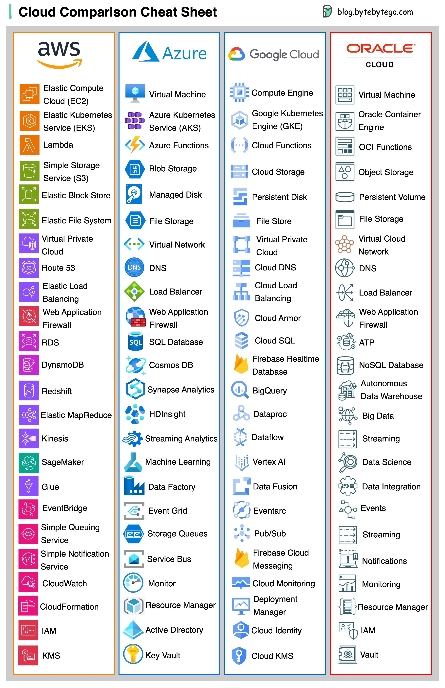
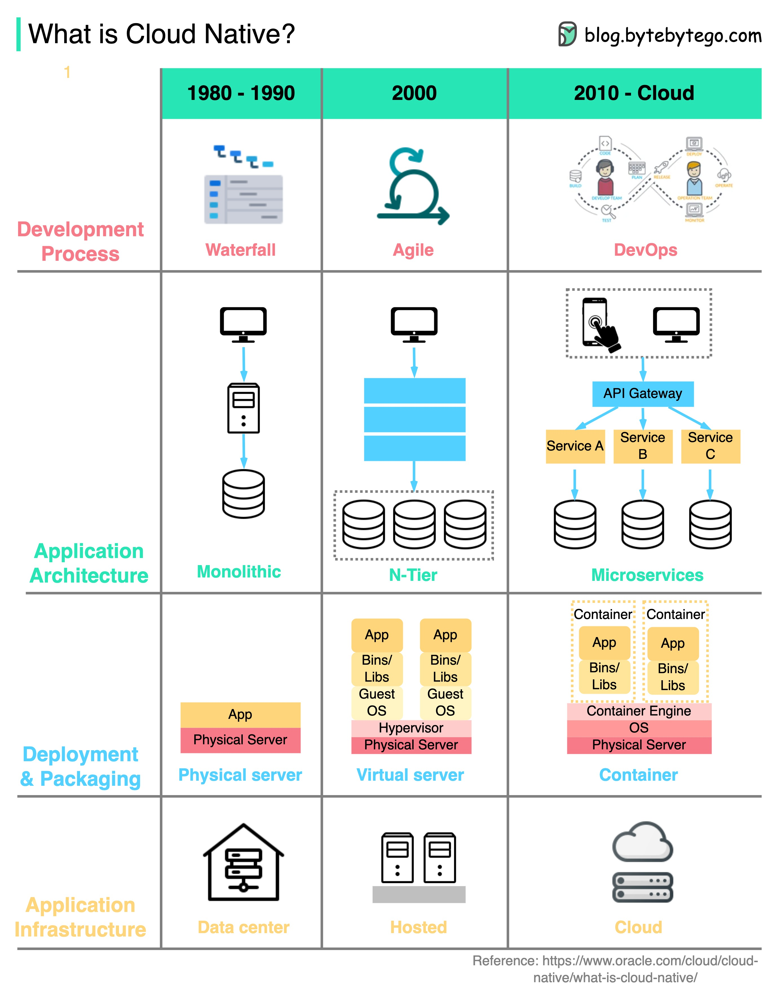

## 云服务

### 2023年不同云服务的速查表

  

### 什么是云原生？

下图展示了自1980年代以来架构和流程的演变。

  

组织可以使用云原生技术在公有云、私有云和混合云上构建和运行可扩展的应用程序。

这意味着应用程序被设计为利用云的特性，因此它们对负载具有弹性且易于扩展。

云原生包括四个方面：

1. **开发过程**

    开发过程已经从瀑布模型进化到敏捷开发，再到 DevOps。

2. **应用架构**

    应用架构已经从单体架构转变为微服务架构。每个服务都被设计得很小，能够适应云容器中的有限资源。

3. **部署与打包**

    应用程序过去是部署在物理服务器上的。大约在2000年，不敏感于延迟的应用程序通常部署在虚拟服务器上。对于云原生应用程序，它们被打包成 Docker 镜像并部署在容器中。

4. **应用基础设施**

    应用程序大量部署在云基础设施上，而不是自托管服务器上。