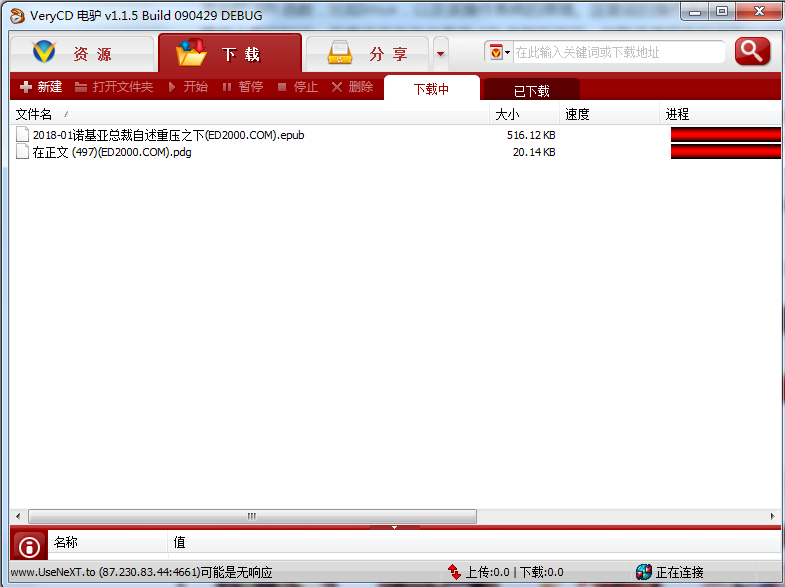

## 如何成为一名合格的 C/C++ 开发者？

### C/C++ 的当前应用领域

例如，对于一个 C++ 类的实例方法，编译器在生成这个方法的机器码时，会将函数的第一个参数设置成对象的 this 指针地址，以此来实现对象与函数的绑定。正因为如此，许多开发者会优化和调整编译器生成的汇编代码。

C++ 的应用领域目前有三大类，第一类就是我们目前见到的各种桌面应用软件，尤其 Windows 桌面软件，如 QQ、安全类杀毒类软件（如金山的安全卫士，已开源，其代码地址：http://code.ijinshan.com/source/source.html ）、各种浏览器等；
另外就是一些基础软件和高级语言的运行时环境，如大型数据库软件、Java 虚拟机、C# 的 CLR、Python 编译器和运行时环境等；

第三类就是一些业务型应用软件的后台，像游戏的服务器后台，如魔兽世界的服务器（代码地址：https://github.com/azerothcore/azerothcore-wotlk ）和一些企业内部的应用系统。

笔者曾在某交易所从事后台开发，其交易系统和行情系统就是基于 C++ 开发的。

### C++ 与操作系统平台

### Linux C++ 与 Windows C++ 领域之争

> 1. Linux C++ 开发就是后台开发，而 Windows C++ 开发就是客户端开发；
> 2. 后端开发比客户端开发（前端）高级，因此后端开发行业薪资水平比客户端开发薪资要高；
> 3. 我只学 Linux，不学 Windows。

### C++ 语言基础与进阶

#### 基础

2. 前面也介绍了单纯的 C++ 您啥也干不了，您必须结合一个具体的操作系统平台，所以得熟悉某个操作系统平台的 API 函数，比如Linux，以及该操作系统的原理。
3. 这里说的操作系统的原理不局限于您在操作系统原理图书上看的知识，而是实实在在与系统 API 关联起来的，如熟练使用各种进程与线程函数、多线程资源同步函数、文件操作函数、系统时间函数、窗口自绘与操作函数（这点针对 Windows）、内存分配与管理函数、PE 或 ELF 文件的编译、链接原理等等。

说了这么多，您可能会觉得很抽象。笔者在这里举个具体例子。假设我们现在要开发一个类似电驴这样的软件，软件界面如下图：

