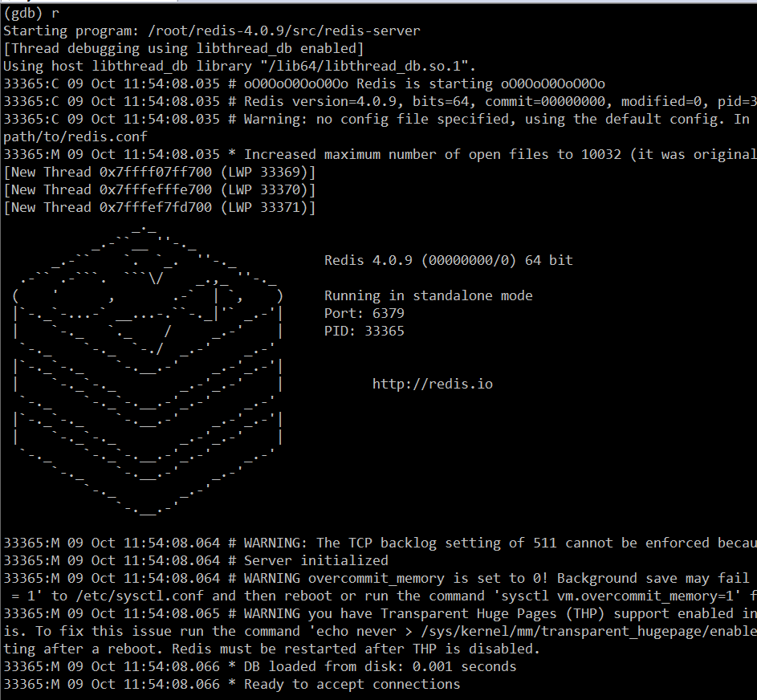
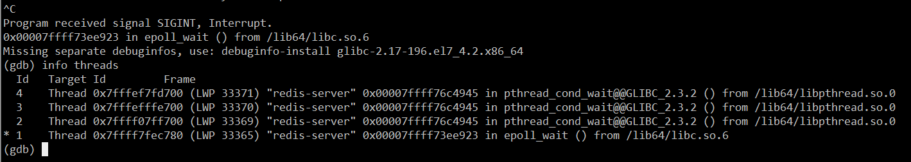

## 如何成为一名合格的 C/C++ 开发者？

### C/C++ 的当前应用领域

C++ 面向对象的语法与 C 相比较起来，在将高级语言翻译成机器二进制码的时候，C++ 编译器在背后偷偷地做了大量工作，生成了大量的额外机器码，而这种机器码相对于 C 来说不是必须的。例如，对于一个 C++ 类的实例方法，编译器在生成这个方法的机器码时，会将函数的第一个参数设置成对象的 this 指针地址，以此来实现对象与函数的绑定。正因为如此，许多开发者会优化和调整编译器生成的汇编代码。

我们再来说说 C++。C++ 的应用领域目前有三大类，第一类就是我们目前见到的各种桌面应用软件，尤其 Windows 桌面软件，如 QQ、安全类杀毒类软件（如金山的安全卫士，已开源，其代码地址：http://code.ijinshan.com/source/source.html ）、各种浏览器等；另外就是一些基础软件和高级语言的运行时环境，如大型数据库软件、Java 虚拟机、C# 的 CLR、Python 编译器和运行时环境等；第三类就是一些业务型应用软件的后台，像游戏的服务器后台，如魔兽世界的服务器（代码地址：https://github.com/azerothcore/azerothcore-wotlk ）和一些企业内部的应用系统。笔者曾在某交易所从事后台开发，其交易系统和行情系统就是基于 C++ 开发的。

### C++ 与操作系统平台

### Linux C++ 与 Windows C++ 领域之争

> 1. Linux C++ 开发就是后台开发，而 Windows C++ 开发就是客户端开发；
> 2. 后端开发比客户端开发（前端）高级，因此后端开发行业薪资水平比客户端开发薪资要高；
> 3. 我只学 Linux，不学 Windows。

**图形化界面之于命令行，是人们对更高级、更方便的工具追求的必然结果。**Linux C++ 也不一定就是后台开发，Windows C++ 也不一定就是客户端开发；所谓的服务器与客户端是个相对的概念，即谁给谁提供服务，提供服务的我们认为是服务端（后台），被服务的我们认为是客户端（前台）。而 Windows 作为后台服务的应用也比比皆是，如笔者之前所在的某交易所的服务器后台都是 Windows 下的 C++ 程序；另外如一些游戏类的服务器端，也不少是 Windows 的。

从编程的角度来说，Windows 的代码风格是所谓的**匈牙利命名法**，而 Linux 是短小精悍的连字符风格。例如同一个表示屏幕尺寸的整型变量，Windows 上可能被命名为 iScreen 或 cxScreen ，而 Linux 可能是 screen；再例如 Windows 上创建线程的函数叫 CreateThread，Linux 下叫 pthread_create。有时候，我觉得 Windows 的匈牙利命名法反而更容易理解代码。

**这里既然提到前端（客户端）开发和后端开发，这里不得不提一下，这二者没有优劣之分。**其侧重点和开发思维是不一样的，前端（客户端）开发一般有较多的界面逻辑，它们是直接与用户打交道，因而一款客户端软件的好坏很大程度上取决于其界面的易用性和流畅性，开发者只要把这一端的“一亩三分地”给管理好即可；而后端服务，对于普通用户是透明的，开发者的程序必须尽量体现“**服务**”这个字眼，即更有效地为更多的客户端服务，这就要求兼顾请求响应的**正确性**、**及时性**和**流畅性**。

### 如何看待 C++ 11/14/17 新标准

- std::thread 库、std::chrono 库
- 线程库 std::thread + 线程同步技术库 std::mutex/std::condition_variable/std::lock_guard 等
- std::bind/std::function 库

### C++ 语言基础与进阶

#### 基础

2. 前面也介绍了单纯的 C++ 您啥也干不了，您必须结合一个具体的操作系统平台，所以得熟悉某个操作系统平台的 API 函数，比如Linux，以及该操作系统的原理。这里说的操作系统的原理不局限于您在操作系统原理图书上看的知识，而是实实在在与系统 API 关联起来的，如熟练使用各种进程与线程函数、多线程资源同步函数、文件操作函数、系统时间函数、窗口自绘与操作函数（这点针对 Windows）、内存分配与管理函数、PE 或 ELF 文件的编译、链接原理等等。
3. 网络通信，网络通信在这里具体一点就是 Socket 编程。这里的 Socket 编程不仅要求熟练使用各种网络 API 函数，还要求理解和灵活运用像三次握手四次挥手等各种基础网络通信协议与原理。关于 Socket 编程实践，《**TCP/IP 网络编程**》这本书是非常好的入门教材。

说了这么多，您可能会觉得很抽象。笔者在这里举个具体例子。假设我们现在要开发一个类似电驴这样的软件，软件界面如下图：

##### **UI 部分**

接着，根据上图中的软件功能，大致分为三大模块，即**资源**、**下载**和**分享**。这三大块是可以使用一个 Windows Tab 控件去组织，这个时候您需要了解 Windows Tab 控件的特性。

- 对于**资源**模块，本质上是一个窗口中嵌入了一个浏览器控件（WebBrowser 控件），那么您需要了解这一个功能点的相关知识。当用户点击了某个列表中某个具体的资源，可以对其进行下载。这就又涉及到 WebBrowser 控件与 C++ 宿主程序的交互了，那么如何实现呢？可以选择使用 ActiveX 技术，也可以使用 JavaScript 与 C++ 交互技术。
- 再来看**下载**模块，当产生一个下载操作时，界面上会产生以下下载列表，每个列表项会实时显示下载进度、下载速率等参数，同时正在下载的项目也可以被暂停、停止和删除。那么这又涉及到 ListView 控件的相关功能，以及 ListView 如何与后台网络通信的逻辑交互。
- **分享**模块是将本地资源分享到服务器或者给其他用户。界面左侧是文件系统的一个快照，那么这又涉及到如何遍历文件系统（了解枚举文件系统的 API），右侧也是一个 ListView 控件，这里不再赘述。

##### **网络通信部分**

网络通信部分，主要有两大块，第一个是程序启动时，与服务端的交互；第二个就是文件下载与分享的 P2P 网络。您在阅读或开发的过程中，如果对这些技术比较陌生，您需要补充这些知识，具体的就是 Socket 的各种 API 函数，以及基于这些 API 逻辑的组合。当然可能也会用到操作系统平台所特有的网络 API 函数，如 **WSAAsyncSelect** 网络模型。

另外一点，网络通信部分如何与 UI 部分进行数据交换，是使用队列？全局变量？或者相应的 Windows 操作平台提供的特殊通信技术，如 PostMessage 函数、管道？如果使用队列，多线程之间如何保持资源的一致性和解决资源竞态，使用 Event、CriticalSection、Mutex、Semaphore 等？

当然，笔者这里只列举了这个软件的主干部分，还有许多方方面面的细节需要考虑。这就需要读者根据自己的情况，斟酌和筛选了。您想达到什么目的，就要去学习和研究相关的代码。

总结起来，可以得到如下公式：

> 一款 C++ 软件 = C++ 语法 + 操作系统 API 函数调用

#### 进阶

学习的过程是先接触，再熟悉，再模仿，再创造。不管什么开源项目，在您心中没有任何思路或者解决方案时，您应该先接触熟悉，不断模仿，做到至少心中有一套对于某场景的解决方案，然后再来谈创新谈批判、改造别人的项目。

我个人学习一套陌生的开源项目时，总是喜欢将程序用调试器正常跑起来，然后再中断下来，统计当前的线程数目，然后通过程序入口 main 函数从主线程追踪其他工作线程是如何创建的；接着，分析和研究每个线程的用途以及线程之间交互的，这就是整体把握，接着找我感兴趣的细节去学习。

这里我以学习 **Redis** 为例。将 Redis 源码从官网下载下来以后，使用喜欢的代码阅读器进行管理。我这里使用的是 Visual Studio，如下图所示：

在大致了解了 Redis 有哪些代码模块以后，我们把代码拷贝到 Linux 平台，然后编译并使用 GDB 调试器跑起来。如下图所示：

然后按 `CTRL+C` 将 GDB 中断下来，输入 `info threads` 查看当前程序的所有线程：

接着挨个使用 `thread + 线程编号` 和 `bt` 命令去查看每个线程的上下文调用堆栈：

对照每个线程的上下文堆栈，搞清楚其逻辑，并结合主线程，看看每个线程是在何时启动的，端口在何时启动侦听的，等等。做完这一步，关于 **redis-server** 的框架也基本清楚了。

接着我们可以选择一个自己感兴趣的命令，搞清楚 **redis-cli** 与 **redis-server** 命令的交互流程。

最后，如果对 **redis-server** 源码中各种数据结构和细节感兴趣，我们可以进一步深入到具体的代码细节。

当然，不熟悉 **GDB** 的读者看笔者这段操作流程比较困难，这是正常的，说明如果想通过调试去研究 **Redis** 这一款开源软件，您需要去补充一点 **GDB** 调试的知识。这就是我上文中所说的，针对性地补缺补差。

### C++ 面试

关于 C++ 面试，面试的要求到底是侧重代码量、项目经验，还是侧重操作系统、数据结构这种基础知识？我在知乎上曾经专门写过一篇文章来介绍我曾经的 C++ 面试经历和经验，有兴趣的读者可以点击这里查看：https://www.zhihu.com/question/264198516/answer/341999235。

关于 C++ 面试常见的面试题，可以参考这里：https://zhuanlan.zhihu.com/p/45668078，这篇文章问题点整理得非常详细，读者可以参考一下。

### 学生与社会人士学习 C++ 方式的区别

作为学生有充裕的时间，建议除了把 C++ 语法学好，系统地多读一点基础的书籍，如操作系统原理、网络编程、数据结构与算法等相关各方各面的经典书籍。

可以参考下这里：

> https://mp.weixin.qq.com/s/EjgtX2Wghia7ajn2AugCtw

尽量做到等您毕业走出校园以后，至少熟悉一门编程语言和其相应的开发环境，这就是一个基础扎实、理论清晰、编码能力强的求职者。可惜的是，从现在的各种招聘反馈来看，大多数学生在求职时，对相关开发工具和语言的陌生程度实在让人瞠目结舌，面试官在面试的时候会很纳闷：这位学生大学四年（或者七年）到底是否调试过程序？
