# [sql语法](https://www.runoob.com/mysql/mysql-create-database.html)

## SQL语句分类

sql语句分类如下：

- DDL  数据定义语言，用来定义数据库对象：库、表、列
  * 代表性关键字：create alter drop
- DML  数据操作语言，用来定义数据库记录
  * 代表性关键字:insert delete update
- DCL  数据控制语言，用来定义访问权限和安全级别
  * 代表性关键字:grant deny revoke
- DQL  数据查询语言，用来查询记录数据
  * 代表性关键字:select

## 表的连接方式

* 内连接（Inner Join）：仅将两个表中满足连接条件的行组合起来作为结果集

  - 自然连接：**只考虑属性相同的元组对**
  - 等值连接：给定条件进行查询

* 外连接（Outer Join）

  - 左连接：左边表的所有数据都有显示出来，右边的表数据只显示共同有的那部分，没有对应的部分补NULL
  - 右连接：和左连接相反
  - 全外连接（Full Outer Join）：**查询出左表和右表所有数据，但是去除两表的重复数据**

* 交叉连接（Cross Join）：返回两表的笛卡尔积（对于所含数据分别为m、n的表，返回m*n的结果）

  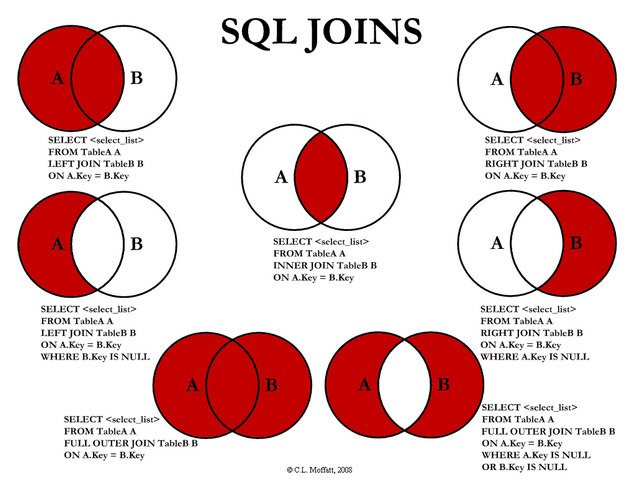

## 存储过程(procedure)

* 存储过程是**事先经过编译并存储在数据库中的一段SQL语句的集合**。想要实现相应的功能时，只需要调用这个存储过程就行了（类似于函数，输入具有输出参数）

* 优点：

  - **预先编译，而不需要每次运行时编译**，提高了数据库执行**效率**
  - **封装了一系列操作，对于一些数据交互比较多的操作**，相比于单独执行SQL语句，可以**减少网络通信量**
  - 具有**可复用性**，减少了数据库开发的工作量
  - **安全性高**，可以让没有权限的用户通过存储过程间接操作数据库
  - 更**易于维护**

* 缺点：

  - **可移植性差**，存储过程将应用程序绑定到了数据库上
  - **开发调试复杂**：没有好的IDE
  - **修改复杂**，需要**重新编译**，有时还需要更新程序中的代码以更新调用

  ```sql
  delimiter //
  
  create procedure myprocedure( out ret int )
      begin
          declare y int;
          select sum(col1)
          from mytable
          into y;
          select y*y into ret;
      end //
  
  delimiter ;
  
  call myprocedure(@ret);
  select @ret;
  ```

## Drop/Delete/Truncate的区别？

- **Delete**用来删除表的全部或者**部分数据**，执行delete之后，用户**需要提交**之后才会执行，会触发表上的DELETE**触发器**（包含一个OLD的虚拟表，可以只读访问被删除的数据），**DELETE之后表结构还在，删除很慢，一行一行地删，因为会记录日志，可以利用日志还原数据**

- **Truncate删除表中的所有数据**，这个操作**不能回滚**，也不会触发这个表上的触发器。操作比DELETE快很多（直接把表drop掉，再创建一个新表，删除的数据不能找回）。如果表中有自增（AUTO_INCREMENT）列，则重置为1

- **Drop**命令从数据库中**删除表**，所有的数据行，索引和约束都会被删除；不能回滚，不会触发触发器

  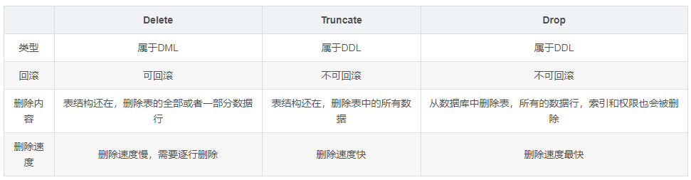

## in和exists的区别

* mysql中的**in语句是把外表和内表作hash 连接**，而**exists语句是对外表作loop循环**，**每次loop循环再对内表进行查询**。一直大家都认为exists比in语句的效率要高，这种说法其实是不准确的。这个是要区分环境的
  * 如果查询的**两个表大小相当**，那么用**in和exists差别不大**
  * 如果**两个表中一个较小，一个是大表，则子查询表大的用exists，子查询表小的用in**
* not in 和not exists：如果查询语句使用了not in，那么**内外表都进行全表扫描，没有用到索引**；**而not exists的子查询依然能用到表上的索引**。所以无论那个表大，用not exists都比not in要快

- 什么是触发器？

  * 触发器（TRIGGER）是由事件（比如INSERT/UPDATE/DELETE）来触发运行的操作（不能被直接调用，不能接收参数）。在数据库里以独立的对象存储，用于**保证数据完整性**（比如可以检验或转换数据）

- 有哪些约束类型？

  * NOT NULL: 用于控制字段的内容一定不能为空（NULL）
  * UNIQUE: **控件字段内容不能重复**，一个表允许有多个 Unique 约束
  * PRIMARY KEY: 也是用于控件字段内容不能重复，但它在一个表只允许出现一个
  * FOREIGN KEY: 用于预防破坏表之间连接的动作，也能防止非法数据插入外键列，因为它必须是它指向的那个表中的值之一。**通过定义外键约束，关系数据库可以保证无法插入无效的数据**。
  * CHECK: 用于控制字段的值范围

- 什么是视图？什么是游标？

  * 视图：**从数据库的基本表中通过查询选取出来的数据组成的虚拟表**（数据库中存放视图的定义）。**可以对其进行增/删/改/查等操作**。**视图是对若干张基本表的引用，一张虚表，查询语句执行的结果，不存储具体的数据（基本表数据发生了改变，视图也会跟着改变）**；可以跟基本表一样，进行增删改查操作(ps:增删改操作有条件限制)；如连表查询产生的视图无法进行，对视图的增删改会影响原表的数据。好处：

    - 通过**只给用户访问视图的权限**，保证数据的**安全性**
    - **简化**复杂的SQL操作，**隐藏数据的复杂性**（比如复杂的连接）

    ```sql
    CREATE VIEW myview AS
    SELECT Concat(col1, col2) AS concat_col, col3*col4 AS compute_col
    FROM mytable
    WHERE col5 = val;
    ```

  * 游标（Cursor）：用于定位在查询返回的**结果集的特定行**，以对特定行进行操作。**使用游标可以方便地对结果集进行移动遍历，根据需要滚动或对浏览/修改任意行中的数据。主要用于交互式应用**

## 外键约束

* FOREIGN KEY: 用于预防破坏表之间连接的动作，也能防止非法数据插入外键列，因为它必须是它指向的那个表中的值之一。**通过定义外键约束，关系数据库可以保证无法插入无效的数据**。

* 定义外键时，需要遵守下列规则：

  - 主表必须已经存在于数据库中，或者是当前正在创建的表。如果是后一种情况，则主表与从表是同一个表，这样的表称为自参照表，这种结构称为自参照完整性
  - 必须为主表定义主键
  - **主键不能包含空值，但允许在外键中出现空值**。也就是说，只要外键的每个非空值出现在指定的主键中，这个外键的内容就是正确的。
  - 在主表的表名后面指定列名或列名的组合。这个列或列的组合必须是主表的主键或候选键。
  - **外键中列的数目必须和主表的主键中列的数目相同**。
  - **外键中列的数据类型必须和主表主键中对应列的数据类型相同**。

* on delete 规则：

  * CASCADE：级联
    * 所谓的级联删除，就是删除主键表的同时，外键表同时删除
    * 删除主键表时必须删除其他与之关联的表，说明外键的作用，保持数据的一致性、完整性。当然反过来讲，删除外键表中的数据并不影响主键表

  * NO ACTION(非活动，默认)、RESTRICT：约束/限制
    * 当取值为No Action或者Restrict时，则当在主键表中删除对应记录时，首先检查该记录是否有对应外键，如果有则不允许删除。（即外键表约束主键表）
    * NO ACTION和RESTRICT的区别：只有在及个别的情况下会导致区别，前者是在其他约束的动作之后执行，后者具有最高的优先权执行
  * SET NULL
    * 当取值为Set Null时，则当在主键表中删除对应记录时，首先检查该记录是否有对应外键，如果有则设置子表中该外键值为null（一样是外键表约束主键表，不过这就要求该外键允许取null）。

# 三大范式

* 范式（数据库设计范式）是符合某一种级别的关系模式的集合。构造数据库必须遵循一定的规则。在关系数据库中，这种规则就是范式。关系数据库中的关系必须满足一定的要求，即满足不同的范式
* 目前关系数据库有六种范式：第一范式（1NF）、第二范式（2NF）、第三范式（3NF）、Boyce-Codd范式（BCNF）、第四范式（4NF）和第五范式（5NF）
* 满足最低要求的范式是第一范式（1NF）。在第一范式的基础上进一步满足更多要求的称为第二范式（2NF），其余范式以次类推。**一般说来，数据库只需满足第三范式（3NF）就行了**

* 第一范式

  * 在任何一个关系数据库中，第一范式（1NF）是对关系模式的基本要求，**不满足第一范式（1NF）的数据库就不是关系数据库**
  * 所谓第一范式（1NF）是指**数据库表的每一列都是不可分割的基本数据项**，**同一列中不能有多个值，即实体中的某个属性不能有多个值或者不能有重复的属性**
  * 如果出现重复的属性，就可能需要定义一个新的实体，新的实体由重复的属性构成，新实体与原实体之间为一对多关系。在第一范式（1NF）中表的每一行只包含一个实例的信息
  * 简而言之，第一范式就是无重复的列
  * 例如，下面的数据库表是符合第一范式的：
    * 字段1 字段2 字段3 字段4
  * 而这样的数据库表是不符合第一范式的：
    * 字段1 字段2 字段3 字段4 字段3.1 字段3.2

* 第二范式

  * 第二范式（2NF）要求**数据库表中的每个实例或行必须可以被唯一地区分**。为实现区分通常需要**为表加上一个列**，以**存储各个实例的唯一标识**。这个唯一属性列被称为**主关键字或主键、主码**

  * 第二范式（2NF）**要求实体的属性完全依赖于主关键字**。所谓**完全依赖是指不能存在仅依赖主关键字一部分的属性**。如果存在，那么这个属性和主关键字的这一部分应该分离出来形成一个新的实体，新实体与原实体之间是一对多的关系。为实现区分通常需要为表加上一个列，以存储各个实例的唯一标识

  * 简而言之，第二范式就是**非主属性完全依赖于主关键字**

  * 假定选课关系表为`SelectCourse`(学号，姓名，年龄，课程名称，成绩，学分)，**关键字为组合关键字**(学号，课程名称)，因为存在如下决定关系：

    * (学号，课程名称) → (姓名，年龄，成绩，学分)

    * 这个数据库表不满足第二范式，因为存在如下决定关系：

      * (课程名称) → (学分)

      * (学号) → (姓名，年龄)

    * **即存在组合关键字中的字段决定非关键字的情况**

  * 由于不符合2NF，这个选课关系表会存在如下问题：

    * (1) **数据冗余**：
      * 同一门课程由n个学生选修，"学分"就重复n-1次；同一个学生选修了m门课程，姓名和年龄就重复了m-1次

    * (2) **更新异常**：
      * 若调整了某门课程的学分，数据表中所有行的"学分"值都要更新，否则会出现同一门课程学分不同的情况

    * (3) **插入异常**：
      * 假设要开设一门新的课程，暂时还没有人选修。这样，由于还没有"学号"关键字，课程名称和学分也无法记录入数据库

    * (4) **删除异常**：
      * 假设一批学生已经完成课程的选修，这些选修记录就应该从数据库表中删除。但是，与此同时，课程名称和学分信息也被删除了。很显然，这也会导致插入异常

  * 把选课关系表SelectCourse改为如下三个表：

    * 学生：Student(学号，姓名，年龄)

    * 课程：Course(课程名称，学分)

    * 选课关系：SelectCourse(学号，课程名称，成绩)

  * 这样的数据库表是符合第二范式的， 消除了数据冗余、更新异常、插入异常和删除异常
  * 另外，**所有单关键字的数据库表都符合第二范式，因为不可能存在组合关键字**

* 第三范式

  * 满足第三范式（3NF） 必须先满足第二范式（2NF）。简而言之，第三范式（3NF）要求一个数据库表中不包含已在其它表中已包含的非主关键字信息
  * 例如，存在一个部门信息表，其中每个部门有部门编号（dept_id）、部门名称、部门简介等信息。那么在图3-2的员工信息表中列出部门编号后就不能再将部门名称、部门简介等与部门有关的信息再加入员工信息表中。如果不存在部门信息表，则根据第三范式（3NF）也应该构建它，否则就会有大量的数据冗余
  * 简而言之，第三范式就是**属性不依赖于其它非主属性**
  * 因此，满足第三范式的数据库表应该**不存在如下依赖关系**：关键字段 → 非关键字段x → 非关键字段y
  * 假定学生关系表为Student(学号，姓名，年龄，所在学院，学院地点，学院电话)，关键字为单一关键字"学号"，因为存在如下决定关系：
    * (学号) → (姓名，年龄，所在学院，学院地点，学院电话)
  * 这个数据库是符合2NF的，但是不符合3NF，因为存在如下决定关系：
    * (学号) → (所在学院) → (学院地点，学院电话)
  * 即存在非关键字段"学院地点"、"学院电话"对关键字段"学号"的**传递函数依赖**
  * 它也会存在数据冗余、更新异常、插入异常和删除异常的情况，读者可自行分析得知。
  * 把学生关系表分为如下两个表：

    * 学生：(学号，姓名,年龄，所在学院)

    * 学院：(学院，地点，电话)
  * 这样的数据库表是符合第三范式的，消除了数据冗余、更新异常、插入异常和删除异常

# ACID及事务基本概念

* 事务(TRANSACTION)**是一个操作序列，不可分割的工作单位**，以**START TRANSACTION/BEGIN开始，以ROLLBACK/COMMIT**结束

  * 事务特性(ACID)
    * **原子性**(Atomicity)：**逻辑上是不可分割的操作单元**，事务的所有操作**要么全部提交成功，要么全部失败回滚**(用**回滚(Undo Log)日志**实现，反向执行日志中的操作)
    * **一致性**(Consistency)：**数据库在事务执行前后都保持一致性状态**。在一致性状态下，**所有事务对一个数据的读取结果都是相同的**
    * **隔离性**(isolation)：一个事务所做的修改，在最终提交以前，对其他事务都是不可见的
    * **持久性**(Durability)：**一旦事务提交，则所做的修改将永远保存到数据库中**。即使系统发生崩溃，事务执行结果也不会丢失。系统发生崩溃可以用**重做日志**（Redo Log）进行恢复，从而实现持久性。与**回滚日志记录数据的逻辑修改不同，重做日志记录的是数据页的物理修改**
  * **只有满足一致性，事务的执行结果才是正确的**。在无并发的情况下，事务串行执行，隔离性一定能够满足。此时**只要能满足原子性，就一定能满足一致性**。在并发的情况下，多个事务并行执行，**事务不仅要满足原子性，还需要满足隔离性，才能满足一致性**。**事务满足持久化是为了能应对系统崩溃的情况**

* **MySQL 默认采用自动提交模式**。也就是说，如果不显式使用`START TRANSACTION`语句来开始一个事务，那么每个查询操作都会被当做一个事务并自动提交

* **隐式提交**

  * 当我们使用`START TRANSACTION`或者`BEGIN`语句开启一个事务，或者把系统变量`autocommit`的值设为`OFF`时，事务就不会自动提交，但是如果输入了某些语句之后就会悄悄提交，就如输入了`COMMIT`语句一样，这种因为某些特殊的语句而导致事务提交的情况称为隐式提交
  * 定义或修改数据库对象的数据定义语言（DDL）。数据库对象指的是库、表、视图、存储过程等。使用`CREATE,ALTER,DROP`等语句去修改这些数据库对象时，就会隐式地提交前边语句所属于的事务
  * 隐式使用或修改MySql数据库中的表：使用`ALTER USER,CREATE USER, DROP USER,GRANT,RENAME USER,SET PASSWORD`等语句时也会隐式地提交前面语句所属的事务
  * 事务控制或关于锁定的语句：当一个事务还没提交或者回滚时，又使用`START TRANSACTION`或者`BEGIN`开启另一个事务，会隐式地提交上一个事务。当`AUTOCOMMIT`系统变量的值为`ON`时，也会隐式提交前边语句所属事务。或者使用`LOCK TABLES,UNLOCK TABLES`等关于锁定的语句也会隐式提交前面语句所属的事务
  * 加载数据的语句：使用`LOAD DATA`语句来批量往数据中导入数据时，也会隐式地提交前边语句所属的事务
  * 其他：使用`ANALYZE TABLE, CACHE INDEX, CHECK TABLE, FLUSH, LOAD INDEX INTO CACHE, OPTIMIZE TABLE,REPAIR TABLE, RESET`等语句也会隐式提交前面语句所属事务

* 保存点

  * 当开启了一个事务，并且已经执行了很多语句，忽然发现上一条语句有点问题，这时只好使用`ROLLBACK`语句来让数据库状态回到事务执行之前的样子，然后一切重来，非常不方便

  * MySQL提出一个保存点(savepoint)的概念，就是在事务对应的数据库语句中打几个点，在调用`ROLLBACK`的时候可以指定回到某一个点，而不是回到原点

  * 定义保存点

    ```sqlite
    SAVEPOINT name;
    ```

  * 回滚到某个保存点

    ```sql
    ROLLBACK [WORK] TO [SAVEPOINT] name;
    ```

  * 如果`ROLLBACK`后面不跟随保存点名称，也会直接回滚到事务执行之前的状态

  * 如果像删除某个保存点，可以使用以下语句

    ```sql
    RELEASE SAVEPOINT name;
    ```

* **并发一致性问题**：在并发环境下，事务的隔离性很难保证，因此会出现很多并发一致性问题

  * **丢失修改**：**一个事务对数据进行了修改，在事务提交之前，另一个事务对同一个数据进行了修改，覆盖了之前的修改**。(例如：T1 和 T2 两个事务都对一个数据进行修改，T1 先修改并提交生效，T2 随后修改，T2 的修改覆盖了 T1 的修改。)
  * **脏读**（Dirty Read）：**一个事务读取了被另一个事务修改了、但未提交（进行了回滚）的数据，造成两个事务得到的数据不一致**。(例如：T1 修改一个数据但未提交，T2 随后读取这个数据。如果 T1 撤销了这次修改，那么 T2 读取的数据是脏数据。)
  * **不可重复读**（Nonrepeatable Read）：**在同一个事务中，某查询操作在一个时间读取某一行数据和之后一个时间读取该行数据，发现数据已经发生修改**（针对**update**操作）。(例如：T2 读取一个数据，T1 对该数据做了修改。如果 T2 再次读取这个数据，此时读取的结果和第一次读取的结果不同。)
  * **幻读**（Phantom Read）：**当同一查询多次执行时，由于其它事务在这个数据范围内执行了插入或删除操作，会导致每次返回不同的结果集**（和不可重复读的区别：针对的是一个数据整体/范围；并且针对**insert/delete**操作）(T1 读取某个范围的数据，T2 在这个范围内插入新的数据，T1 再次读取这个范围的数据，此时读取的结果和和第一次读取的结果不同)

* 数据库**四种隔离级别**

  * **未提交读**（Read Uncommited）：在一个事务提交之前，它的执行结果对其它事务也是可见的。**会导致脏读、不可重复读、幻读**

  * **提交读**（Read Commited）：一个事务只能看见**已经提交的事务**所作的改变。**可避免脏读问题**

  * **可重复读**（Repeatable Read）：可以确保同一个事务在**多次读取同样的数据时得到相同的结果**。（MySQL的默认隔离级别）。可避免不可重复读

  * **可串行化**（Serializable）：强制事务串行执行，使之不可能相互冲突，从而解决幻读问题。可能导致大量的超时现象和锁竞争，实际很少使用

  * 设置方法：

    ```sql
    SET [SESSION|GLOBAL] TRANSACTION ISOLATION LEVEL [READ UNCOMMITTED|READ COMMITTED|REPEATABLE READ|SERIALIZABLE];
    ```

# MySQL体系架构

* [详见1](https://blog.csdn.net/u022812849/article/details/107614372)
* [详见2](https://www.cnblogs.com/yanjieli/p/9780100.html)
* [详见3](http://c.biancheng.net/view/7939.html)

# 锁分类及概念

* **什么是乐观锁和悲观锁？**

  - 悲观锁：**认为数据随时会被修改，因此每次读取数据之前都会上锁，防止其它事务读取或修改数据**；应用于**数据更新比较频繁**的场景；
  - 乐观锁：操作数据时不会上锁，但是**更新时会判断在此期间有没有别的事务更新这个数据，若被更新过，则失败重试；适用于读多写少的场景**。乐观锁的**实现方式**有：
    - **加一个版本号或者时间戳字段，每次数据更新时同时更新这个字段**
    - **先读取想要更新的字段或者所有字段，更新的时候比较一下，只有字段没有变化才进行更新**

* MySQL锁分类？**MySQL大致可归纳为以下3种锁**：

  * **表级锁**：开销小，加锁快；不会出现死锁；锁定粒度大，发生锁冲突的概率最高，并发度最低
  * **行级锁**：开销大，加锁慢；会出现死锁；锁定粒度最小，发生锁冲突的概率最低，并发度也最高
  * **页面锁**：开销和加锁时间界于表锁和行锁之间；会出现死锁；锁定粒度界于表锁和行锁之间，并发度一般(使用页级锁定的主要BerkeleyDB存储引擎)
  * **锁的作用：用于管理对共享资源的并发访问，保证数据库的完整性和一致性**

* 封锁粒度

  * MySQL 中主要提供了两种封锁粒度：**行级锁以及表级锁**
  * 应该尽量**只锁定需要修改的那部分数据**，而不是所有的资源。**锁定的数据量越少，发生锁争用的可能就越小，系统的并发程度就越高**
  * 但是加锁需要消耗资源，锁的各种操作（包括获取锁、释放锁、以及检查锁状态）都会增加系统开销。**因此封锁粒度越小，系统开销就越大**
  * 在选择封锁粒度时，需要在锁开销和并发程度之间做一个权衡

* 常见封锁类型

  * **排他锁**（Exclusive Lock）/ X锁：事务对数据加上X锁时，**只允许此事务读取和修改此数据**，并且**其它事务不能对该数据加任何锁**

  * **共享锁**（Shared Lock）/ S锁：加了S锁后，**该事务只能对数据进行读取而不能修改**，并且**其它事务只能加S锁，不能加X锁**

  * **意向锁**（Intention Lock）：意向锁在原来的 X/S 锁之上引入了 IX/IS。**IX/IS 都是表锁**，*用来表示一个事务想要在表中的某个数据行上加 X 锁或 S 锁*

    - 一个事务在获得某个**数据行**对象的 S 锁之前，必须**先获得整个表的 IS 锁或更强的锁**

    - 一个事务在获得某个**数据行**对象的 X 锁之前，必须**先获得整个表的 IX 锁**

    - 锁的兼容性：

      |                | 共享锁(S) | 排他锁(X) | 意向共享锁(IS) | 意向排他锁(IX) |
      | :------------: | :-------: | :-------: | :------------: | :------------: |
      |   共享锁(S)    |   兼容    |   冲突    |      兼容      |      冲突      |
      |   排他锁(X)    |   冲突    |   冲突    |      冲突      |      冲突      |
      | 意向共享锁(IS) |   兼容    |   冲突    |      兼容      |      兼容      |
      | 意向排他锁(IX) |   冲突    |   冲突    |      兼容      |      兼容      |

    - **任意 IS/IX 锁之间都是兼容的**，因为它们只表示**想要对表加锁**，而不是真正加锁。这里兼容关系针对的是表级锁，**而表级的 IX 锁和行级的 X 锁兼容**，两个事务可以对两个数据行加 X 锁(行X锁)。（事务 T1 想要对数据行 R1 加 X 锁，事务 T2 想要对同一个表的数据行 R2 加 X 锁，两个事务都需要对该表加 IX 锁，但是 IX 锁是兼容的，并且 IX 锁与行级的 X 锁也是兼容的，因此两个事务都能加锁成功，对同一个表中的两个数据行做修改）

    - 好处：**如果一个事务想要对整个表加X锁，就需要先检测是否有其它事务对该表或者该表中的任意一行加了锁(逐行检测)，这种检测非常耗时**。有了意向锁之后，**只需要检测整个表是否存在IX/IS/X/S锁**就行了，如果加了就表示**有其它事务正在使用这个表或者表中某一行的锁**

  * **当一个事务需要给自己需要的某个资源加锁的时候，如果遇到一个共享锁正锁定着自己需要的资源的时候，自己可以再加一个共享锁，不过不能加排他锁；但是，如果遇到自己需要锁定的资源已经被一个排他锁占有之后，则只能等待该锁定释放资源之后自己才能获取锁定资源并添加自己的锁定**

  * **而意向锁的作用就是当一个事务在需要获取资源锁定的时候，如果遇到自己需要的资源已经被排他锁占用的时候，该事务可以需要锁定行的表上面添加一个合适的意向锁。如果自己需要一个共享锁，那么就在表上面添加一个意向共享锁。而如果自己需要的是某行（或者某些行）上面添加一个排他锁的话，则先在表上面添加一个意向排他锁。意向共享锁可以同时并存多个，但是意向排他锁同时只能有一个存在**

* 如何**加锁**？

  * MyISAM在执行**查询**语句（SELECT）前，会**自动**给涉及的**所有表加共享锁**(S锁)，在执行**更新操作**（UPDATE、DELETE、INSERT等）前，会**自动**给涉及的表加**排他锁**(X锁)，这个过程并不需要用户干预，因此，用户一般不需要直接用LOCK TABLE命令给MyISAM表显式加锁(**MyISAM只支持表锁**)

  * **意向锁是 InnoDB 自动加的**， 不需用户干预。 **对于 UPDATE、 DELETE 和 INSERT 语句**， InnoDB 会**自动给涉及数据集加排他锁**（X)； 对于**普通 SELECT 语句**，InnoDB **不会加任何锁**

  * 事务可以通过以下语句显式给记录集加共享锁或排他锁

    ```sql
    共享锁(S)：SELECT * FROM table_name WHERE ... LOCK IN SHARE MODE
    排他锁(X)：SELECT * FROM table_name WHERE ... FOR UPDATE
    ```

    * 用`SELECT ... LOCK IN SHARE MODE`获得共享锁，主要用在需要数据依存关系时来确认某行记录是否存在，并确保没有人对这个记录进行`UPDATE`或者`DELETE`操作。 其他 session 仍然可以查询记录，并也可以对该记录加 共享锁。**但是如果当前事务需要对该记录进行更新操作，则很有可能造成死锁**。对于锁定行记录后需要进行更新操作的应用，应该使用`SELECT... FOR UPDATE`方式获得排他锁
    * `SELECT * FROM table_name WHERE ... FOR UPDATE`获得排他锁，其他session可以查询该记录，但是不能对该记录加共享锁或排他锁，而是等待获得锁
    * `for update` 可以根据条件来完成行锁锁定，**并且锁的对象是有索引键的列(因为行锁是加在索引上)**，**如果锁的对象不是索引键那么InnoDB将完成表锁，并发将无从谈起**

* 什么时候使用表锁？

  * **对于InnoDB表，在绝大部分情况下都应该使用行级锁**，因为事务和行锁往往是我们之所以选择InnoDB表的理由。但在个别特殊事务中，也可以考虑使用表级锁

    - 第一种情况是：事务需要更新大部分或全部数据，表又比较大，如果使用默认的行锁，不仅这个事务执行效率低，而且可能造成其他事务长时间锁等待和锁冲突，这种情况下可以考虑使用表锁来提高该事务的执行速度
    - 第二种情况是：事务涉及多个表，比较复杂，很可能引起死锁，造成大量事务回滚。这种情况也可以考虑一次性锁定事务涉及的表，从而避免死锁、减少数据库因事务回滚带来的开销
    - 当然，应用中这两种事务不能太多，否则，就应该考虑使用ＭyISAＭ表

  * 在InnoDB下 ，使用表锁要注意以下两点

    * 使用`LOCK TALBES`虽然可以给InnoDB加表级锁，但必须说明的是，表锁不是由InnoDB存储引擎层管理的，而是由其上一层ＭySQL Server负责的，仅当`autocommit=0、innodb_table_lock=1`（默认设置）时，InnoDB层才能知道MySQL加的表锁，ＭySQL Server才能感知InnoDB加的行锁，这种情况下，InnoDB才能自动识别涉及表级锁的死锁；否则，InnoDB将无法自动检测并处理这种死锁

    * 在用`LOCK TABLES`对InnoDB锁时要注意，要将`AUTOCOMMIT`设为0，**否则ＭySQL不会给表加锁**；事务结束前，不要用`UNLOCK TABLES`释放表锁，因为`UNLOCK TABLES`会隐含地提交事务；`COMMIT`或`ROLLBACK`不能释放用`LOCK TABLES`加的表级锁，必须用`UNLOCK TABLES`释放表锁，正确的方式见如下语句。例如，如果需要写表t1并从表t读，可以按如下做：

      ```sql
      SET AUTOCOMMIT=0;
      LOCK TABLES t1 WRITE, t2 READ, ...;
      [do something with tables t1 and here];
      COMMIT;
      UNLOCK TABLES;
      ```

* 死锁

  * MyISAM表锁是**deadlock free**的，这是因为MyISAM总是**一次获得所需的全部锁，要么全部满足，要么等待**，因此不会出现死锁。但在InnoDB中，除单个SQL组成的事务外，锁是逐步获得的，**当两个事务都需要获得对方持有的排他锁才能继续完成事务，这种循环锁等待就是典型的死锁**
  * 在InnoDB的事务管理和锁定机制中，有专门检测死锁的机制，**会在系统中产生死锁之后的很短时间内就检测到该死锁的存在**。当InnoDB检测到系统中产生了死锁之后，InnoDB会通过**相应的判断来选这产生死锁的两个事务中较小的事务来回滚，而让另外一个较大的事务成功完成**

* 封锁协议

  * 一级封锁协议

    * 事务 T 要修改数据 A 时必须加 X 锁，直到 T 结束才释放锁0

    * 可以解决**丢失修改**问题，因为不能同时有两个事务对同一个数据进行修改，那么事务的修改就不会被覆盖

      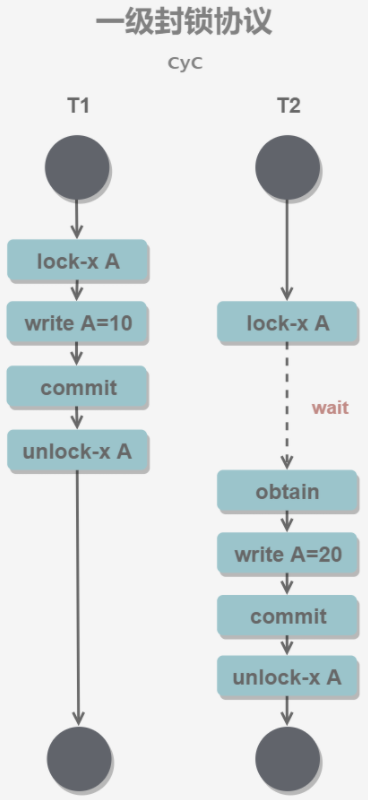

  * 二级封锁协议

    * **在一级的基础上，要求读取数据 A 时必须加 S 锁，读取完马上释放 S 锁**

    * 可以解决**读脏数据**问题，因为如果一个事务在对数据 A 进行修改，根据 一 级封锁协议，会加 X 锁，那么就不能再加 S 锁了，也就是不会读入数据

      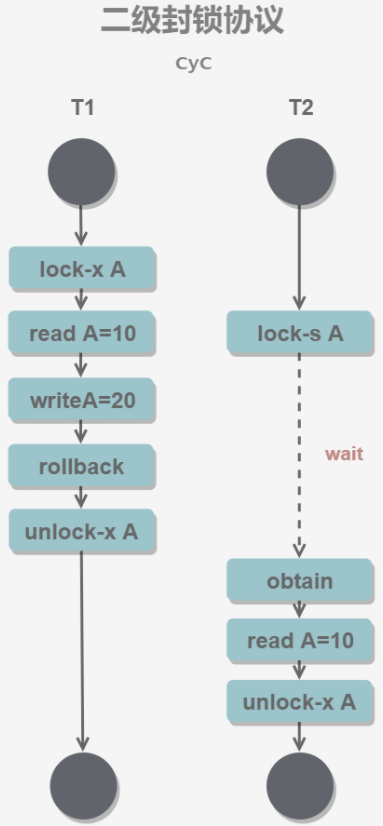

  * 三级封锁协议

    * 在二级的基础上，要求读取数据 A 时必须加 S 锁，直到事务结束了才能释放 S 锁

    * 可以解决**不可重复读**的问题，因为读 A 时，其它事务不能对 A 加 X 锁，从而避免了在读的期间数据发生改变

      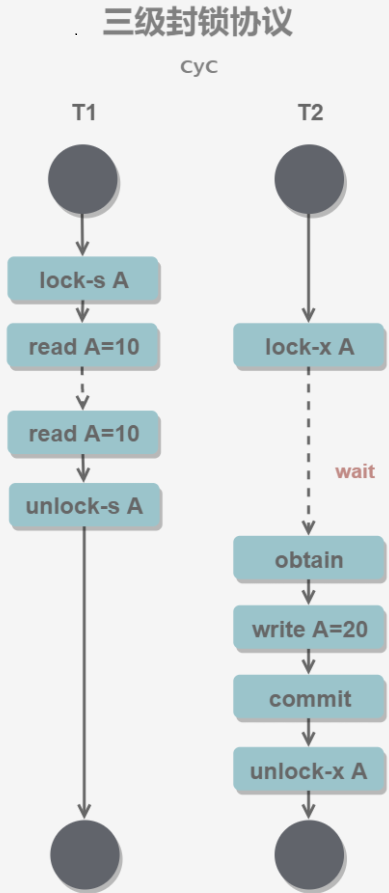

* 两段锁协议

  * 事务必须严格分为两个阶段对数据进行**加锁和解锁**的操作，**第一阶段加锁，第二阶段解锁**。也就是说**一个事务中一旦释放了锁，就不能再申请新锁了**

  * **可串行化调度**是指，通过并发控制，使得并发执行的事务结果与某个串行执行的事务结果相同。事务遵循两段锁协议是保证可串行化调度的充分条件

  * 事务遵循两段锁协议是保证可串行化调度的充分条件。例如以下操作满足两段锁协议，它是可串行化调度

    ```sql
    lock-x(A)...lock-s(B)...lock-s(C)...unlock(A)...unlock(C)...unlock(B)
    ```

  * 但不是必要条件，例如以下操作不满足两段锁协议，但它还是可串行化调度

    ```sql
    lock-x(A)...unlock(A)...lock-s(B)...unlock(B)...lock-s(C)...unlock(C)
    ```

# [MVCC](https://baijiahao.baidu.com/s?id=1629409989970483292&wfr=spider&for=pc)

## [MVCC(多版本并发控制，Multi-Version Concurrency Control)](https://www.jianshu.com/p/8845ddca3b23)实现

* MVCC在每行记录后面都保存有两个隐藏的列，用来存储**创建版本号**和**删除版本号**（都是事务版本号）

* 创建版本号：创建一个数据行时的事务版本号（**事务版本号**：事务开始时的系统版本号；**系统版本号**：每开始一个新的事务，系统版本号就会自动递增）

* 删除版本号：**删除操作时的事务版本号**

* 各种操作：

  * 在 MVCC 中事务的**修改操作**（DELETE、INSERT、UPDATE）会为**数据行新增一个版本快照(事务版本号)**
  * 插入操作时，记录创建版本号
  * 删除操作时，记录删除版本号
  * 更新操作时，先记录删除版本号，再新增一行记录创建版本号
  * **查询操作时，要符合以下条件才能被查询出来：删除版本号未定义或大于当前事务版本号**（删除操作是在当前事务启动之后做的）；**创建版本号小于或等于当前事务版本号**（创建操作是事务完成或者在事务启动之前完成）

* 通过版本号减少了锁的争用，**提高了系统性能**；可以实现**提交读**和**可重复读**两种隔离级别，未提交读无需使用MVCC。脏读和不可重复读最根本的原因是事务读取到其它事务未提交的修改。在事务**进行读取操作**时，为了解决**脏读和不可重复读**问题，MVCC 规定**只能读取已经提交的快照**。当然一个事务可以读取自身未提交的快照，这不算是脏读

* 而 MVCC 利用了多版本的思想，**写操作更新最新的版本快照，而读操作去读旧版本快照**，没有互斥关系，这一点和 Copy On Write 类似


## 快照读与当前读

* **使用 MVCC 读取的是快照中的数据**，这样可以减少加锁所带来的开销

  ```sql
  select * from table ...;
  ```

* 当前读**读取的是最新的数据，需要加锁**。以下第一个语句需要加 S 锁，其它都需要加 X 锁。**MVCC 对数据库进行修改的操作（INSERT、UPDATE、DELETE）需要进行加锁操作，从而读取最新的数据。可以看到 MVCC 并不是完全不用加锁，而只是避免了 SELECT 的加锁操作**

  ```sql
  select * from table where ? lock in share mode; -- S锁
  select * from table where ? for update;		-- X锁
  insert;
  update;
  delete;
  ```

## ReadView

* MVCC 维护了一个 ReadView 结构，主要包含了**当前系统未提交的事务列表** (`list`)TRX_IDs {TRX_ID_1, TRX_ID_2, ...}，还有该列表的最小值 (`up_limit_id`)TRX_ID_MI2N 和**最小尚未分配的事务id号**(`lower_limit_id`)TRX_ID_MAX

  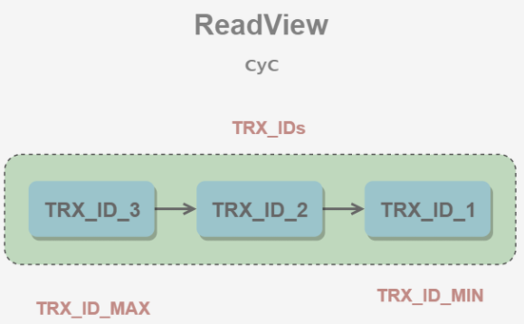

* 在进行 SELECT 操作时，**根据数据行快照的 TRX_ID 与 TRX_ID_MIN 和 TRX_ID_MAX 之间的关系，从而判断数据行快照是否可以使用**：

  - TRX_ID < TRX_ID_MIN，表示该数据行快照时在当前所有未提交事务之前进行更改的，因此**可以使用**
  - TRX_ID > TRX_ID_MAX，表示该数据行快照是在事务启动之后被更改的，因此**不可使用**
  - TRX_ID_MIN <= TRX_ID <= TRX_ID_MAX，需要根据隔离级别再进行判断：
    - 提交读：如果 TRX_ID 在 TRX_IDs 列表中，表示该数据行快照对应的事务**还未提交**，则该快照不可使用。否则表示已经提交，可以使用
    - 可重复读：**都不可以使用**。因为如果可以使用的话，那么其它事务也可以读到这个数据行快照并进行修改，那么当前事务再去读这个数据行得到的值就会发生改变，也就是出现了不可重复读问题

  **在数据行快照不可使用的情况下，需要沿着 Undo Log 的回滚指针 ROLL_PTR 找到下一个快照，再进行上面的判断**

* mvcc通过控制**readview的生成时机**实现RC和RR隔离级别
  * 对于RC隔离级别，**每次执行快照读都生成一个readview**，可以读到最新提交的快照，实现RC，同时导致不可能重复读
  * 对于RR隔离级别，**只在第一次快照读生成一个readview**，后续的快照读都使用第一次生成的readview，从而实现可重复读

## 解决幻读

* **在可重复读（REPEATABLE READ）隔离级别下，通过多版本并发控制（MVCC）+ Next-Key Lock 防止幻读**

* Record Lock

  * **锁定一个记录上的索引，而不是记录本身**。**如果表没有设置索引，InnoDB 会自动在主键上创建隐藏的聚簇索引，因此 Record Lock依然可以使用**

* Gap Lock

  * 锁定索引之间的间隙，但是不包含索引本身。例如当一个事务执行以下语句，其它事务就不能在 t.c 中插入 15

    ```sql
    SELECT c FROM t WHERE c BETWEEN 10 and 20 FOR UPDATE;
    ```

* Next-Key Lock

  * Next-Key Lock 是 MySQL 的 InnoDB 存储引擎的一种锁实现。**MVCC 不能解决幻影读问题**，Next-Key Lock 就是为了解决这个问题而存在的

  * 它是 Record Lock和 Gap Lock 的结合，**不仅锁定一个记录上的索引，也锁定索引之间的间隙**。它锁定一个**前开后闭区间**，例如一个索引包含以下值：10, 11, 13, and 20，那么就需要锁定以下区间：
  
    ```sql
    (-∞, 10]
    (10, 11]
    (11, 13]
    (13, 20]
    (20, +∞)
    ```

# 索引

## B+树

* InnoDB的索引使用的是B+树实现，**B+树对比B树的好处**：

  - **IO次数少**：B+树的中间结点只存放索引，数据都存在叶结点中，因此中间结点可以存更多的索引数据，让索引树更加矮胖

  - **范围查询效率更高**：B树需要中序遍历整个树，只B+树需要遍历叶结点中的链表

  - **查询效率更加稳定**：每次查询都需要从根结点到叶结点，路径长度相同，所以每次查询的效率都差不多

    

* 使用**B树索引和哈希索引的比较**

  * **哈希索引能以 O(1) 时间进行查找，但是只支持精确查找，无法用于部分查找和范围查找，无法用于排序与分组**；B树索引支持大于小于等于查找，范围查找。哈希索引遇到大量哈希值相等的情况后查找效率会降低。**哈希索引不支持数据的排序**
  * InnoDB 存储引擎有一个特殊的功能叫“**自适应哈希索引**”，当**某个索引值被使用的非常频繁**时，会在 **B+Tree 索引之上再创建一个哈希索引**，这样就让 B+Tree 索引具有哈希索引的一些优点，比如快速的哈希查找

* **B+树与红黑树的比较**

  *红黑树等平衡树也可以用来实现索引*，但是**文件系统及数据库系统普遍采用 B+ Tree 作为索引结构**，这是因为**使用 B+ 树访问磁盘数据有更高的性能**

  * **B+ 树有更低的树高**
    * 平衡树的树高 $\textbf{O}(h)=\textbf{O}(\log_dN)$，其中 d 为每个节点的出度。红黑树的出度为 2，而 B+ Tree 的出度一般都非常大，所以红黑树的树高 *h* 很明显比 B+ Tree 大非常多
  * **磁盘访问原理**
    * 操作系统一般将内存和磁盘分割成固定大小的块，每一块称为一页(一般为4kB)，内存与磁盘**以页为单位交换数据**。**数据库系统将索引的一个节点的大小设置为页的大小，使得一次 I/O 就能完全载入一个节点**
    * **Innodb页大小默认为16kB，MySQL一次载入一个InnoDB页**
    * 如果数据不在同一个磁盘块上，那么通常需要移动制动手臂进行寻道，而制动手臂因为其物理结构导致了移动效率低下，从而增加磁盘数据读取时间。**B+ 树相对于红黑树有更低的树高，进行寻道的次数与树高成正比**，在同一个磁盘块上进行访问只需要很短的磁盘旋转时间，所以 B+ 树更适合磁盘数据的读取
  * **磁盘预读特性**
    * **为了减少磁盘 I/O 操作，磁盘往往不是严格按需读取，而是每次都会预读**。预读过程中，**磁盘进行顺序读取，顺序读取不需要进行磁盘寻道，并且只需要很短的磁盘旋转时间，速度会非常快。并且可以利用预读特性，相邻的节点也能够被预先载入**

* B+树索引

  * 是大多数 MySQL 存储引擎的默认索引类型

  * 因为不再需要进行全表扫描，只需要对树进行搜索即可，所以查找速度快很多

  * 适用于**全键值、键值范围和键前缀查找**，其中**键前缀查找只适用于最左前缀查找**。**如果不是按照索引列的顺序进行查找，则无法使用索引**

  * InnoDB 的 B+Tree 索引分为**主索引和辅助索引**。**主索引的叶子节点 data 域记录着完整的数据记录，这种索引方式被称为聚簇索引**。因为**无法把数据行存放在两个不同的地方**，所以**一个表只能有一个聚簇索引**

    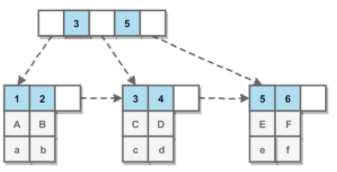

  * **辅助索引也叫非聚簇索引**的叶子节点的 **data 域记录着主键的值**，因此在**使用辅助索引进行查找时，需要先查找到主键值，然后再到主索引中进行查找**

    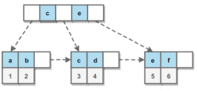

* 全文索引

  * MyISAM 存储引擎支持全文索引，用于**查找文本中的关键词，而不是直接比较是否相等**
  * 查找条件使用 `MATCH AGAINST`，而不是普通的 `WHERE`
  * 全文索引使用**倒排索引**实现，它记录着**关键词到其所在文档的映射**
  * **InnoDB 存储引擎在 MySQL 5.6.4 版本中也开始支持全文索引**

* 覆盖索引

  * 索引**包含所有需要查询的字段的值**。具有以下优点：
    - 索引通常远小于数据行的大小，只读取索引能大大减少数据访问量
    - 一些存储引擎（例如 MyISAM）在内存中只缓存索引，而数据依赖于操作系统来缓存。因此，只访问索引可以不使用系统调用（通常比较费时）
    - **对于 InnoDB 引擎，若辅助索引能够覆盖查询，则无需访问主索引(回表)**

* 使用索引的优点和缺点

  * 大大加快了数据的**检索速度**
  * 可以显著减少查询中**分组和排序**的时间
  * 通过创建唯一性索引，可以保证数据库表中每一行数据的唯一性
  * 将随机 I/O 变为**顺序 I/O**（B+Tree 索引是有序的，会将相邻的数据都存储在一起）
  * **缺点**：**建立和维护索引耗费时间空间，更新索引很慢**

## [**聚簇索引和非聚簇索引区别**](https://www.imooc.com/article/details/id/289139)

* **聚簇索引(clustered index)**
  * 概念
    * 聚簇索引就是按照每张表的主键构造一棵B+树，同时**叶子节点中存放的就是整张表的行记录数据，存储数据的顺序和索引顺序一致**，也将聚集索引的**叶子节点称为数据页**，**在记录插入的时候，会对数据页重新排序**
    * 一个表只能有一个聚簇索引，因为在一个表中数据的存放方式只有一种
  * 优点
    * 由于**行数据和叶子节点存储在一起，同一页中会有多条行数据，访问同一数据页不同行记录时，已经把页加载到了Buffer中，再次访问的时候，会在内存中完成访问**，不必访问磁盘。这样**主键和行数据是一起被载入内存的，找到叶子节点就可以立刻将行数据返回**了，**如果按照主键Id来组织数据，获得数据更快**
    * 聚簇索引**对于索引列的排序查找和范围查找速度非常快**，因为其数据是按照大小排列的
  * 缺点
    * **聚簇索引的更新代价比较高**，如果更新了行的聚簇索引列，就需要将数据移动到相应的位置。这可能因为要插入的页已满而导致“页分裂”。因此，对于InnoDB表，我们一般定义主键为不可更新
    * **聚簇索引可能导致全表扫描速度变慢，因为可能需要加载物理上相隔较远的页到内存中**（需要耗时的磁盘寻道操作）
    * 插入速度严重依赖于插入顺序，**按照主键进行插入的速度是加载数据到Innodb中的最快方式，否则将会出现页分裂，严重影响性能**。因此，对于InnoDB表，我们一般都会定义一个**自增的ID列为主键**。如果不是按照主键插入，最好在加载完成后使用`OPTIMIZE TABLE`命令重新组织一下表
    * **维护索引很昂贵，特别是插入新行或者主键被更新导致页分裂(page split)问题**
    * 表因为使用UUId（随机ID）作为主键，使数据存储稀疏，这就会出现聚簇索引有可能有比全表扫面更慢，所以建议使用int的auto_increment作为主键
* **非聚簇索引(nonclustered index)**
  * 概念
    * Innodb非聚簇索引的叶子节点并**不包含行记录的全部数据**，**叶子节点除了包含键值外，还包含了相应行数据的聚簇索引键**
    * 非聚簇索引的存在不影响数据在聚簇索引中的组织，所以一张表可以有多个非聚簇索引。在innodb中有时也称非聚簇索引为二级索引
  * 优点
    * 非聚簇叶子节点数据部分只存储了聚簇索引键值，而不是行指针(row pointers)，这减小了移动数据或者数据页面分裂时维护非聚簇索引的开销，因为**不需要更新索引的行指针**
  * 缺点
    * 非聚簇索引的二次查询（回表）问题：**二级索引访问需要两次索引查找，第一次找到主键值，第二次根据主键值找到行数据**
  * **建立复合索引（多列索引，组合索引）解决二次查询问题**
* **根本区别：**
  * 聚簇索引和非聚簇索引的**根本区别**是**索引和表数据是否存放在一起**

## Innodb和Myisam索引实现

* Innodb索引实现

  * 主键索引

    * 在**InnoDB中，表数据文件本身就是按B+Tree组织的一个索引结构**，这棵树的叶节点data域保存了完整的数据记录。这个索引的key是数据表的主键，因此InnoDB表数据文件本身就是主索引

    * 因为InnoDB的数据文件本身要按主键聚集，所以InnoDB要求表必须有主键（MyISAM可以没有），如果没有显式指定，则MySQL系统会自动选择一个可以唯一标识数据记录的列作为主键，如果不存在这种列，则**MySQL自动为InnoDB表生成一个隐含字段(rowid)作为主键，这个字段长度为6个字节，类型为长整形**

      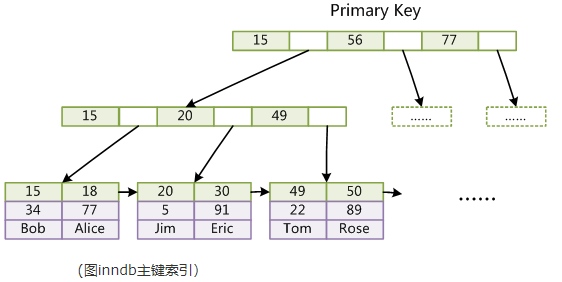

  * 辅助索引

    * InnoDB 表是基于聚簇索引建立的，因此InnoDB 的索引能提供一种非常快速的主键查找性能。InnoDB的所有非聚簇索引都引用聚簇索引键值作为data域，所以，**如果主键定义的比较大，其他索引也将很大**。如果想在表上定义很多索引，则**争取尽量把主键定义得小一些**。**InnoDB 不会压缩索引**

      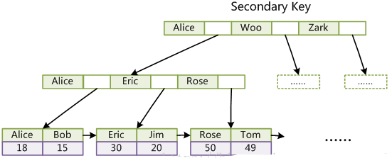

* Myisam索引实现

  * 主键索引

    * MyISAM引擎使用B+Tree作为索引结构，**MyISAM索引文件和数据文件是分离的**，叶节点的**data域存放的是数据记录的地址**

      

  * 辅助索引

    * 在MyISAM中，**主索引和辅助索引（Secondary key）在结构上没有任何区别**，**只是主索引要求key是唯一的，而辅助索引的key可以重复**

    * 同样也是一颗B+Tree，data域保存数据记录的地址。因此，**MyISAM中索引检索的算法为首先按照B+Tree搜索算法搜索索引，如果指定的Key存在，则取出其data域的值，然后以data域的值为地址，读取相应数据记录**

      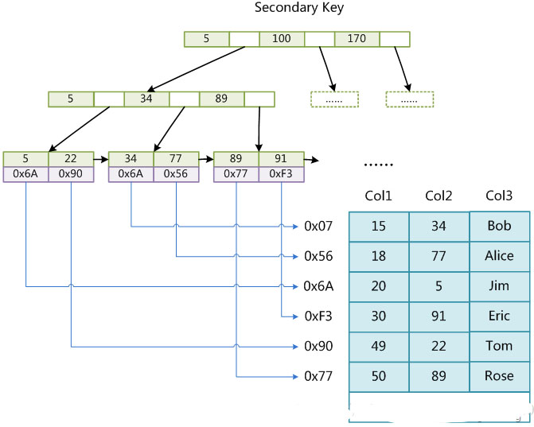

* Innodb和Myisam索引差别

  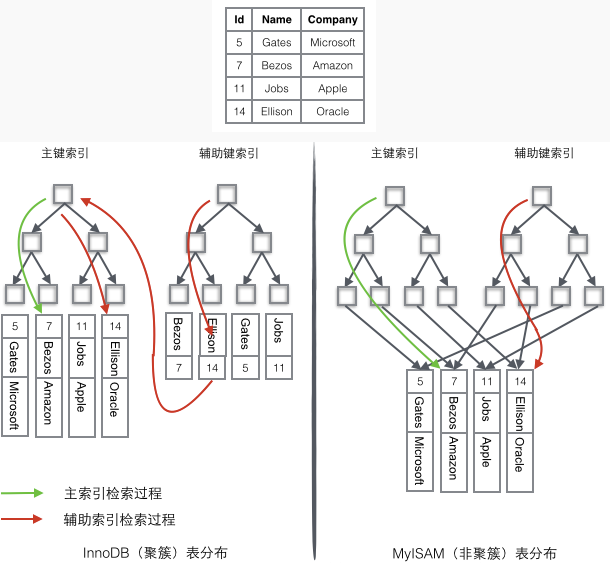

* **一个表中无论索引有多少个，数据只存储一份**。**数据在进行插入时，是必须跟索引存储在一起的。在Innodb存储引擎中，如果表中有主键，则用主键建立聚簇索引；如果没有主键，则用唯一键作为主键建立聚簇索引；如果还是没有唯一键，则Innodb会自动创建一个6字节的rowid字段为主键，作为聚簇索引。数据与聚簇索引存放一起**。无论如何，一定会建立一个聚簇索引

## 为什么官方建议使用自增长主键作为索引？

* 结合B+Tree的特点，**自增主键是连续的，在插入过程中尽量减少页分裂，即使要进行页分裂，也只会分裂很少一部分**。并且能减少数据的移动，每次插入都是插入到最后。总之就是**减少分裂和移动的频率**

## 索引失效条件

* 以“%(表示任意0个或多个字符)”开头的LIKE语句

* OR语句**前后没有同时使用索引**

* **数据类型出现隐式转化**（如varchar不加单引号的话可能会自动转换为int型）

* 对于组合索引，必须满足 **最左匹配原则**/**最左前缀原则** (最左优先，eg：多列索引col1、col2和col3，则索引生效的情形包括 col1或col1，col2或col1，col2，col3)

* 如果MySQL估计**全表扫描比索引快，则不使用索引**（比如**非常小的表**）

* or的真相

  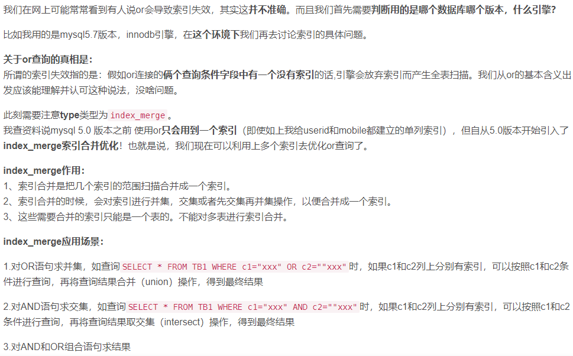

## 最左前缀匹配原则

* 创建组合索引：`ALTER TABLE tablename ADD INDEX lname_fname_age (lame, fname, age);`
* 为了提高搜索效率，我们需要考虑运用多列索引，由于索引文件以B+Tree格式保存，所以我们不用扫描任何记录，即可得到最终结果
* 注：在mysql中执行查询时，只能使用一个索引，如果我们在lname，fname，age上分别建索引，执行查询时，只能使用一个索引，mysql会选择一个最严格(获得结果集记录数最少)的索引
* **最左前缀原则：**顾名思义，就是最左优先，上例中我们创建了lname_fname_age多列索引，**相当于创建了(lname)单列索引，(lname，fname)组合索引以及(lname，fname，age)组合索引**
* mysql会**一直向右匹配直到遇到范围查询**(**>、<、between、like**)就停止匹配，比如a = 1 and b = 2 and c > 3 and d = 4 如果建立(a,b,c,d)顺序的索引，d是用不到索引的，如果建立(a,b,d,c)的索引则都可以用到，a,b,d的顺序可以任意调整

## [**索引下推**](https://blog.csdn.net/sinat_29774479/article/details/103470244)

* 概念

  * 索引下推（index condition pushdown ）简称ICP，在Mysql5.6的版本上推出，用于优化查询

  * 在不使用ICP的情况下，**在使用非主键索引（又叫普通索引或者二级索引）进行查询时**，**存储引擎通过索引检索到数据，然后返回给MySQL服务器，服务器然后判断数据是否符合条件** 

    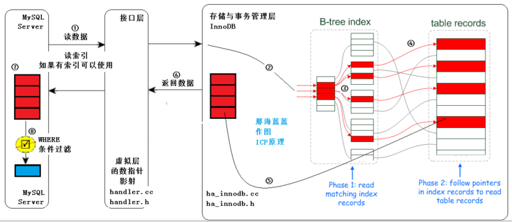

  * **在使用ICP的情况下，如果存在某些被索引的列的判断条件时，MySQL服务器将这一部分判断条件传递给存储引擎，然后由存储引擎通过判断索引是否符合MySQL服务器传递的条件，只有当索引符合条件时才会将数据检索出来返回给MySQL服务器** 

    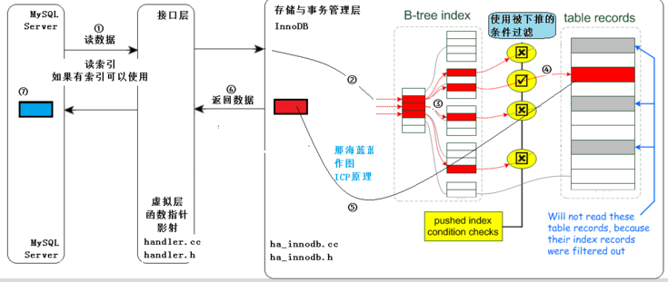

  * **索引条件下推优化可以减少存储引擎查询基础表的次数，也可以减少MySQL服务器从存储引擎接收数据的次数**

  * 索引下推优化技术其实就是**充分利用了索引中的数据**，**尽量在查询出整行数据之前过滤掉无效的数据**

* 实例解析

  * 在开始之前先先准备一张用户表(user)，其中主要几个字段有：id、name、age、address。**建立联合索引（name，age）**

  * 假设有一个需求，要求匹配姓名第一个为陈的所有用户，sql语句如下

    ```sql
    SELECT * from user where  name like '陈%'
    ```

  * 根据 "最佳左前缀" 的原则，这里使用了**联合索引**（name，age）进行了查询，性能要比全表扫描肯定要高

  * 问题来了，如果有其他的条件呢？假设又有一个需求，要求匹配姓名第一个字为陈，年龄为20岁的用户，此时的sql语句如下

    ```sql
    SELECT * from user where  name like '陈%' and age=20
    ```

  * 这条sql语句应该如何执行呢？下面对Mysql 5.6之前版本和之后版本进行分析

    * 5.6之前的版本是没有索引下推这个优化的，因此执行的过程如下图

      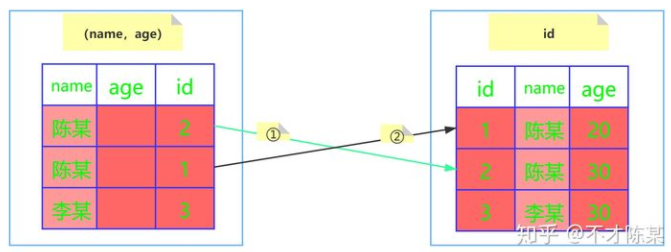

    * 会忽略age这个字段，直接通过name进行查询，在(name,age)这课树上查找到了两个结果，id分别为2,1，然后拿着取到的id值一次次的回表查询，因此这个过程需要**回表两次**

    * 5.6版本添加了索引下推这个优化，执行的过程如下图

      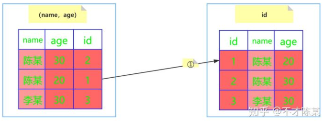

    * InnoDB并**没有忽略age这个字段**，而是**在索引内部就判断了age是否等于20**，对于不等于20的记录直接跳过，因此在(name, age)这棵索引树中只匹配到了一个记录，此时拿着这个id去主键索引树中回表查询全部数据，这个过程**只需要回表一次**

  * 索引下推在**非主键索引**上的优化，可以**有效减少回表的次数，大大提升了查询的效率**

  * 关闭索引下推可以使用如下命令

  ```sql
  set optimizer_switch='index_condition_pushdown=off';
  ```

## 什么地方适合做索引

* **某列经常作为最大最小值**
* 在**作为主键**的列上，强制该列的唯一性和组织表中数据的排列结构
* **经常被查询的字段**
* 在**经常用作表连接的字段**上，这些列**主要是一些外键**，可以加快连接的速度
* **经常出现在ORDER BY/GROUP BY/DISDINCT后面的字段**
* 在**经常需要排序**的列上创建索引，因为索引已经排序，这样查询可以利用索引的排序，加快排序查询时间
* 在**经常使用在WHERE子句**中的列上面创建索引，加快条件的判断速度
* 在经常需要**根据范围进行搜索**的列上创建索引，因为索引已经排序，其指定的范围是连续的

## 创建索引时需要注意什么？

* 只应建立在**小字段**上，而不要对大**文本或图片**建立索引（**一页存储的数据越多一次IO操作获取的数据越大效率越高**）
* 建立索引的字段应该**非空**，在MySQL中，**含有空值的列很难进行查询优化，因为它们使得索引、索引的统计信息以及比较运算更加复杂**。应该用0、一个特殊的值或者一个空串代替NULL
* 选择**数据密度大**（唯一值占总数的百分比很大）的字段作索引
* 对于那些在**查询中很少使用或者参考的列不应该创建索引**。这是因为，既然这些列很少使用到，因此有索引或者无索引，并不能提高查询速度。相反，由于增加了索引，反而降低了系统的维护速度和增大了空间需求
* 对于那些只有**很少数据值的列**也不应该增加索引。这是因为，由于这些列的取值很少，**例如人事表的性别列**，在查询的结果中，结果集的数据行占了表中数据行的很大比例，即需要在表中搜索的数据行的比例很大。增加索引，并不能明显加快检索速度
* 对于那些定义为**text, image和bit数据类型**的列不应该增加索引。这是因为，这些列的**数据量要么相当大，要么取值很少**
* 当**修改性能远远大于检索性能**时，不应该创建索引。这是因为，修改性能和检索性能是互相矛盾的。当增加索引时，会提高检索性能，但是会降低修改性能。当减少索引时，会提高修改性能，降低检索性能。因此，当修改性能远远大于检索性能时，不应该创建索引

# MySQL优化

## SQL 语句优化

* **分析慢查询日志**：记录了在MySQL中响应时间超过阀值`long_query_time`的SQL语句，通过日志去找出IO大的SQL以及发现未命中索引的SQL

  * 首先分析语句，看看**是否load了额外的数据**，可能是查询了**多余的行并且抛弃掉了**，可能是加载了**许多结果中并不需要的列**，对语句进行分析以及重写
  * 分析语句的执行计划，然后**获得其使用索引的情况**，之后**修改语句或者修改索引**，**使得语句可以尽可能的命中索引**
  * 如果对语句的优化已经无法进行，可以**考虑表中的数据量是否太大**，如果是的话可以进行横向或者纵向的分表

* **只返回必要的列**：最好不要使用 `SELECT *` 语句

* **UNION ALL的效率高于UNION**

* 只**返回必要的行**：使用 **LIMIT 语句**来限制返回的数据，可以记录上次查询的最大ID，下次查询直接根据ID来查询

* 将一个**大连接查询分解成对每一个表进行一次单表查询**，然后在应用程序中进行关联，这样做的好处有

  - **让缓存更高效**。对于连接查询，**如果其中一个表发生变化，那么整个查询缓存就无法使用**。**而分解后的多个查询，即使其中一个表发生变化，对其它表的查询缓存依然可以使用**
  - 分解成**多个单表查询**，这些单表查询的缓存结果更可能被其它查询使用到，**从而减少冗余的查询**
  - **减少锁竞争**

* **优化WHERE子句**

  * 对查询进行优化，应尽量避免全表扫描，**首先应考虑在 where 及 order by 涉及的列上建立索引**

  * 应尽量**避免在 where 子句中对字段进行 null 值判断**，否则将导致引擎放弃使用索引而进行全表扫描

  * 应尽量**避免在 where 子句中使用!=或<>操作符**，否则引擎将放弃使用索引而进行全表扫描

  * 应尽量避免在 where 子句中**使用or 来连接条件**，否则将导致引擎放弃使用索引而进行全表扫描

    ```sql
    select id from t where num=10 or num=20;
    -- 可以这样查询：
    select id from t where num=10 
    union all 
    select id from t where num=20;
    ```

  * in 和 not in 也要慎用，否则会导致全表扫描

  * 下面的查询也将导致全表扫描：`select id from t where name like '%李%'`若要提高效率，可以考虑全文检索

  * **如果在 where 子句中使用参数，也会导致全表扫描**。因为SQL只有在运行时才会解析局部变量，但优化程序不能将访问计划的选择推迟到运行时；它必须在编译时进行选择。然 而，如果在编译时建立访问计划，变量的值还是未知的，因而无法作为索引选择的输入项。如下面语句将进行全表扫描

    ```sql
    select id from t where num=@num;
    -- 可以改为强制查询使用索引：
    select id from t with(index(索引名)) where num=@num;
    ```

  * 应尽量避免在 where 子句中**对字段进行表达式操作**，这将导致引擎放弃使用索引而进行全表扫描

    ```sql
    select id from t where num/2=100
    -- 应改为:
    select id from t where num=100*2
    ```

  * 应尽量避免在where子句中**对字段进行函数操作**，这将导致引擎放弃使用索引而进行全表扫描

    ```sql
    select id from t where substring(name,1,3)='abc';
    -- name以abc开头的id应改为:
    select id from t where name like 'abc%';
    ```

  * 不要在 where 子句中的**“=”左边进行函数、算术运算或其他表达式运算**，否则系统将可能无法正确使用索引

* **优化长难的查询语句**

  * MySQL内部每秒能扫描内存中上百万行数据，相比之下，响应数据给客户端就要慢得多
  * 使用**尽可能小的查询是好的**，但是有时将一个**大的查询分解为多个小的查询**是很有必要的
  * **切分查询，将一个大的查询分为多个小的相同的查询**
  * **一次性删除1000万的数据要比一次删除1万，暂停一会的方案更加损耗服务器开销**
  * 分解**关联查询，让缓存的效率更高**
  * **执行单个查询可以减少锁的竞争**
  * 在应用层做关联更容易对数据库进行拆分，查询效率会有大幅提升
  * 较少冗余记录的查询

* 优化**特定类型**的查询语句

  * **count(*)会忽略所有的列，直接统计所有列数，不要使用count(列名)**
  * MyISAM中，没有任何where条件的`count(*)`非常快
  * 当有where条件时，MyISAM的count统计不一定比其它引擎快
  * 可以使用explain查询近似值，用近似值替代count(*)
  * 增加汇总表
  * **使用缓存**

* 优化**关联查询**

  - **确定ON或者USING子句中是否有索引**
  - 确保**GROUP BY和ORDER BY只有一个表中的列**，这样MySQL才有可能使用索引

* 优化**子查询**

  * 用**关联查询**替代
  * 优化GROUP BY和DISTINCT
  * 这两种查询据可以使用索引来优化，是最有效的优化方法
  * 关联查询中，使用标识列分组的效率更高
  * 如果不需要ORDER BY，进行GROUP BY时加ORDER BY NULL，MySQL不会再进行文件排序
  * WITH ROLLUP超级聚合，可以挪到应用程序处理

* **区分in和exists， not in和not exists**

  ```sql
  select * from 表A where id in (select id from 表B);
  ```

  上面sql语句相当于

  ```sql
  select * from 表A where exists(select * from 表B where 表B.id=表A.id)
  ```

  区分in和exists主要是造成了驱动顺序的改变（这是性能变化的关键），**如果是exists，那么以外层表为驱动表，先被访问，如果是IN，那么先执行子查询**。所以**IN适合于外表大而内表小的情况；EXISTS适合于外表小而内表大的情况**

* **关于not in和not exists，推荐使用not exists，不仅仅是效率问题，not in可能存在逻辑问题**

  ```sql
  select colname … from A表 where a.id not in (select b.id from B表);
  ```

  高效的sql语句

  ```sql
  select colname … from A表 left join B表 on a.id = b.id where b.id is null;
  ```

  取出的结果为A表不在B表中的数据

## mysql 查看sql语句执行时间和效率

* 1 show profiles
* 2 show variables;查看profiling 是否是on状态
* 3 如果是off，则 set profiling = 1
* 4 执行自己的sql语句
* 5 show profiles；就可以查到sql语句的执行时间

## 使用explain优化sql和索引

* 通过explain命令可以得到**表的读取顺序**、**数据读取操作的操作类型**、**哪些索引可以使用**、**哪些索引被实际使用**、表之间的引用以及**被扫描的行数**等问题
* **对于复杂、效率低的sql语句，我们通常是使用explain sql 来分析sql语句，这个语句可以打印出，语句的执行。这样方便我们分析，进行优化**
* 如果发现**查询需要扫描大量的数据，但只返回少数的行**
  * 使用索引覆盖扫描，把所有的列都放到索引中，这样存储引擎不需要回表获取对应行就可以返回结果
  * 改变数据库和表的结构，修改数据表范式
  * 重写SQL语句，让优化器可以以更优的方式执行查询
* table：**显示这一行的数据是关于哪张表的**
* **type**：**这是重要的列，显示连接使用了何种类型。从最好到最差的连接类型为const、eq_reg、ref、range、index和ALL**
  * all：**full table scan ;MySQL将遍历全表以找到匹配的行；**
  * **index**：index scan; index 和 all的区别在于index类型只遍历索引；
  * **range：**索引范围扫描，对索引的扫描开始于某一点，返回匹配值的行，常见与between ，等查询；
  * **ref：**非唯一性索引扫描，返回匹配某个单独值的所有行，常见于使用非唯一索引即唯一索引的非唯一前缀进行查找
  * **eq_ref：**唯一性索引扫描，对于每个索引键，表中只有一条记录与之匹配，常用于主键或者唯一索引扫描；
  * **const，system：**当MySQL**对某查询某部分进行优化**，**并转为一个常量时，使用这些访问类型**。如果将主键置于where列表中，MySQL就能将该查询转化为一个常量
* **possible_keys：**显示**可能应用在这张表中的索引**。如果为空，没有可能的索引。可以**为相关的域从WHERE语句中选择一个合适的语句**
* **key：** **实际使用的索引**。如果为NULL，则没有使用索引。很少的情况下，MySQL会选择优化不足的索引。这种情况下，可以在SELECT语句中使用USE INDEX（indexname）来强制使用一个索引或者用IGNORE INDEX（indexname）来强制MySQL忽略索引
* **key_len：**使用的索引的长度。在不损失精确性的情况下，长度越短越好
* **ref：**显示索引的哪一列被使用了，如果可能的话，是一个常数
* **rows：**MySQL认为必须检查的用来返回请求数据的行数
* **Extra：**关于MySQL如何解析查询的额外信息

* 索引的优化
  * 注意会**引起索引失效的情况**，以及**在适合的地方建立索引**

## 数据库表结构的优化

* 设计表时遵循**三大范式**
* 选择合适的**数据类型**：尽可能不要存储NULL字段；使用简单的数据类型（int, varchar/ text）
* 表的**水平切分**（Sharding）：将同一个表中的记录拆分到多个结构相同的表中（策略：哈希取模；根据ID范围来分）。当一个表的数据不断增多时，Sharding 是必然的选择，它可以将数据分布到集群的不同节点上，从而缓解单个数据库的压力
* 表的**垂直切分**：将一张表按列切分成多个表。可以将不常用的字段单独放在同一个表中；把大字段独立放入一个表中；或者把经常使用的字段（关系密切的）放在一张表中。垂直切分之后业务更加清晰，系统之间整合或扩展容易，数据维护简单

* 系统配置的优化操作系统

  * 增加TCP支持的队列数
  * MySQL配置文件优化：**缓存池大小和个数设置**

* 硬件的优化磁盘性能

  * 固态硬盘
  * CPU：多核且高频
  * 内存：增大内存

* 切分

  * 水平切分

    * 水平切分又称为 Sharding，它是将同一个表中的记录拆分到多个结构相同的表中

    * 当一个表的数据不断增多时，Sharding 是必然的选择，它可以将数据分布到集群的不同节点上，从而缓存单个数据库的压力

      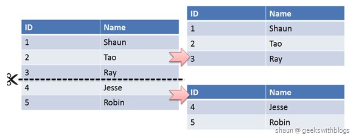

  * 垂直切分

    * 垂直切分是将一张表按列切分成多个表，通常是按照列的关系密集程度进行切分，也可以利用垂直切分将经常被使用的列和不经常被使用的列切分到不同的表中

    * 在数据库的层面使用垂直切分将按数据库中表的密集程度部署到不同的库中，例如将原来的**电商数据库垂直切分成商品数据库、用户数据库**等

      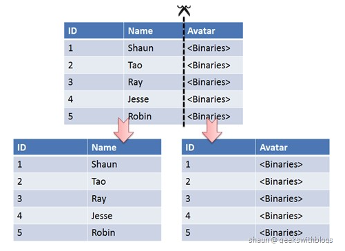

  * Sharding 策略

    * 哈希取模：hash(key) % N；
    * 范围：可以是 ID 范围也可以是时间范围
    * 映射表：使用单独的一个数据库来存储映射关系

  * Sharding 存在的问题

    * 事务问题
      * 使用分布式事务来解决，比如 XA 接口
    * 连接
      * 可以将原来的连接分解成多个单表查询，然后在用户程序中进行连接
    * ID 唯一性
      * 使用全局唯一 ID（GUID）
      * 为每个分片指定一个 ID 范围
      * 分布式 ID 生成器 (如 Twitter 的 Snowflake 算法)

# 分库分表

## 分库分表方案

- 水平分库：以字段为依据，按照一定策略（hash、range等），将一个库中的数据拆分到多个库中
- 水平分表：以字段为依据，按照一定策略（hash、range等），将一个表中的数据拆分到多个表中
- 垂直分库：以表为依据，按照业务归属不同，将不同的表拆分到不同的库中
- 垂直分表：以字段为依据，按照字段的活跃性，将表中字段拆到不同的表（主表和扩展表）中

# 主从复制

* 什么是主从复制？实现原理是什么？

  * 主从复制（Replication）是指数据可以**从一个MySQL数据库主服务器复制到一个或多个从服务器**，从服务器可以复制主服务器中的所有数据库或者特定的数据库，或者特定的表。**默认采用异步模式**

  * 实现原理：

    - 主服务器 **binary log dump 线程**：**将主服务器中的数据更改（增删改）日志写入 Binary log** 中

    - 从服务器 **I/O 线程**：**负责从主服务器读取binary log，并写入本地的 Relay log**

    - 从服务器 **SQL 线程**：负责**读取 Relay log，解析出主服务器已经执行的数据更改，并在从服务器中重新执行（Replay），保证主从数据的一致性**

      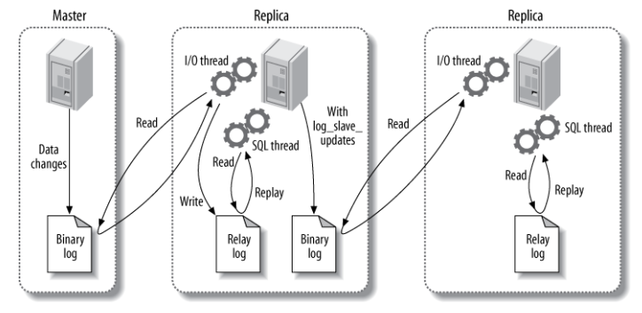

* 为什么要主从复制？

  * **读写分离**：主服务器负责写，从服务器负责读

    - **缓解了锁的争用**，**即使主服务器中加了锁，依然可以进行读操作**

    - **从服务器可以使用 MyISAM，提升查询性能以及节约系统开销**

    - **增加冗余，提高可用性**

    - **读写分离常用代理方式来实现**，代理服务器接收应用层传来的读写请求，然后决定转发到哪个服务器

      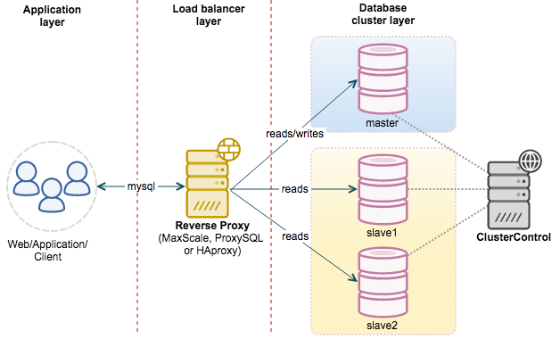

  * **数据实时备份，当系统中某个节点发生故障时，可以方便的故障切换**

  * **降低单个服务器磁盘I/O访问的频率，提高单个机器的I/O性能**

* **主从复制的不同模式及区别**

  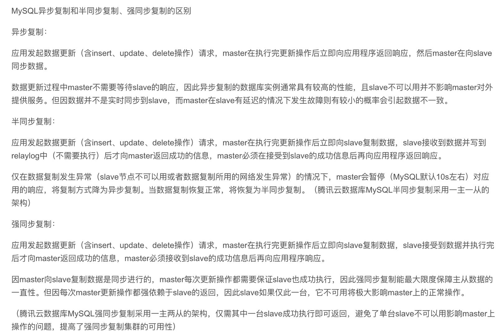

* 主从复制延迟产生的原因

  * 在某些部署环境中，备库所在的机器性能要比主库所在的机器性能差。此时如果**机器的资源不足的话，就会影响备库同步的效率**
  * 备库充当了读库，一般情况下主要写的压力在主库，那么备库会提供一部分读的压力，而如果**备库的查询压力过大**的话，备库的查询消耗了大量的cpu资源，那么必不可少的就会影响同步的速度
  * **大事务执行**，如果主库的一个事务执行了10分钟，而binlog的写入必须要等待事务完成之后，才会传入备库，那么此时在开始执行的时候就已经延迟了10分钟了
  * **主库的写操作是顺序写binlog，从库单线程去主库顺序读binlog，从库取到binlog之后在本地执行**。mysql的主从复制都是单线程操作，但是由于主库是顺序写，所以效率很高，而从库也是顺序读取主库的binlog日志，此时的效率也是比较高的，**但是当数据拉去回来之后变成了随机的读写操作**，而不是顺序的，此时也会发生延迟
  * 从库在同步数据的同时，可能**跟其他查询的线程发生锁抢占**的情况，此时也是会发生延迟
  * 当从库的TPS并发非常高的情况下，产生的DDL数量超过了一个线程所能承受的范围的时候，那么也可能导致延迟
  * 在进行binlog日志传输的时候，如果**网络带宽不是很好**，那么**网络延迟**也可能造成数据同步延迟

* 主从复制延迟解决办法

  * 架构方面

    * **业务的持久化层实现采用分库架构，让不同的业务请求分散到不同的数据库服务上，分散单台机器的压力**
    * 服务的基础架构在服务和mysql之间加入缓冲层，减少mysql读的压力，但是需要注意的是，**如果数据经常要发生修改，那么这种设计是不合理的**，因为**需要频繁的去更新缓存中的数据**，保持数据的一致性，**导致缓存的命中率很低**，所以此时就要慎用缓存
    * 使用更好的硬件设备，比如cpu，ssd等，但是这种方案一般对于公司而言不太能接受，原因很简单，就是会增加公司的成本，需要评估投入产出比

  * 并行复制

    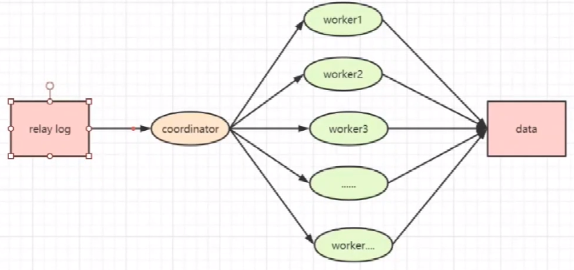

    * MySQ 5.6版本后引入了并行复制的概念
    * 所谓的并行复制，就是在中间添加了一个分发环节，也就是原来的sql_thread变成了coordinator组件，当日志来了之后，coordinator负责读取日志信息和分发事务，真正的日志执行的过程是放在了worker线程上，由**多个线程并行执行**
    * 分发规则
      * 更新同一行的多个事务，必须要分发到同一个worker中执行，否则会引起数据不一致的问题
      * 同一个事务不能被拆开，必须分发给同一个worker执行

* 数据更新流程

  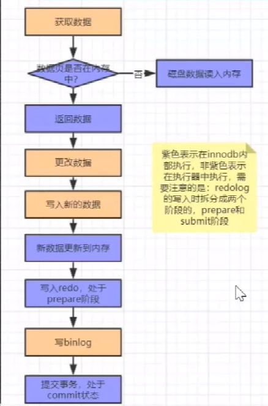

  * 执行流程
    * 执行器先从引擎中找到数据，如果在内存中直接返回，不在，查询后返回
    * 执行器拿到数据之后会先修改数据，然后调用引擎接口重新写入数据
    * 引擎将数据更新到内存，同时写数据到redolog中，此时**处于prepare阶段**，并通知执行器执行完成，随时可以操作
    * 执行器生成这个操作的binlog
    * 执行器调用引擎的事务提交接口，引擎把刚写完的redolog改成**commit状态**，更新完成
  * **redo log两阶段提交**
    * **先写redo log后写binlog**：假设在redo log写完，binlog还没有写完的时候，mysql进程异常重启。由于在redo log写完后，系统即使崩溃，仍然能后把数据恢复回来，但由于binlog没写完就crash了，这时候binlog就没有记录完修改语句。因此之后备份日志的时候，存起来的binlog里面语句不全。如果使用这个binlog恢复临时库，会与主库的数据不一致
    * **先写binlog后写redo log**：如果在binlog写完后crash，由于redo log还没写，崩溃恢复以后这个事务无效，但是binlog已经记录了完整的事务日志。所以之后用binlog恢复从库数据时，与主库数据也不一致

# 存储引擎比较

* MySQL的两种存储引擎 InnoDB 和 MyISAM 的区别？

  * InnoDB**支持事务**，可以进行Commit和Rollback

  * **MyISAM 只支持表级锁**，而 InnoDB 还**支持行级锁**，提高了并发操作的性能

  * InnoDB **支持外键**，Myisam不支持

  * MyISAM **崩溃**后发生损坏的概率比 InnoDB 高很多，而且**恢复的速度**也更慢

  * MyISAM 支持**压缩**表和空间数据索引，InnoDB需要更多的内存和存储

  * MyISAM存储引擎下**索引和数据存储是分离的**，**InnoDB索引和数据存储在一起(聚簇索引)**

  * InnoDB 支持在线**热备份**

  * MyISAM是deadlock-free的，而InnoDB可能会出现死锁现象

  * 应用场景

    * **MyISAM** 管理非事务表。它提供高速存储和检索（MyISAM强调的是性能，**每次查询具有原子性**，其执行速度比InnoDB更快），以及全文搜索能力。如果**表比较小**，或者是**只读数据**（有大量的SELECT），还是可以使用MyISAM
    * **InnoDB** 支持事务，**并发情况下有很好的性能**，基本可以替代MyISAM

  * 热备份和冷备份

    * 热备份：**在数据库运行的情况下备份的方法**。优点：可按表或用户备份，备份时数据库仍可使用，可恢复至任一时间点。但是不能出错

    * 冷备份：**数据库正常关闭后，将关键性文件复制到另一位置的备份方式**。优点：操作简单快速，恢复简单

      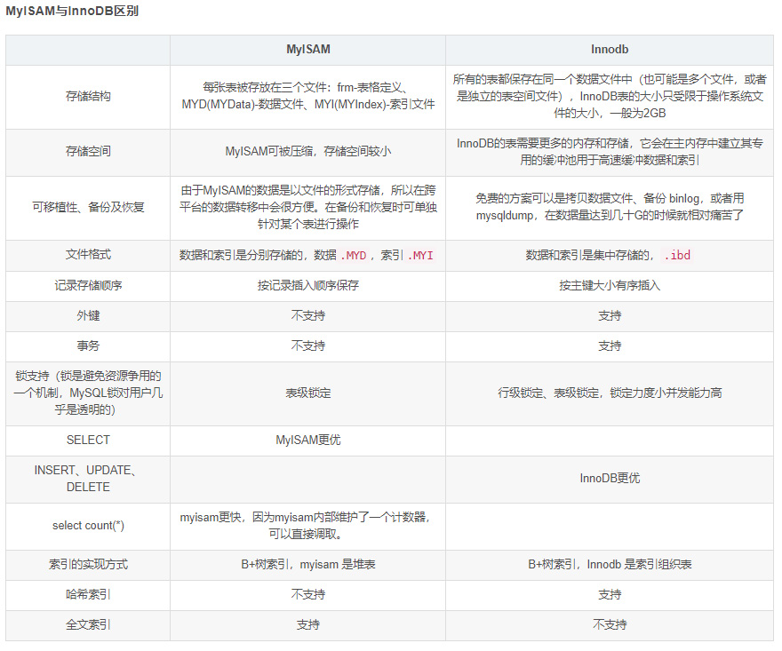

* 其他整理：
  - InnoDB支持**事务**，MyISAM不支持事务
  - InnoDB支持**外键**，MyISAM不支持外键
  - InnoDB 支持 MVCC(多版本并发控制)，MyISAM 不支持 select count(*) from table时，MyISAM更快，因为它有一个变量保存了整个表的总行数，可以直接读取，InnoDB就需要全表扫描
  - Innodb不支持全文索引，而MyISAM支持全文索引（5.7以后的InnoDB也支持全文索引）
  - InnoDB支持**表、行级锁**，并发度更高，而MyISAM支持表级锁
  - InnoDB表**必须有主键**，而MyISAM可以没有主键
  - Innodb表需要更多的内存和存储，而**MyISAM可被压缩**，存储空间较小，。
  - Innodb**按主键大小有序插入**，MyISAM记录插入顺序是，按记录插入顺序保存
  - InnoDB 存储引擎提供了具有**提交、回滚、崩溃恢复能力的事务安全**，与MyISAM比InnoDB 写的效率差一些，并且会占用更多的磁盘空间以保留数据和索引

# SQL注入

* SQL注入

  * SQL注入攻击是通过操作输入来修改SQL语句，用以达到执行代码对WEB服务器进行攻击的方法。简单的说就是在post/getweb表单、输入域名或页面请求的查询字符串中插入SQL命令，最终使web服务器执行恶意命令的过程。可以通过一个例子简单说明SQL注入攻击。假设某网站页面显示时URL为http://www.example.com?test=123，**此时URL实际向服务器传递了值为123的变量test**，这**表明当前页面是对数据库进行动态查询的结果**。由此，我们可以在URL中插入恶意的SQL语句并进行执行。另外，在网站开发过程中，**开发人员使用动态字符串构造SQL语句，用来创建所需的应用，这种情况下SQL语句在程序的执行过程中被动态的构造使用**，可以根据不同的条件产生不同的SQL语句，比如需要根据不同的要求来查询数据库中的字段。这样的开发过程其实为SQL注入攻击留下了很多的可乘之机

  * 如在没有过滤特殊字符时，出现的SQL情况

    ```sql
    $name = "Qadir'; DELETE FROM users;";
    mysql_query($conn, "SELECT * FROM users WHERE name='{$name}'");
    ```

    以上的注入语句中，我们没有对 \$name 的变量进行过滤，$name 中插入了我们不需要的SQL语句，将删除 users 表中的所有数据。

    * **Like语句中的注入**：like查询时，如果用户输入的值有"\_"和"%"，则会出现这种情况：用户本来只是想查询"abcd"，查询结果中却有"abcd_"、"abcde"、"abcdf"等等；用户要查询"30%"（注：百分之三十）时也会出现问题。

  * 注入过程

    * 第一步：SQL注入点探测。**探测SQL注入点是关键的一步**，通过适当的分析应用程序，**可以判断什么地方存在SQL注入点**。通常**只要带有输入提交的动态网页，并且动态网页访问数据库，就可能存在SQL注入漏洞**。如果程序员信息安全意识不强，采用动态构造SQL语句访问数据库，**并且对用户的输入未进行有效性验证**，则存在SQL注入漏洞的可能性很大。一般通过页面的报错信息来确定是否存在SQL注入漏洞
    * 第二步：收集后台数据库信息。不同数据库的注入方法、函数都不尽相同，**因此在注入之前，我们先要判断一下数据库的类型**。判断数据库类型的方法很多，可以输入特殊字符，如单引号，让程序返回错误信息，我们根据错误信息提示进行判断；还可以使用特定函数来判断，比如输入“1 and version（）>0”，程序返回正常，说明version（）函数被数据库识别并执行，而version（）函数是MySQL特有的函数，因此可以推断后台数据库为MySQL
    * 第三步：**猜解用户名和密码**。**数据库中的表和字段命名一般都是有规律的**。通过构造特殊SQL语句在数据库中依次**猜解出表名、字段名、字段数、用户名和密码**
    * 第四步：查找Web后台管理入口。WEB后台管理通常不对普通用户开放，要找到后台管理的登录网址，可以利用Web目录扫描工具（如wwwscan、AWVS）快速搜索到可能的登录地址，然后逐一尝试，便可以找到后台管理平台的登录网址
    * 第五步：入侵和破坏。一般后台管理具有较高权限和较多的功能，**使用前面已破译的用户名、密码成功登录后台管理平台后，就可以任意进行破坏，比如上传木马、篡改网页、修改和窃取信息等，还可以进一步提权，入侵Web服务器和数据库服务器**

  * 检测技术

    * SQL注入的检测方式目前主要有两大类，第一：**动态监测**，即**在系统运行时，通常在系统验收阶段或上线运行阶段使用该方法，使用动态监测攻击对其系统进行扫描，然后依据扫描结果判断是否存在SQL注入漏洞**。第二：**静态检测**，又称静态代码扫描，对代码做深层次分析
      * **动态检测**：动态监测分为两类：**手工监测以及工具监测**。相对于**手动监测的高成本以及高漏检率**，在实际生产过程中更偏向于工具监测，但**工具监测同样存在较大的局限性**。其原因在于**工具是用报文来判断SQL注入是否生效**，然而**仅仅通过报文是很难精准地判断SQL注入是否存在**，因此存在较高的误报率
      * **静态检测**：静态检测的误报率相对较低，其主要原因在于**SQL注入漏洞的代码特征较为明显**
        * **使用数据库交互代码**；
        * 使用**字符串拼接方式构造动态SQL语句**；
        * **使用未过滤的不可信任数据**
      * 在常规的排查应用系统中是否存在SQL注入漏洞时，由于静态扫描的代码特征明显，误报率低和直接阅读相关代码，工作总量减少的优势，通常使用静态扫描

  * 防止SQL注入

    * 永远不要信任用户的输入。对用户的**输入进行校验**，可以**通过正则表达式**，或**限制长度**；对**单引号和 双"-"进行转换**等
    * 永远**不要使用动态拼装SQL**，可以使用**参数化的SQL或者直接使用存储过程进行数据查询存取**
    * **永远不要使用管理员权限的数据库连接，为每个应用使用单独的权限有限的数据库连接**
    * **不要把机密信息直接存放，加密或者hash掉密码和敏感的信息**
    * **应用的异常信息应该给出尽可能少的提示，最好使用自定义的错误信息对原始错误信息进行包装**
    * SQL注入的检测方法一般采取辅助软件或网站平台来检测，软件一般采用sql注入检测工具jsky，网站平台就有亿思网站安全平台检测工具。MDCSOFT SCAN等。采用MDCSOFT-IPS可以有效的防御SQL注入，XSS攻击等
    * 分级管理
      * 对用户进行分级管理，严格控制用户的权限，**对于普通用户，禁止给予数据库建立、删除、修改等相关权限，只有系统管理员才具有增、删、改、查的权限**。例如用户在查询语句中加入了drop table。肯定是不能让其执行的，否则系统的数据库安全性就无法保障。故而通过权限的设计限制。使得即使恶意攻击者在数据提交时嵌入了相关攻击代码。但因为设置了权限，从而使得代码不能执行。从而减少SQL注入对数据库的安全威胁
    * 参数传值
      * **程序员在书写SQL语言时，禁止将变量直接写入到SQL语句**，必须**通过设置相应的参数来传递相关的变量**。从而抑制SQL注入。数据输入不能直接嵌入到查询语句中。同时要过滤输入的内容，过滤掉不安全的输入数据。或者采用参数传值的方式传递输入变量。这样可以最大程度防范SQL注入攻击
    * 基础过滤与二次过滤
      * SQL注入攻击前，入侵者通过修改参数提交“and”等特殊字符，判断是否存在漏洞，然后通过select、update等各种字符编写SQL注入语句。因此防范SQL注入**要对用户输入进行检查，确保数据输入的安全性，在具体检查输入或提交的变量时，对于单引号、双引号、冒号等字符进行转换或者过滤，从而有效防止SQL注入**。当然危险字符有很多，在获取用户输入提交的参数时，**首先要进行基础过滤，然后根据程序的功能及用户输入的可能性进行二次过滤，以确保系统的安全性**
    * 使用安全参数
      * SQL数据库为了有效抑制SQL注入攻击的影响。在进行SQL Server数据库设计时**设置了专门的SQL安全参数**。**在程序编写时应尽量使用安全参数来杜绝注入式攻击**。从而确保系统的安全性
      * SQL Server数据库提供了[Parameters集合](https://baike.baidu.com/item/Parameters集合/8058495)，它在数据库中的功能是**对数据进行类型检查和长度验证**，当程序员在程序设计时**加入了Parameters集合，系统会自动过滤掉用户输入中的执行代码，识别其为字符值**。如果**用户输入中含有恶意的代码，数据库在进行检查时也能够将其过滤掉**。同时Parameters集合还能进行**强制执行检查**。一旦检查值超出范围。系统就会出现异常报错，同时将信息发送系统管理员，方便管理员做出相应的防范措施
    * 漏洞扫描
      * 为了更有效地防范SQL注入攻击，作为系统管理除了设置有效的防范措施，**更应该及时发现系统存在SQL攻击安全漏洞**。系统管理员可以通过采购一些**专门系统的SQL漏洞扫描工具**，通过专业的扫描工具，可以及时的扫描到系统存在的相应漏洞。虽然漏洞扫描工具只能扫描到SQL注入漏洞，不能防范SQL注入攻击。但系统管理员可以通过扫描到的安全漏洞，根据不同的情况采取相应的防范措施封堵相应的漏洞，从而把SQL注入攻击的门给关上，从而确保系统的安全
    * 多层验证
      * 现在的网站系统功能越来越庞大复杂。为确保系统的安全，**访问者的数据输入必须经过严格的验证才能进入系统**，验证没通过的输入直接被拒绝访问数据库，并且向上层系统发出错误提示信息。同时在客户端访问程序中验证访问者的相关输入信息，从而更有效的防止简单的SQL注入。但是如果多层验证中的下层如果验证数据通过，那么绕过客户端的攻击者就能够随意访问系统。因此在进行多层验证时，要每个层次相互配合，只有在客户端和系统端都进行有效的验证防护，才能更好地防范SQL注入攻击
    * 数据库信息加密
      * 传统的加解密的方法大致可以分为三种
        * 对称加密：即加密方和解密方都使用相同的加密算法和密钥，这种方案的密钥的保存非常关键，**因为算法是公开的，而密钥是保密的**，一旦密匙泄露，黑客仍然可以轻易解密。常见的[对称加密算法](https://baike.baidu.com/item/对称加密算法/211953)有：AES、DES等
        * 非对称加密：即使用不同的密钥来进行加解密，密钥被分为公钥和私钥，**用私钥加密的数据必须使用公钥来解密，同样用公钥加密的数据必须用对应的私钥来解密**，常见的[非对称加密算法](https://baike.baidu.com/item/非对称加密算法/1208652)有：RSA等
        * 不可逆加密：利用哈希算法使数据加密之后无法解密回原数据，这样的哈希算法常用的有：md5、SHA-1等

# 面试问题整理

## 大表查询的优化方案

- 优化shema、sql语句+索引；
- 可以考虑加缓存，memcached, redis，或者JVM本地缓存；
- 主从复制，读写分离；
- 分库分表；

## MySQL主从复制延迟有哪些原因？如何解决？

- 需要同步的从库数据太多
- 从库的硬件资源较差，需要提升
- 网络问题，需要提升网络带宽
- 主库的数据写入量较大，需要优配置和硬件资源
- sql语句执行过长导致，需要优化

## 生产一主多从从库宕机，如何手工恢复？

- 停止与主库的连接
- 修复好从库数据库
- 然后重新操作主库同步
