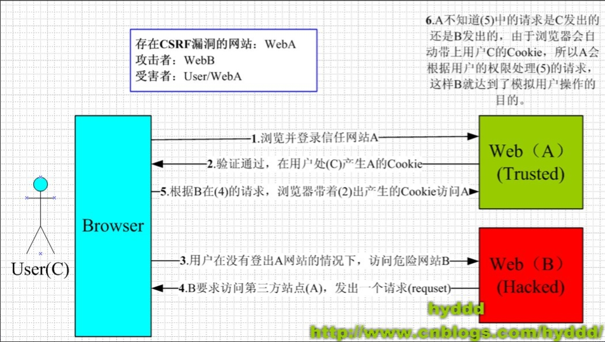
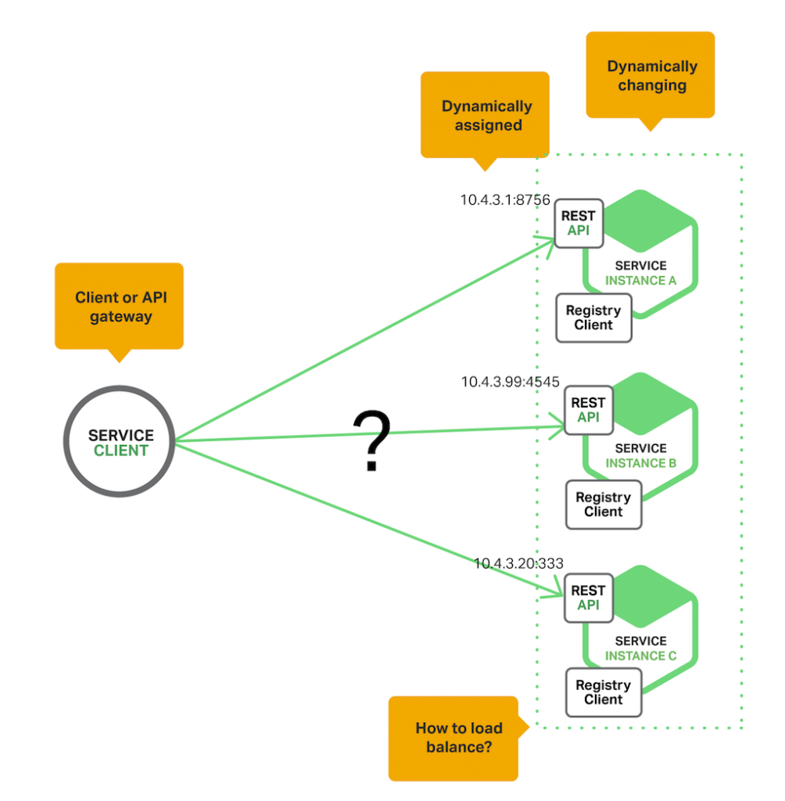
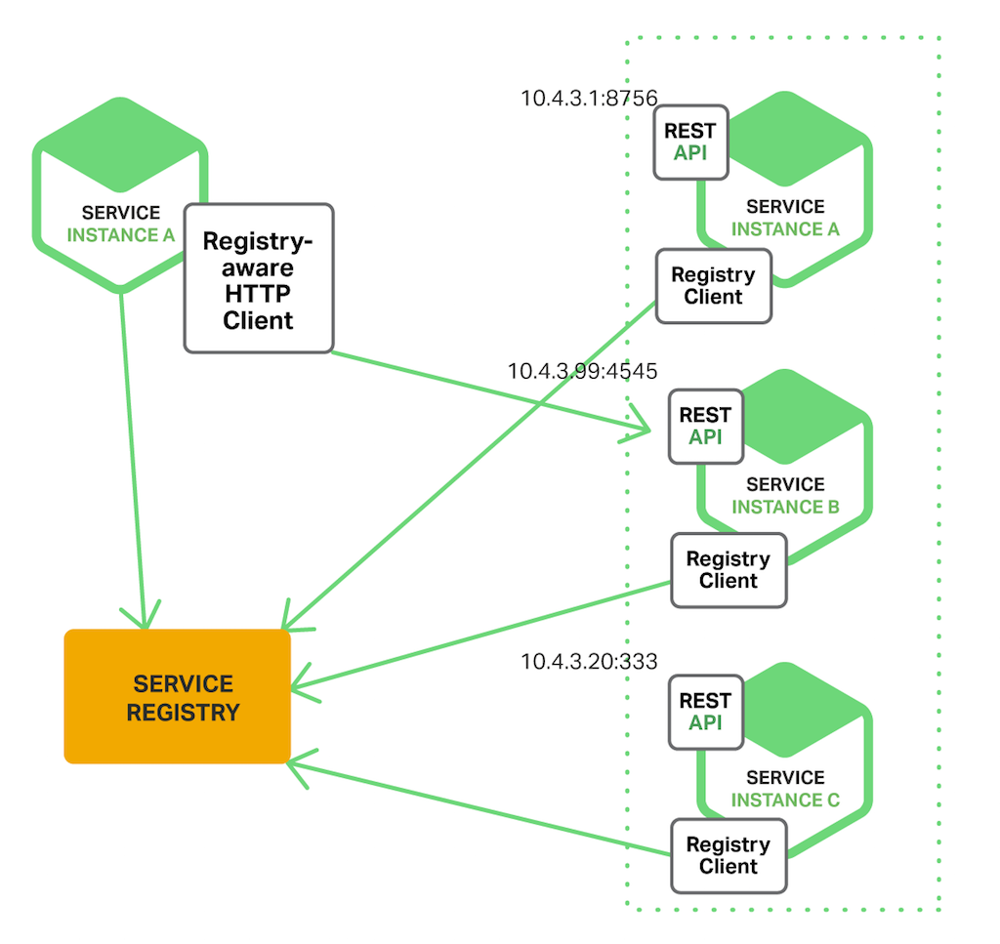
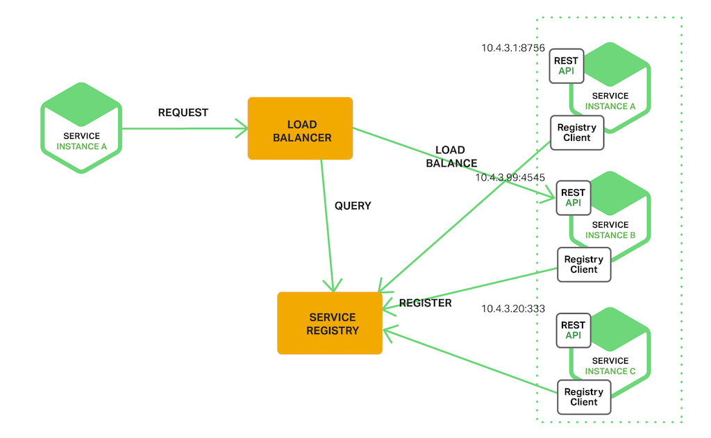
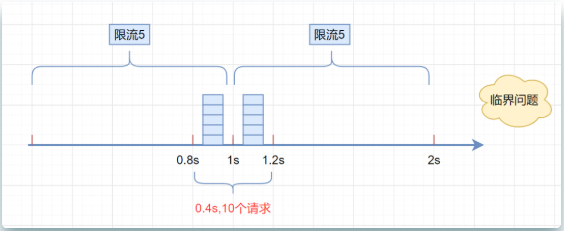
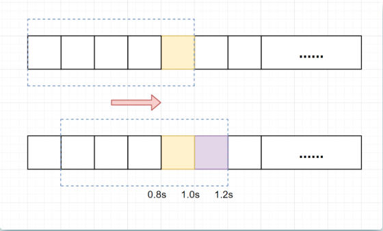
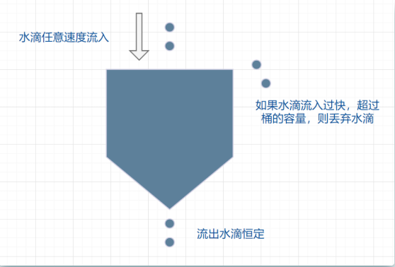
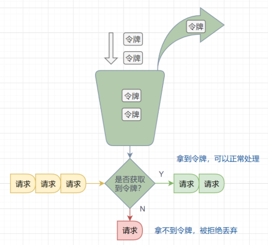

# 网络安全

## 攻击方式

### CSRF/XSRF

#### 基本概念和攻击原理

* CSRF（Cross-site request forgery），中文名称：**跨站请求伪造**，也被称为：one click attack/session riding，缩写为：CSRF/XSRF

* CSRF攻击可以理解为：攻击者盗用了你的身份，以你的名义发送恶意请求。CSRF能够做的事情包括：以你名义发送邮件，发消息，盗取你的账号，甚至于购买商品，虚拟货币转账......造成的问题包括：个人隐私泄露以及财产安全

* CSRF攻击的思想：

  

  * 从上图可以看出，要完成一次CSRF攻击，受害者必须依次完成两个步骤：
    1. **登录受信任网站A，并在本地生成Cookie**
    2. **在不登出A的情况下，访问危险网站B**
  * 看到这里，你也许会说：“如果我不满足以上两个条件中的一个，我就不会受到CSRF的攻击”。是的，确实如此，但你不能保证以下情况不会发生：
    	1. 你不能保证你登录了一个网站后，不再打开一个tab页面并访问另外的网站
     	2. 你不能保证你关闭浏览器了后，你本地的Cookie立刻过期，你上次的会话已经结束（事实上，关闭浏览器不能结束一个会话，但大多数人都会错误的认为关闭浏览器就等于退出登录/结束会话了......）
     	3. 上图中所谓的攻击网站，可能是一个存在其他漏洞的可信任的经常被人访问的网站

#### 示例1

* 银行网站A，它以GET请求来完成银行转账的操作，如：http://www.mybank.com/Transfer.php?toBankId=11&money=1000

* 危险网站B，它里面有一段HTML的代码如下

  ```http
  
  ```

* 首先，你登录了银行网站A，然后访问危险网站B，噢，这时你会发现你的银行账户少了1000块......为什么会这样呢？
  * 原因是银行网站A违反了HTTP规范，使用GET请求更新资源
  * 在访问危险网站B的之前，你已经登录了银行网站A，而B中的以GET的方式请求第三方资源（这里的第三方就是指银行网站了，原本这是一个合法的请求，但这里被不法分子利用了）
  * 所以你的浏览器会**带上你的银行网站A的Cookie发出GET请求**，去获取资源“http://www.mybank.com/Transfer.php?toBankId=11&money=1000”，结果银行网站服务器收到请求后，认为这是一个更新资源操作（转账操作），所以就立刻进行转账操作......

#### 示例2

* 为了杜绝上面的问题，银行决定改用POST请求完成转账操作

* 银行网站A的WEB表单如下：

  ```http
  <form action="Transfer.php" method="POST">
      <p>ToBankId: <input type="text" name="toBankId" /></p>
      <p>Money: <input type="text" name="money" /></p>
      <p><input type="submit" value="Transfer" /></p>
  </form>
  ```

* 后台处理页面Transfer.php如下：

  ```php
  <?php
      session_start();
      if (isset($_REQUEST['toBankId'] &&　isset($_REQUEST['money']))
      {
      	buy_stocks($_REQUEST['toBankId'],　$_REQUEST['money']);
      }
  ?>
  ```

* 危险网站B，仍然只是包含那句HTML代码
* 和示例1中的操作一样，你首先登录了银行网站A，然后访问危险网站B，结果.....和示例1一样，你再次没了1000块～T_T，这次事故的原因是：
  * 银行后台使用了\$\_REQUEST去获取请求的数据，而\$\_REQUEST既可以获取GET请求的数据，也可以获取POST请求的数据，这就造成了**在后台处理程序无法区分这到底是GET请求的数据还是POST请求的数据**
  * 在PHP中，可以使用\$\_GET和​\$\_POST分别获取GET请求和POST请求的数据。**在JAVA中，用于获取请求数据request一样存在不能区分GET请求数据和POST数据的问题**

#### 示例3

* 经过前面2个惨痛的教训，银行决定把获取请求数据的方法也改了，改用\$\_POST，只获取POST请求的数据，后台处理页面Transfer.php代码如下：

  ```php
  <?php
      session_start();
      if (isset($_POST['toBankId'] &&　isset($_POST['money']))
      {
      	buy_stocks($_POST['toBankId'],　$_POST['money']);
      }
  ?>
  ```

* 然而，危险网站B与时俱进，它改了一下代码：

  ```http
  <html>
  　　<head>
  　　　　<script type="text/javascript">
  　　　　　　function steal()
  　　　　　　{
            　　　　 iframe = document.frames["steal"];
  　　     　　      iframe.document.Submit("transfer");
  　　　　　　}
  　　　　</script>
  　　</head>
  
  　　<body onload="steal()">
  　　　　<iframe name="steal" display="none">
  　　　　　　<form method="POST" name="transfer"　action="http://www.myBank.com/Transfer.php">
  　　　　　　　　<input type="hidden" name="toBankId" value="11">
  　　　　　　　　<input type="hidden" name="money" value="1000">
  　　　　　　</form>
  　　　　</iframe>
  　　</body>
  </html>
  ```

* 如果用户仍是继续上面的操作，很不幸，结果将会是再次不见1000块......因为这里**危险网站B暗地里发送了POST请求到银行**!

#### 总结

* 总结一下上面3个例子，CSRF主要的攻击模式基本上是以上的3种，其中以第1,2种最为严重，因为触发条件很简单，一个就可以了，而第3种比较麻烦，需要使用JavaScript，所以使用的机会会比前面的少很多，但无论是哪种情况，只要触发了CSRF攻击，后果都有可能很严重
* 理解上面的3种攻击模式，其实可以看出，**CSRF攻击是源于WEB的隐式身份验证机制**！WEB的身份验证机制虽然可以保证一个请求是来自于某个用户的浏览器，但却**无法保证该请求是用户批准发送的**！

#### CSRF防御

* CSRF的防御可以**从服务端和客户端两方面着手**，防御效果是**从服务端着手效果比较好**，现在一般的CSRF防御也都在服务端进行

* 服务端的CSRF方式方法很多样，但总的思想都是一致的，就是**在客户端页面增加伪随机数**

* Cookie Hashing(所有表单都包含同一个伪随机值)：这可能是最简单的解决方案了，因为攻击者不能获得第三方的Cookie(理论上)，所以表单中的数据也就构造失败了

  ```php
  <?php
      //构造加密的Cookie信息
      $value = “DefenseSCRF”;
      setcookie(”cookie”, $value, time()+3600);
  ?>
  ```

  在表单里增加Hash值，以认证这确实是用户发送的请求

  ```php
  <?php
      $hash = md5($_COOKIE['cookie']);
  ?>
  <form method=”POST” action=”transfer.php”>
      <input type=”text” name=”toBankId”>
      <input type=”text” name=”money”>
      <input type=”hidden” name=”hash” value=”<?=$hash;?>”>
      <input type=”submit” name=”submit” value=”Submit”>
  </form>
  ```

   然后在服务器端进行Hash值验证

  ```php
   <?php
   	if(isset($_POST['check'])) {
   		$hash = md5($_COOKIE['cookie']);
   		if($_POST['check'] == $hash) {
   			doJob();
   		} else {
   		//...
   		}
   	} else {
   	//...
   	}
  ?>
  ```

  这个方法已经可以杜绝99%的CSRF攻击了，那还有1%呢....**由于用户的Cookie很容易由于网站的XSS漏洞而被盗取**，这就另外的1%。一般的攻击者看到有需要算Hash值，基本都会放弃了，某些除外，所以如果需要100%的杜绝，这个不是最好的方法

1. 检查 Referer 首部字段

   * Referer 首部字段位于 HTTP 报文中，**用于标识请求来源的地址**。**检查这个首部字段并要求请求来源的地址在同一个域名下**，可以极大的防止 CSRF 攻击

   * 这种办法简单易行，工作量低，仅需要在关键访问处增加一步校验。但这种办法也有其局限性，因其完全依赖浏览器发送正确的 Referer 字段。虽然 HTTP 协议对此字段的内容有明确的规定，但并无法保证来访的浏览器的具体实现，亦无法保证浏览器没有安全漏洞影响到此字段。并且也存在攻击者攻击某些浏览器，篡改其 Referer 字段的可能。

2. 添加校验 Token
   * 在访问敏感数据请求时，要求用户浏览器提供不保存在 Cookie 中，并且**使用攻击者无法伪造的数据作为校验**。例如**服务器生成随机数并附加在表单中，并要求客户端传回这个随机数**

3. 输入验证码
   * 因为 CSRF 攻击是在用户无意识的情况下发生的，所以要求用户输入验证码可以让用户知道自己正在做的操作

# [跨域问题](https://segmentfault.com/a/1190000017579464)

## 同源策略

* 同源策略 (Same-Origin Policy) 最早由 Netscape 公司提出,，所谓同源就是要求域名，协议，端口相同。**非同源的脚本不能访问或者操作其他域的页面对象**(如DOM等)
* 作为著名的安全策略，虽然它只是一个规范，并不强制要求， 但现在所有支持 javaScript 的浏览器都会使用这个策略。 以至于该策略成为浏览器最核心最基本的安全功能，如果缺少了同源策略，web的安全将无从谈起。并且，**浏览器不是阻止请求的发送，而是对请求的拦截**

* 同源策略要求三同, 即: 同域, 同协议, 同端口.
  - 同域即host相同，顶级域名，一级域名，二级域名， 三级域名等必须相同，且域名不能与 ip 对应;
  - 同协议要求， http与https协议必须保持一致;
  - 同端口要求，端口号必须相同

## 同源策略带来的问题

* 同源策略下的web世界，域的壁垒高筑， 从而保证各个网页相互独立, 互相之间不能直接访问， iframe，ajax 均受其限制，而script标签不受此限制

* iframe限制
  * 可以访问同域资源，可读写
  * 访问跨域页面时，只读

* Ajax限制
  * Ajax 的限制比 iframe 限制更严
* 同域资源可读写
  * **跨域请求会直接被浏览器拦截**(chrome下跨域请求不会发起，其他浏览器一般是可发送跨域请求，但响应被浏览器拦截)

* Script限制
  * script并无跨域限制，这是因为script标签引入的文件不能够被客户端的 js 获取到，不会影响到原页面的安全，因此script标签引入的文件没必要遵循浏览器的同源策略
  * 相反, ajax 加载的文件内容可被客户端 js 获取到，引入的文件内容可能会泄漏或者影响原页面安全，故，ajax必须遵循同源策略

## 跨域方法

* 使用代理

* JSONP

* postMassage

* CORS跨域访问

* flash URLLoder

* WebSocket

  * 在WebSocket出现之前, 很多网站为了实现实时推送技术, 通常采用的方案是轮询(Polling)和Comet技术，Comet又可细分为两种实现方式，一种是长轮询机制，一种称为流技术，这两种方式实际上是对轮询技术的改进，这些方案带来很明显的缺点，需要由浏览器对服务器发出HTTP request，大量消耗服务器带宽和资源。面对这种状况，HTML5定义了WebSocket协议，能更好的节省服务器资源和带宽并实现真正意义上的实时推送
  * WebSocket 本质上是一个基于TCP的协议，它的目标是在一个单独的持久链接上提供**全双工**(full-duplex)，**双向通信**，以基于事件的方式，赋予浏览器实时通信能力。既然是双向通信，就意味着服务器端和客户端可以同时发送并响应请求，而不再像HTTP的请求和响应(同源策略对 web sockets 不适用)

  * **原理**: 为了建立一个WebSocket连接，客户端浏览器首先要向服务器发起一个HTTP请求，这个请求和通常的HTTP请求不同，包含了一些附加头信息，其中附加头信息”**Upgrade: WebSocket**”表明这是一个申请协议升级的HTTP请求，服务器端解析这些附加的头信息然后产生应答信息返回给客户端，客户端和服务器端的WebSocket连接就建立起来了，双方就可以通过这个连接通道自由的传递信息，并且这个连接会持续存在直到客户端或者服务器端的某一方主动的关闭连接

# [服务发现](https://www.jianshu.com/p/1bf9a46efe7a)

* 假设我们写的代码会调用 REST API 或者 Thrift API 的服务。为了完成一次请求，代码需要知道**服务实例的网络位置**（IP 地址和端口）

* 运行在物理硬件上的传统应用中，服务实例的网络位置是相对固定的，代码能从一个偶尔更新的配置文件中读取网络位置

* 对于基于云端的、现代化的微服务应用而言，这却是一大难题。将容器应用部署到集群时，**其服务地址是由集群系统动态分配的**。那么，当我们需要访问这个服务时，如何确定它的地址呢？这时就需要服务发现（Service Discovery）了

* 服务发现有两大模式：**客户端发现模式和服务端发现模式**

  

## 客户端发现模式

* 使用客户端发现模式时，**客户端决定相应服务实例的网络位置**，**并且对请求实现负载均衡**。**客户端查询服务注册表，后者是一个可用服务实例的数据库；然后使用负载均衡算法从中选择一个实例，并发出请求**

* 服务实例的网络位置在启动时被记录到服务注册表，等实例终止时被删除。服务实例的注册信息通常使用心跳机制来定期刷新

* 客户端发现模式优缺点兼有

  - 这一模式相对直接，除了服务注册外，其它部分无需变动。此外，由于客户端知晓可用的服务实例，能针对特定应用实现智能负载均衡，比如使用哈希一致性
  - 这种模式的一大**缺点**就是**客户端与服务注册绑定**，要**针对服务端用到的每个编程语言和框架，实现客户端的服务发现逻辑**

  

## 服务端发现模式

* 客户端**通过负载均衡器向某个服务提出请求**，**负载均衡器查询服务注册表**，并将请求转发到可用的服务实例

* Kubernetes 和 Marathon 这样的部署环境会在**每个集群上运行一个代理**，**将代理用作服务端发现的负载均衡器**。客户端使用主机 IP 地址和分配的端口通过代理将请求路由出去，向服务发送请求。**代理将请求透明地转发到集群中可用的服务实例**

* 服务端发现模式兼具优缺点
  * 它最大的优点是**客户端无需关注发现的细节**，只需要简单地向负载均衡器发送请求，这减少了编程语言框架需要完成的发现逻辑。并且如上文所述，某些部署环境免费提供这一功能
  * 这种模式也有缺点。**除非负载均衡器由部署环境提供，否则会成为一个需要配置和管理的高可用系统组件**

  

# 微服务部署

​	在项目迭代的过程中，不可避免需要”上线“。上线对应着部署，或者重新部署；部署对应着修改；修改则意味着风险

​	目前有很多用于部署的技术，有的简单，有的复杂；有的得停机，有的不需要停机即可完成部署

## 蓝绿部署(Blue/Green Deployment)

* **蓝绿部署无需停机，并且风险较小**
  1. 部署版本1的应用（一开始的状态），所有外部请求的流量都打到这个版本上
  2. 部署版本2的应用，版本2的代码与版本1不同(新功能、Bug修复等)
  3. 将流量从版本1切换到版本2
  4. 如版本2测试正常，就删除版本1正在使用的资源（例如实例），从此正式用版本2

* 从过程不难发现，在部署的过程中，我们的应用始终在线。并且，新版本上线的过程中，并没有修改老版本的任何内容，在部署期间，老版本的状态不受影响。这样风险很小，并且，只要老版本的资源不被删除，理论上，我们**可以在任何时间回滚到老版本**

## 滚动发布(Rolling Update)

* 滚动发布，一般是**取出一个或者多个服务器停止服务**，执行更新，并重新将其投入使用。周而复始，直到集群中所有的实例都更新成新版本
* 这种部署方式相对于蓝绿部署，**更加节约资源**——**它不需要运行两个集群、两倍的实例数**。我们可以部分部署，例如每次只取出集群的20%进行升级
* 这种方式也有很多缺点，例如：
  1. 没有一个确定OK的环境。使用蓝绿部署，我们能够清晰地知道老版本是OK的，而使用滚动发布，我们无法确定
  2. 修改了现有的环境
  3. 如果需要回滚，很困难。举个例子，在某一次发布中，我们需要更新100个实例，每次更新10个实例，每次部署需要5分钟。当滚动发布到第80个实例时，发现了问题，需要回滚。此时，脾气不好的程序猿很可能想掀桌子，因为回滚是一个痛苦，并且漫长的过程
  4. 有的时候，我们还可能对系统进行动态伸缩，如果部署期间，系统自动扩容/缩容了，我们还需判断到底哪个节点使用的是哪个代码。尽管有一些自动化的运维工具，但是依然令人心惊胆战
* 并不是说滚动发布不好，滚动发布也有它非常合适的场景

## 灰度发布/金丝雀部署

* 灰度发布是指在黑与白之间，能够**平滑过渡**的一种发布方式。AB test就是一种灰度发布方式，**让一部分用户继续用A，一部分用户开始用B，如果用户对B没有什么反对意见，那么逐步扩大范围，把所有用户都迁移到B上面来**。灰度发布可以保证整体系统的稳定，在初始灰度的时候就可以发现、调整问题，以保证其影响度

* 很多人把灰度发布与蓝绿部署混为一谈，笔者认为，与灰度发布最类似的应该是金丝雀部署

* “金丝雀部署”是**增量发布**的一种类型，它的执行方式是在原有软件生产版本可用的情况下，同时部署一个新的版本。同时运行同一个软件产品的多个版本需要软件针对配置和完美自动化部署进行特别设计。

* 我们来看一下金丝雀部署的步骤：
  1. 准备好部署各个阶段的工件，包括：构建工件，测试脚本，配置文件和部署清单文件
  2. 从负载均衡列表中移除掉“金丝雀”服务器
  3. 升级“金丝雀”应用（排掉原有流量并进行部署）
  4. 对应用进行自动化测试
  5. 将“金丝雀”服务器重新添加到负载均衡列表中（连通性和健康检查）
  6. 如果“金丝雀”在线使用测试成功，升级剩余的其他服务器（否则就回滚）

* 灰度发布中，常常按照用户设置路由权重，例如90%的用户维持使用老版本，10%的用户尝鲜新版本。不同版本应用共存，经常与A/B测试一起使用，用于测试选择多种方案。灰度发布比较典型的例子，是阿里云那个“新版本”，点击“进入新版本”，我们就成了金丝雀

## 总结

1. 蓝绿部署：不停止老版本，额外搞一套新版本，等测试发现新版本OK后，删除老版本
2. 滚动发布：按批次停止老版本实例，启动新版本实例
3. 灰度发布/金丝雀部署：不停止老版本，额外搞一套新版本，常常按照用户设置路由权重，例如90%的用户维持使用老版本，10%的用户尝鲜新版本。不同版本应用共存，经常与A/B测试一起使用，用于测试选择多种方案

# 服务降级和熔断

* 服务降级是解决系统资源不足和海量任务请求之间的矛盾
  * 在暴增的流量请求下，对一些非核心流程业务、非关键业务，进行有策略的放弃，以此来释放系统资源，保证核心业务的正常运行，尽量避免这种系统资源分配的不平衡，打破二八策略，让更多的机器资源，承载主要的业务请求。服务降级不是一个常态策略，而是应对非正常情况下的应急策略。服务降级的结果，通常是对一些业务请求返回一个统一的结果，可以理解为是一种failover快速失败的策略。一般通过配置中心配置开关实现开启降级
* 熔断模式保护的是业务系统不被外部大流量或者下游系统的异常而拖垮
  * 如果开启了熔断，订单服务可以在下由调用出现部分异常时，调节流量请求，比如出现10%失败后，减少50%的流量请求，如果继续出现50%异常，则减少80%的流量请求；相应地，在检测的下游服务正常后，首先恢复30%的流量，然后是50%的流量，接下来是全部流量

# 常见容错机制

## failover：失效转移

* Fail-Over的含义为“失效转移”，是一种**备份操作模式**，当主要组件异常时，其**功能转移到备份组件**。其要点在于**有主有备**，且主故障时备可启用，并设置为主。如Mysql的双Master模式，当正在使用的Master出现故障时，可以拿备Master做主使用

## failfast：快速失败

* 从字面含义看就是“快速失败”，**尽可能的发现系统中的错误，使系统能够按照事先设定好的错误的流程执行**，对应的方式是“fault-tolerant（错误容忍）”。以JAVA集合（Collection）的快速失败为例，当多个线程对同一个集合的内容进行操作时，就可能会产生fail-fast事件。例如：当某一个线程A通过iterator去遍历某集合的过程中，若该集合的内容被其他线程所改变了；那么线程A访问集合时，就会**抛出**ConcurrentModificationException**异常**（发现错误执行设定好的错误的流程），产生fail-fast事件。

## failback：失效自动恢复

* Fail-over之后的自动恢复，在簇网络系统（有两台或多台服务器互联的网络）中，由于要某台服务器进行维修，**需要网络资源和服务暂时重定向到备用系统**。在此之后**将网络资源和服务器恢复为由原始主机提供的过程**，称为自动恢复

## failsafe：失效安全

* Fail-Safe的含义为“失效安全”，即使**在故障的情况下也不会造成伤害或者尽量减少伤害**。维基百科上一个形象的例子是红绿灯的“冲突监测模块”当监测到错误或者冲突的信号时会将十字路口的红绿灯变为闪烁错误模式，而不是全部显示为绿灯

# 高并发系统限流

* 限流一般需要结合容量规划和压测来进行。当外部请求接近或者达到系统的最大阈值时，触发限流，采取其他的手段进行降级，保护系统不被压垮。**常见的降级策略包括延迟处理、拒绝服务、随机拒绝**等

## 固定窗口限流/计数法

* 算法原理：
  * 将时间划分为固定的窗口大小，例如1s
  * 在窗口时间内，每来一个请求，对计数器+1
  * 当计数器达到设定限制后，该窗口时间内的之后的请求都被丢弃处理
  * 该窗口时间结束后，计数器清零，重新开始计数

* 算法缺陷

  * **临界问题**：假设限流阀值为5个请求，单位时间窗口是1s,如果我们在单位时间内的前0.8-1s和1-1.2s，分别并发5个请求。虽然都没有超过阀值，但是如果算0.8-1.2s,则并发数高达10，已经**超过单位时间1s不超过5阀值**的定义

    

## 滑动窗口限流/计数法

* 滑动窗口限流**解决固定窗口临界值**的问题。它将单位时间周期分为n个小周期，分别记录每个小周期内接口的访问次数，并且根据时间滑动删除过期的小周期

* 算法原理：

  * 将时间划分为细粒度的时间区间，每个区间维持一个计数器，对每个区间每进入一个请求则将计数器+1

  * 多个区间组成一个单位时间窗口，每流逝一个小的时间区间，则抛弃一个旧的时间区间，纳入一个新的时间区间

  * 若当前组成的单位时间窗口中，所有时间区间的计数器总和超过限制数量，则本窗口后续请求都被丢弃

    

  * 假设我们1s内的限流阀值还是5个请求，0.8\~1.0s内（比如0.9s的时候）来了5个请求，落在黄色格子里。时间过了1.0s这个点之后，又来5个请求，落在紫色格子里。如果**是固定窗口算法，是不会被限流的**，但是**滑动窗口的话，每过一个小周期，它会右移一个小格**。过了1.0s这个点后，会右移一小格，当前的单位时间段是0.2~1.2s，这个区域的请求已经超过限定的5了，已触发限流啦，实际上，紫色格子的请求都被拒绝

* 当滑动窗口的小区间划分的越多，那么滑动窗口的滚动就越平滑，限流的统计就会越精确

* 缺点：滑动窗口算法虽然解决了**固定窗口的临界问题**，但是一旦到达限流后，请求都会直接暴力被拒绝。这样会损失一部分请求，这其实对于产品来说，并不太友好

## 漏桶算法

* 漏桶算法面对限流，就更加的柔性，不存在直接的粗暴拒绝

* 原理

  * 它的原理很简单，可以认为就是**注水漏水**的过程。**往漏桶中以任意速率流入水，以固定的速率流出水。当水超过桶的容量时，会被溢出，也就是被丢弃。因为桶容量是不变的，保证了整体的速率**

  

* 流入的水滴，可以看作是访问系统的请求，这个流入速率是不确定的

* 桶的容量一般表示系统所能处理的请求数

* 如果桶的容量满了，就达到限流的阀值，就会丢弃水滴（拒绝请求）

* 流出的水滴，是恒定速率的，对应服务按照固定的速率处理请求

* 缺点

  * **无法应对突发流量**：在正常流量的时候，系统按照固定的速率处理请求，是我们想要的。但是**面对突发流量**的时候，漏桶算法还是循规蹈矩地处理请求，这就不是我们想看到的啦。流量变突发时，我们肯定**希望系统尽量快点处理请求**，提升用户体验嘛

## 令牌桶算法

* 面对**突发流量**的时候，我们可以使用令牌桶算法限流

* **令牌桶算法原理**：
  * 有一个令牌管理员，**根据限流大小，定速往令牌桶里放令牌**
  * 如果令牌数量满了，超过令牌桶容量的限制，那就丢弃
  * 系统在接受到一个用户请求时，都会先去令牌桶要一个令牌。如果拿到令牌，那么就处理这个请求的业务逻辑
  * 如果拿不到令牌，就直接拒绝这个请求

  

* 如果令牌发放的策略正确，这个系统即不会被拖垮，也能提高机器的利用率。Guava的RateLimiter限流组件，就是基于**令牌桶算法**实现的
