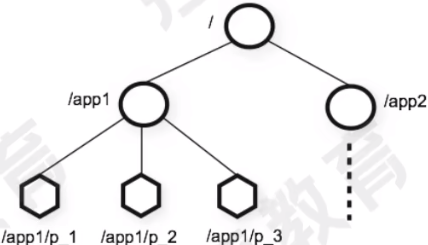
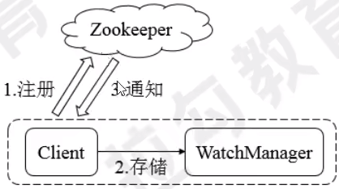

# Zookeeper简介

## Zookeeper是什么？

* Zookeeper是一个分布式协调服务的开源框架，**主要用来解决分布式集群中应用系统的一致性问题**，例如怎样避免同时操作同一数据造成脏读问题
* Zookeeper本质是一个分布式的小文件存储系统。提供基于类似于文件系统的目录树方式的数据存储，并且可以对树中的节点进行有效管理
* Zookeeper提供给**客户端监控存储在zk内部数据的功能**，从而可以达到基于数据的集群管理，诸如：统一命名服务(dubbo)、分布式配置管理(solr的配置集中管理)、分布式消息队列(sub/pub)、分布式锁、分布式协调等功能

## Zookeeper的架构组成

* Zookeeper也是Master/Slave架构，但是Zookeeper集群中的Leader不是指定而来，而是通过选举产生
* Leader
  * Zookeeper集群工作的核心角色
  * 集群内部各个服务器的调度者
  * 事务请求(写操作)的唯一调度和处理者，保证集群事务处理的顺序性；对于create，setData、delete等有写操作的请求，**则需要统一转发给leader处理，leader需要决定编号，执行操作，这个过程称为一个事务**
* Follower
  * 处理客户端非事务(读操作)请求
  * 转发事务请求给Leader
  * 参与集群Leader选举投票，2n-1台可以做集群投票
* Observer
  * 为访问量表较大的集群增设
  * 观察者角色，观察Zookeeper集群的最新状态变化并将这些状态同步过来，其对于非事务请求可以进行独立处理，对于事务请求，则会转发给Leader服务器进行处理
  * 不会参与任何形式的投票只提供非事物服务，通常用于在不影响集群事务处理能力的前提下提升集群的非事务处理能力。增加了集群并发的读请求

## Zookeeper特点

* Zookeeper：一个领导者(leader)，多个跟随者(follower)组成的集群
* leader负责投票的发起和决议，更新系统状态(内部原理)
* follower用于接受客户请求并向客户端返回结果，在选举leader过程中参与投票
* 集群中只要有**半数以上节点存活，Zookeeper集群就能正常服务**
* **全局数据一致**：每个server保存一份相同的数据副本，client无论连接到哪个server，数据都是一致的
* 更新请求顺序进行(内部原理)
* 数据更新原子性，一次数据更新要么成功，要么失败

# Zookeeper环境搭建

## Zookeeper搭建方式

Zookeeper安装方式有三种，单机模式、集群模式及伪集群模式

* 单机模式：Zookeeper只运行在一台服务器上，适合测试环境
* 伪集群模式：就是在一台服务器上运行多个Zookeeper实例
* 集群模式：Zookeeper运行于一个集群上，适合生产环境，这个计算机集群被称为一个”集合体“

# Zookeeper数据结构与监听机制

## ZNode

* 在Zookeeper中，数据信息被保存在一个个数据节点上，这些节点被称为znode。znode是zookeeper中最小数据单位，在znode下面又可以挂载znode，形成一个层次化命名空间的znode tree，它采用类似文件系统的层级树状结构进行管理

  

* 在Zookeeper中，每个数据节点都是一个znode。znode的节点路径表示方式和unix文件系统路径非常相似，都是由一系列使用斜杠(/)进行分割的路径表示，开发人员可以通过这种路径表示方式向某个节点写入数据，也可以在这个节点下面创建节点

## ZNode类型

* Zookeeper节点类型可以分为三大类：
  * 持久性节点(Persistent)
  * 临时性节点(Ephemeral)
  * 顺序性节点(Sequential)
* 创建节点的时候通过组合可以生成四种节点类型：持久性节点、持久顺序节点、临时节点、临时顺序节点。不同类型的节点则会有不同的声明周期
* 持久节点：zookeeper中最常见的一种节点类型，被创建后会一直存在服务器，直到主动执行删除操作
* 持久顺序节点：有顺序的持久节点，节点特性和持久节点一样 ，知识额外特性表现在顺序上。顺序特性实质是在创建节点的时候，会**在节点后面加上一个自动递增的数字后缀，来表示其顺序**
* 临时节点：会被自动清理的节点，他的生命周期和客户端会话绑定在一起，客户端会话结束，节点就会被删除掉。与持久性节点不同的是，**临时节点不能创建子节点**
* 临时顺序节点：有顺序的临时节点，拥有临时节点和顺序节点的特性

## ZNode的状态信息

* 事务ID：在Zookeeper中，事务是指能够改变Zookeeper服务器状态的操作，也称事务操作或更新操作，一般包括数据节点创建与删除，数据节点内容更新等操作。对于每一个事物请求，Zookeeper都会为其分配一个全局唯一的事物ID，用ZXID来表示，通常是一个64位的数字。每一个ZXID对应一次更新操作，从这些ZXID中可以简介地识别出Zookeeper处理这些更新操作请求的全局顺序

* 整个ZNode节点内容包括两部分：节点数据内容和节点状态信息

  ```
  cZxid：create ZXID，表示节点被创建时的事物ID
  ctime：create time，表示节点创建时间
  mZxid：modified ZXID，表示节点最后一次被修改的事务ID
  mtime：modified time，表示节点最后一次被修改的时间
  pZxid：表示该节点的子节点列表最后一次被修改时的事务ID，只有子节点列表变更才会更新pZxid，子节点内容变更不会更新
  cversion：表示子节点的版本号
  dataVersion：表示内容版本号
  aclversion：标识acl版本号
  ephemeralOwner：标识创建该临时节点时的会话sessionID，如果是持久性节点，值为0
  dataLength：表示数据长度
  numChildren：表示直系子节点数
  ```

## Watcher机制

* Zookeeper使用Watcher机制实现分布式数据的发布/订阅功能

* 一个典型的发布/定于模型系统定义了一种一对多的订阅关系，能够让多个定于这同时监听某一个主题对象，当这个主题对象自身状态改变时，会通知所有订阅者，使它们能够做出响应的处理

* 在Zookeeper中，引入了Watcher机制来实现这种分布式的通知功能。Zookeeper允许客户端向服务端注册一个Watcher监听，当服务端的一些指定时间触发了这个Watcher，那么Zk就会向指定客户端发送一个时间通知来实现分布式的通知功能

* Watcher注册与通知过程如下图

  

  Zookeeper的Watcher机制主要包括客户端线程、客户端WatcherManager、Zookeeper服务器三部分

  具体工作流程为：

  * 客户端在向Zookeeper服务器注册的同时，会将Watcher对象存储在客户端的WatcherManager中
  * 当Zookeeper服务器触发Watcher事件后，会向客户端发送通知
  * 客户端线程从WatcherManager中取出对应的Watcher对象来执行回调逻辑
