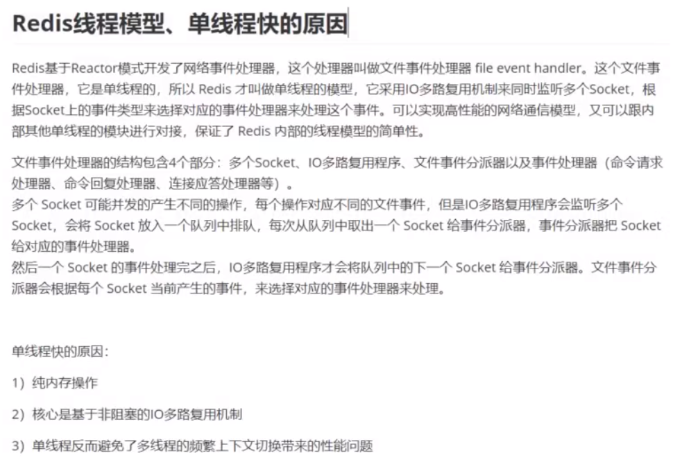
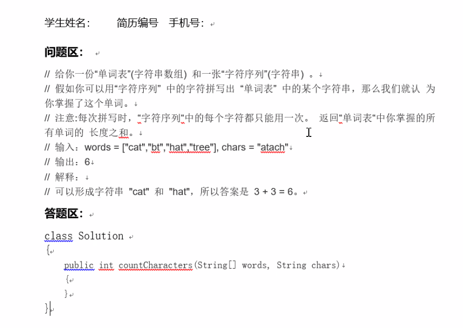

# linux/os

* linux查看各硬件资源的方法

  1. 显卡信息
     dmesg | grep -i vga
     lspci | grep -i vga //查看显卡信息

  2. 查看主板信息，查看主板的序列号

     dmidecode | grep -i 'serrial number' 

  3. CPU信息

  　　#通过/proc文件系统
  　　cat /proc/cpuinfo
  　　dmesg | grep -i cpu
  　　#通过查看开机信息
  　　dmidecode -t processor

  ​		# 实时监测多处理器系统上的**每个CPU的使用情况**

  ​		**mpstat** 

  4. 硬盘信息
     fdisk -l //分区情况
     df -h //大小情况
     du -h //使用情况
     dmesg | grep sda

  5. 内存信息
     cat /proc/meminfo
     dmesg | grep mem
     free -m
     vmstat
     dmldecode | grep -i mem

  6. 网卡信息

     dmesg | grep -i eth
     lspci | grep -i eth

     ifconfig

     #简单的网络流量监测工具

     **ifstat** 

  7. 鼠标键盘和USB信息
     cat /proc/bus/input/devices 查看键盘和鼠标
     cat /proc/bus/usb/devices 查看USB设备
     cat /proc/interrupts

  8. 声卡信息
     lspci | grep -i vga
     dmesg | grep -i vga

  9. 其他命令
     lspci (显示外设备信息，如USB，网卡等信息)

* linux的性能好坏评判有什么指标
  * https://www.cnblogs.com/zhoufankui/p/8372654.html

# sql

* limit优化

  * limit用于分页查询时越往后翻性能越差，解决的原则：缩小扫描范围 ，如下所示：
    select * from orders order by id desc limit 100000,10 

    耗时0.4秒

    select * from orders order by id desc limit 1000000,10

    耗时5.2秒

  * 先筛选出ID缩小查询范围，写法如下：
    select * from orders where id > (select id from orders order by id desc  limit 1000000, 1) order by id desc limit 0,10

    耗时0.5秒

  * 如果查询条件仅有主键ID，写法如下：
    select id from orders where id between 1000000 and 1000010 order by id desc

    耗时0.3秒
    如果以上方案依然很慢呢？只好用游标了，参考JDBC使用游标实现分页查询的方法

* 联合索引、最左前缀匹配

  * https://www.cnblogs.com/lanqi/p/10282279.html

* sql性能优化
  * https://www.cnblogs.com/hlkawa/p/12164961.html

# redis

* redis常问问题

  * https://mp.weixin.qq.com/s/MF07h90MRVc85vTGin5KFw
  
* redis为什么那么快？

  

* 怎么实现redis分布式锁
  * https://www.zhihu.com/question/300767410/answer/1931519430

# 秒杀系统设计

* 什么是秒杀
  * 通俗一点讲就是网络商家为促销等目的组织的网上限时抢购活动

* 业务特点
  * 高并发：秒杀的特点就是这样时间极短、 瞬间用户量大
  * 库存量少：一般秒杀活动商品量很少，这就导致了只有极少量用户能成功购买到
  * 业务简单：流程比较简单，一般都是下订单、扣库存、支付订单
  * 恶意请求，数据库压力大

* 解决方案
  * 前端：页面资源静态化，按钮控制，**使用答题校验码可以防止秒杀器的干扰**，让更多用户有机会抢到
  * nginx：校验恶意请求，转发请求，负载均衡；**动静分离**，不走tomcat获取静态资源，nginx处理静态资源，后台tomcat等容器处理动态资源；gzip压缩，减少静态文件传输的体积，节省带宽，提高渲染速度
  * 业务层：集群，多台机器处理，提高并发能力
  * redis：集群保证高可用，持久化数据；分布式锁（悲观锁）；缓存热点数据（库存）
  * mq：**削峰限流，MQ堆积订单，保护订单处理层的负载，Consumer根据自己的消费能力来取Task，实际上下游的压力就可控了。重点做好路由层和MQ的安全**
  * 数据库：读写分离，拆分事务提高并发度

* 秒杀系统设计小结
  * 秒杀系统就是一个“三高”系统，即高并发、高性能和高可用的分布式系统
  * 秒杀设计原则：前台请求尽量少，后台数据尽量少，调用链路尽量短，尽量不要有单点
  * 秒杀高并发方法：访问拦截、分流、动静分离
  * 秒杀数据方法：减库存策略、热点、异步、限流降级
  * 访问拦截主要思路：通过CDN和缓存技术，尽量把访问拦截在离用户更近的层，尽可能地过滤掉无效请求
  * 分流主要思路：通过分布式集群技术，多台机器处理，提高并发能力

# 场景题

### bigo

1. 十亿用户的上线下线时间数据，生成统计每个时刻在线用户的数量。 

2. 用户名片系统，有用户id和其他信息，要求的功能为查找，增加，删除，查找频次较多，怎么设计？ 

3. 十亿用户给100万主播投票，每人只能投一次，实时显示得票数top100的主播。 

  思路： 

1. 十亿用户的上线下线时间数据，生成统计每个时刻在线用户的数量

   假设第i个用户的上下线时间为[Si, Ei] ,单位为s，即第i个用户在第Si秒上线，在第Ei秒时下线。一天有24*60*60 = 86,400s， 输出的数组长度out为86400，out[i] 表示第i秒在线的用户数量。 

   再维护两个同等长度的数组，一个是online，一个是offline， online[i]表示在第i秒上线的人数，offline[i]表示再第i秒下线的人数。 out，online，offline数组全部初始化为0。 

   十亿用户的数据是无序的。依次遍历数据[Si, Ei]，online[Si]++; offline[Ei]++;    

   遍历之后，状态转移方程为 out[i] = out[i-1] + online[i] - offline[i]] ; 第i秒在线的人数等于第i-1秒在线的人数 + 在第i秒上线的人数 - 在第i秒下线的人数； 

   时间复杂度 O(N) 

   空间复杂度O(N) 

2. 用户名片系统，有用户id和其他信息（还是十亿个用户），要求的功能为**查找，增加，删除，查找频次较多**，怎么设计？ 

   这题答得不好，第一反映是用红黑树来存储，因为查找比较多嘛。后来想想用户数量是十亿个，不能同时放到放到内存里，用红黑树不大行

   回答的是用链表来存储信息，具体来说是用跳表存储，这样的话查找删除增加的复杂度也可以是O(logN)，并且相对红黑树来说更容易实现

   面试官：这种方法有什么缺点?   占用额外的空间比较多，除了数据本身占用的空间之外，还要额外的空间来存储跳表相关的信息

   面试官：如果服务器宕机了怎么办？(持久化问题)  在磁盘上保留一个数据的备份。具体的说，这十亿数据肯定不能都放到内存中的，大部分都是在磁盘里的，所以要对数据分段，读入和换出内存的时候以段为单位进行操作，类似于操作系统，可以使用lru，lfu页面淘汰算法决定哪个段要被淘汰。操作的时候，先判断数据在不在内存中，如果不在的话对数据段进行换入换出操作，把要操作的段换入到内存中。如果对内存中的数据进行了修改，也要同步地修改磁盘地数据。可以使用一个队列，把每次修改地信息压到队列里面，然后开个线程专门用来执行周期性地回写操作，这样就能保证磁盘地数据也是较新的数据

3. 十亿用户给100万主播投票，每人只能投一次，实时显示得票数top100的主播 

   那就维护一个size=100的小顶堆，主播的得票数有更新的时候，就去跟堆顶的得票数比一比，如果比它大，就把弹出堆顶元素，把当前主播压入堆

   面试官：怎么保证每个人只能投票一次。  这种大量数据，**每个数据的状态比较简单的情景最好用位图表示**，申请一块连续的十亿位的空间，每个用户的id对应一个位，该位为0表示当前用户未投票，否则就表示已经投过票了

# 面试总结

## 2021.7.15 字节游戏中台一面

* 自我介绍

* 实习项目细节、lua

* redis：底层数据结构、rehash过程、集群(cluster，哨兵)

* 网络编程：epoll，et、多线程、可重入锁、enable_shared_from_this

* os：虚拟内存、进程地址空间分布、cas、aba问题

* linux命令：性能检测、find

  ```shell
  find . -name "*.log" -exec rm -rf {} \;
  ```

* c++：move右值(拷贝)、vector迭代器失效、智能指针、原子变量、内存序

* 算法题：回溯

## 2021.7.19 字节游戏中台二面

* 自我介绍
* 实习项目细节、docker用的什么网络模型？
* mysql：索引、b+树、mvcc
* 网络编程：select、poll、epoll、多线程细节、是否有线程安全问题？
* 算法题：easy

## 2021.7.27 字节游戏中台三面

* 自我介绍
* 实习、项目、论文专利
* 进程、线程、协程，为什么实际多线程用得少？
* 能不能来实习？
* 算法：easy

## 2021.8.6 华为视频一面

* 自我介绍
* 项目：高并发，业务处理长时间阻塞，连接池保活，动态调整数量，高性能高可用服务器可能遇到的其他问题
* c++：内存管理
* 算法：easy

## 2021.8.6 华为视频二面

* 自我介绍

* 实习、项目

* 算法：easy

  

## 2021.8.26 华为三面

* 自我介绍
* 实习、项目
* 聊天

## 2021.8.17 虎牙一面

* 自我介绍
* stl：vector，list，placement new，map红黑树，unordered_map，b/b+树
* ssd是否要用b+树？https://www.zhihu.com/question/304196656
* std::sort自定义compare规则不能写等号，必须严格增或减
* **tcp层socket细节**
* 项目难点

## 2021.8.25 虎牙二面

* 自我介绍
* 项目：lru实现，如果用工作线程池会导致http包乱序，怎么做？
* 虚拟内存、cgroup，swap
* mysql慢查询，redis了解什么版本？rpc了解多少？用过什么框架学习？
* 场景题
  * 网络链路，发一个tcp包从广州到上海要30ms，那么从广州到上海发送一个请求最少需要多少时间？
  * 一个动态库，定义了一个类，使用这个库，怎么修改这个类的私有成员变量(涉及内存布局，内存对齐)？

## 2021.8.19 阿里云音视频一面

* 自我介绍

* 论文、课题组情况

* 多线程同步方式、死锁避免、发生后解决，可重入锁及实现原理

* tcp为什么三次握手、tcp和udp区别

* select/poll/epoll、客户端connect的过程

* 虚函数、多态、智能指针、多态、析构函数中delete this会发生什么？

* 其他offer情况

* 编程题：解码，0x00 00 00 01初始码，数据帧中每遇到0x00 00 插入一个03防止串扰，输入字节流，输出解码后的帧，含有多帧

  如：0x 00 00 01--->0x 00 00 03 01

## 2021.8.24 网易数据中台一面

* 自我介绍

* 实习工作介绍

* docker原理（cgroup），进程、线程、协程，进程线程同步，inode，软链接、硬链接

* top参数：load average，cpu使用率怎么算

  * 系统负载（System Load）是系统CPU繁忙程度的度量，即有多少进程在等待被CPU调度（进程等待队列的长度）
  * load average：1.97,2.14,2.99 来举例：
    - 第一位1.97：表示最近1分钟平均负载
    - 第二位2.14：表示最近5分钟平均负载
    - 第三位2.99：表示最近15分钟平均负载
  * Load < 0.7时：系统很闲，马路上没什么车，要考虑多部署一些服务
  * 0.7 < Load < 1时：系统状态不错，马路可以轻松应对
  * Load == 1时：系统马上要处理不多来了，赶紧找一下原因
  * Load > 1时：马路已经非常繁忙了，进入马路的每辆汽车都要无法很快的运行
  * 通常我们先看15分钟load，如果load很高，再看1分钟和5分钟负载，查看是否有下降趋势
  * 1分钟负载值 > 1，那么我们不用担心，但是如果15分钟负载都超过1，我们要赶紧看看发生了什么事情。所以我们要根据实际情况查看这三个值
  * "load average"一共返回三个平均值：1分钟系统负荷、5分钟系统负荷，15分钟系统负荷
  * 如果只有1分钟的系统负荷大于1.0，其他两个时间段都小于1.0，这表明只是暂时现象，问题不大
  * 如果15分钟内，平均系统负荷大于1.0（调整CPU核心数之后），表明问题持续存在，不是暂时现象。所以，你应该主要观察"15分钟系统负荷"，将它作为电脑正常运行的指标
  * 结合具体情况具体分析（单核）：
    - 1分钟Load>1，5分钟Load<1，15分钟Load<1：短期内繁忙，中长期空闲，初步判断是一个“抖动”，或者是“拥塞前兆”
    - 1分钟Load>1，5分钟Load>1，15分钟Load<1：短期内繁忙，中期内紧张，很可能是一个“拥塞的开始”
    - 1分钟Load>1，5分钟Load>1，15分钟Load>1：短、中、长期都繁忙，系统“正在拥塞”
    - 1分钟Load<1，5分钟Load>1，15分钟Load>1：短期内空闲，中、长期繁忙，不用紧张，系统“拥塞正在好转”

* select、epoll、C10k，影响更大并发的可能原因是什么？

* c++多态，volatile

* 中间件知道哪些？redis缓存穿透，优点

* 场景题：

  * 为什么删除文件后，硬盘空间没有减少？

    * 在Linux或者Unix系统中，通过rm或者文件管理器删除文件将会从文件系统的文件夹结构上解除链接(unlink)。然而假设文件是被打开的（有一个进程正在使用），那么进程将仍然能够读取该文件，磁盘空间也一直被占用
    * 解决办法：

      * 列出删除的被占用的资源：lsof |grep delete

      * 一种方法是kill掉相应的进程，或者停掉使用这个文件的应用，让os自己主动回收磁盘空间

  * 访问www.163.com，用到什么技术扛并发？(CDN放什么资源合适？)

  * 正则表达式，耗时长，超时怎么做？多个正则表达式呢？

  * 怎么知道你访问的网易是真的网易？

* 刷题

  * 链表有环

## 2021.8.25 番茄小说一面

* 自我介绍
* 服务器项目细节
* tcp生命周期与系统调用的关系
* mysql，为什么分库分表，大并发大流量怎么处理？连接池？，limit
  * select xxx from yyy limit 100, 100，和select xxx from yyy limit 10000000, 100哪个快？
  * select id, type, ct from xxx where id = zzz，id为主键，怎么优化？
* 算法
  * 单例
  * 字符串连续最长不重复子串
  * LRU

## 2021.8.26 腾讯TEG一面

* 自我介绍
* 实习、项目
* tcp、time-wait、ewouldblock
* 场景题
  * dns缓存，内存淘汰，换出内存，存放到硬盘文件中，若单一文件太大，建立多级索引，分成小文件
  * 布隆过滤器，防止缓存穿透

## 2021.8.27 bigo短视频中台一面

* 自我介绍
* tcp、ip、time-wait、三握四挥、网络编程系统调用
* 怎么创建进程、线程(fork、clone)、孤儿进程、进程调度方法(cfs)、访问localhost和其他机器在协议栈中有什么不同、求两个文件交集，linux开机启动过程、多线程调试(怎么只调试一个线程？)、死锁检测、core dump定位、core文件坏了怎么办(系统日志、程序日志)？
* nginx请求处理过程、负载均衡策略
* redis读写命令，redis缓存，list列出某个范围的值用什么命令，mysql crud用什么命令
* 5L、3L杯子倒四升水
* 手撕：层次遍历

