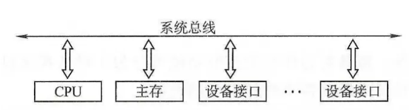
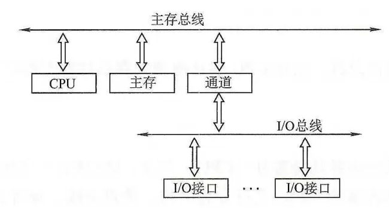

总线

### 1. 导言

- **总线是什么做什么，有什么用？**
- **缓存的组成是怎么样的？**
- **缓存的是如何工作的？**

本文从上面这些角度出发，希望能够让读者知道总线的作用以及原理。

### 2. 总线是什么

- ***总线是什么，有什么用？***

  现代计算机是从冯若伊曼计算机发展起来的。其组成部分有存储器、运算器、控制器、输入设备、输出设备，在现代计算机中，人们将运算器与控制器封装起来成为CPU（中央处理单元）。计算机的各种部件想要进行数据交互，就必须让这些部件形成一定的连接关系，以便数据交互的进行。

* ***不同部件是怎么连接的？***

  > IO设备，指输入输出等外设。
  >
  > 分时：同一时刻只允许一个部件向总线发送信息
  >
  > 共享：同一时刻多个部件可以从总线接收相同的信息

  假设有CPU、存储设备、外设等，他们是可以以全连接的方式连接，但是这种方式未免太过繁琐和复杂。弊端不可一一而说。这时候就有一个很朴素的想法，线路复用，有线路复用的线路就可以叫做总线，因此总线的严格定义是一组能为多个部件分时共享的公共信息传送线路。但本质上就是复用嘛。

### 3. 总线有哪些呢？

#### 3.1 总线的结构

* **单总线结构**

  

  单总线结构将 CPU、主存、I/O 设备（通过I/O接口）都挂在一组总线上，允许I/O 设备之间、I/O设备与主存之间直接交换信息，如图6.1 所示。CPU 与主存、CPU与外设之间可直接进行信息交换，而无须经过中间设备的干预。

  * 注意：单总线并不是指只有一根信号线，系统总线按传送信息的不同可细分为地址总线、数据总线和控制总线。
  * 优点∶结构简单，成本低，易于接入新的设备。
  * 缺点∶带宽低、负载重，多个部件只能争用唯一的总线，且不支持并发传送操作。

* **双总线结构**

  

  双总线结构有两条总线∶一条是主存总线，用于在 CPU、主存和通道之间传送数据;另一条是 I/O 总线，用于在多个外部设备与通道之间传送数据，如图所示。

  * 优点：将低速 I/O 设备从单总线上分离出来，实现了存储器总线和I/O 总线分离。
  * 缺点：需要增加通道等硬件设备。

#### 3.2 总线的分类

> 同步：指只有一个时钟源。
>
> 异步：指有多个是时钟源。

- 按数据传输格式：
  - 串行总线
  - 并行总线
- 按功能（即连接的部件）：
  - 片内总线：它是CPU芯片内部寄存器与寄存器之间、寄存器与ALU之间的公共连接线。
  - 系统总线：系统总线是计算机系统内各功能部件（CPU、主存、I/O接口）之间相互连接的总线。
    - 数据总线
    - 地址总线
    - 控制总线
  - 通信总线
- 按时序控制方式：
  - 同步总线
  - 异步总线

#### ==3.3 总线锁==

- 总线锁：在多CPU下，当其中一个处理器要对共享内存进行操作的时候，在总线上发出一个LOCK信号，使得其他处理器无法访问共享数据，开销很大，如果我们能够控制锁的粒度就能减少开销，从而引入了缓存锁。
- 缓存锁：只要保证多个CPU缓存的同一份数据是一致的就可以了，相比总线锁，缓存锁即降低了锁的力度。核心机制是基于缓存一致性协议来实现的。

### 4. 总线的工作原理 

- **总线传输的四个阶段：**
  1. 申请分配阶段：分配下一周期的总线使用权，包括传输请求、总线仲裁。
  2. 寻址阶段：取得主模块要访问的从模块的地址和命令。
  3. 传输阶段：主模块和从模块进行数据交换，单向或双向。
  4. 结束阶段：信息从总线撤除，让出总线使用权。

* ***==异步总线，是如何完成传输的？特别是如果一个高频的向一个低频的发起很多数据写任务呢？==***